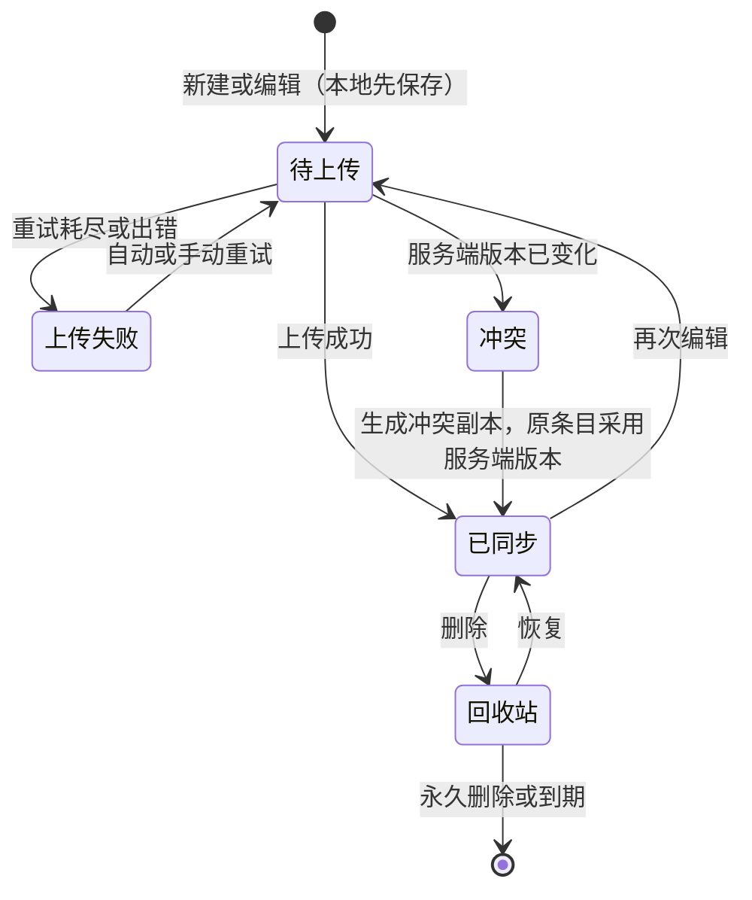
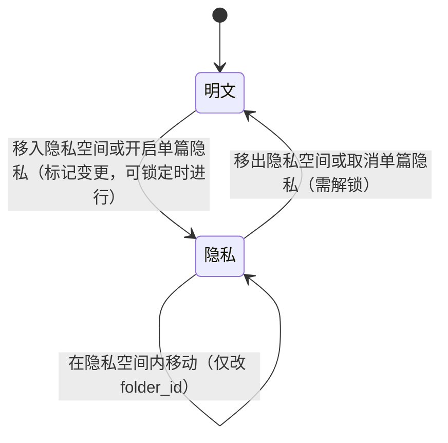

# Menote 功能拆解（v2）

| 项 | 内容 |
|---|---|
| 文档性质 | 产品功能拆解：把已定需求拆成可开发、可验收的功能点，并补齐每个功能的入口、流程、规则、异常和状态闭环 |
| 基准 | 仓库根目录 `Menote-设计文档-v7.4.md`（下文简称“需求文档”或“设计文档”）。本文不修改需求文档，所有功能点都标注来源小节。布局与交互另参照界面原型 `prototype/menote-prototype.html`（下文简称“原型”，引用写作 `P:行号`） |
| 工作原则 | 功能与规则以设计文档为准，布局与交互以原型（prototype/menote-prototype.html）为准，冲突时由用户确认 |
| 版本 | v2 |
| 日期 | 2026-09-26 |
| 状态 | 第二稿，已按用户 2026-09-26 的决定修订。已确认的问题见 10.0；其余待确认问题确认前，相关功能点仍按“建议”写法暂定 |
| 不包含 | 技术实现（接口、表结构、同步算法细节）归项目架构文档；本文只写到“用户看到什么、系统必须保证什么” |

### 标注约定

| 标注 | 含义 |
|---|---|
| `§8.9` | 该功能点在需求文档中的来源小节 |
| 【已定】 | 需求文档已明确，本文只做拆解 |
| 【补全】 | 需求文档未写明，但由已定规则可以直接推出，不改变任何决定 |
| 【建议·待确认 Qn】 | 需求文档未定义或有矛盾，本文给出建议写法，需在第十章第 n 条确认 |
| 【后续定】 | 需求文档明确列入“后续深入设计清单”的事项，本文只保留占位，不展开 |
| 【已定·用户确认 2026-09-26】 | 用户（产品负责人）于 2026-09-26 确认的决定。与需求文档 v7.4 不同时，在该处注明“与设计文档 v7.4 §x 不同，经用户确认；设计文档待同步” |
| 【暂定·用户确认 2026-09-26】 | 用户同意暂按此写法（多为按原型），以后可能调整；其中仍未决定的部分保留在第十章 |

### 修订记录

| 版本 | 日期 | 内容 |
|---|---|---|
| v1 | 2026-09-25 | 初稿 |
| v2 | 2026-09-26 | 按用户确认的决定修订，明细见下 |

v2 修订内容：

1. 头部：增加工作原则（功能与规则以设计文档为准，布局与交互以原型为准，冲突时由用户确认）；新增标注【已定·用户确认 2026-09-26】和【暂定·用户确认 2026-09-26】。
2. 导航（Q1 已确认）：导航顺序定为首页、Memo、待办、最近编辑、收藏、笔记本、标签、隐私空间；新增独立的“待办”导航项，原型中 Memo 视图内的“清单”tab（列表 / 看板）移到“待办”视图，Memo 视图只保留时间轴 / 瀑布流（M02-02、M06-10、M07-05）。
3. 快速录入框：保留 Memo / 待办 / 笔记三种模式切换，默认 Memo，是添加内容的主入口；Memo 视图和待办视图各有一个「添加」按钮；删除功能栏中单独的“待办”按钮（M02-02、M06-01、M07-01、M04-01）。与设计文档 §7.4 及变更记录第 12 条不同。
4. 回收站入口定在设置 › 版本与回收站（Q2 已确认，M12-02、M18）。
5. 搜索入口定在顶栏，快捷键 Ctrl+K / Cmd+K，结果在主操作区显示（Q3 已确认，M02-01、M09-01）。
6. 一次解锁同时解开 Memo 门禁和全部加密内容，界面只有一个锁定状态（Q5 已确认，M06-08）。
7. 最近编辑、收藏、标签三个视图都不包含 Memo（Q8 已确认）；Memo 因此不提供收藏，Q9 改为只讨论时间轴置顶；Memo 中的标签不会让 Memo 出现在标签视图，作为已接受的后果记录（M03-07、M06-06、9.1）。
8. 新建笔记、表格时不提供加密选项，单篇加密只在编辑器「更多」菜单中开关（M04-02、M08-08）。与设计文档 §6.2、§8.8 不同。
9. 允许在锁定状态下把条目移入加密空间（只能移到空间根目录，移入后立即锁定不可见）；补充技术可行性说明与用户的备选方案（M08-09、M08-11、9.2、9.4）。与设计文档 §6.3 不同。新增 Q25（锁定时是否允许开启单篇加密）。
10. 暂定项：默认解锁档位 5 分钟（Q4 部分确认，“仅本次查看”下 Memo 死路仍待确认）；编辑器加密状态显示放在底部状态栏（M08-06、M08-12，与设计文档 §6.9 不同）；新建笔记放根目录、默认标题“未命名笔记”（Q24 部分确认，标题与正文首行的关系仍待确认）。
11. 第十章：新增 10.0“已确认”，Q1、Q2、Q3、Q5、Q8 移入，Q4、Q24 的已确认部分也记录在此；新增 10.3（Q25）。第十一章末尾新增“需求文档待同步的用户决定”。

### 功能点编号规则

`模块号-序号`，如 `M06-03` 表示 Memo 模块第 3 个功能点。验收时按编号逐条核对。

---

## 一、功能模块总览

| 编号 | 模块 | 包含的功能 | 主要来源 |
|---|---|---|---|
| M01 | 账户与认证 | 首位注册即 owner、注册开关、登录、会话、登出、修改登录密码 | §5 |
| M02 | 界面框架与导航 | 顶栏（搜索、同步状态、隐私胶囊）、功能栏、主操作区、首页、启动视图、全局状态标识、同步状态 | §7.4、§6.9、§15.3 |
| M03 | 笔记本与文件夹 | 文件夹树、三层限制、条目列表、新建/重命名/移动/删除 | §4.5、§7.4 |
| M04 | 笔记 | 新建、编辑器三种模式、自动保存、大小提示、标签、置顶/收藏 | §7.1、§10.10、§12.1 |
| M05 | 表格 | 新建与列定义、十种字段、行 ID、行内编辑、筛选排序、图册、大小限制、降级 | §10 |
| M06 | Memo | 快速录入、图片、标签、Memo 视图（时间轴、瀑布流）、编辑/删除、转笔记、隐私浏览门禁 | §8 |
| M07 | 清单 | 待办录入、任务字段、待办视图（列表/看板）、清单与普通 Memo 切换 | §9 |
| M08 | 隐私锁 | 启用与恢复码、解锁与锁定、解锁档位、加密空间、单篇加密、批量转换、忘记密码、状态标识 | §6 |
| M09 | 搜索 | 本地搜索、加密内容内存索引、Memo 门禁过滤、服务端兜底 | §13、§6.10 |
| M10 | 附件与图片 | 上传、缩略图、去重、加密附件、孤儿清理 | §14 |
| M11 | 版本历史 | 自动封存、手动版本、查看与 diff、恢复、保留策略 | §12 |
| M12 | 回收站与永久删除 | 移入、恢复、永久删除范围、到期清理 | §7.1、§14.4 |
| M13 | 同步、离线与冲突 | 离线优先、outbox、同步状态、多标签页、冲突副本 | §15 |
| M14 | 分享 | 单篇、单条 Memo、Memo 固定合集、密码与过期、撤销、访客查看 | §16.1 |
| M15 | 导出 | 单篇 md、Memo 按条件导出、全量 ZIP | §16.2 |
| M16 | 备份与恢复 | R2 快照、外部备份目标、删除策略、立即备份、从备份恢复 | §16.3 |
| M17 | MCP | 令牌管理、权限与范围、11 个工具的产品规则、审计 | §17 |
| M18 | 设置 | 十个子页面的设置项清单与保存方式 | §7.5 |
| M19 | 数据与实例管理 | 个人用量、附件管理、实例用量、注册开关、成员管理 | §7.5、§1.3 |

---

## 二、账户与界面框架

### M01 账户与认证

#### M01-01 首位注册即 owner【已定 §5.3】

- **触发**：库中没有任何用户时访问应用。
- **表现**：显示注册页（不受注册开关限制），提示“第一个注册的账号将成为管理员（owner）”。
- **规则**：用户名全局唯一、不区分大小写；登录密码输入两次。注册成功后自动登录，进入启动视图。
- **闭环**：第一个用户创建后，注册页恢复受注册开关控制（默认关闭，登录页不再显示注册入口）。

#### M01-02 注册开关【已定 §5.2】

- **入口**：设置 › 实例管理（仅 owner）。
- **操作**：打开 / 关闭；打开时可选“到期自动关闭”（如 24 小时后，选项细则可在实例管理页做闭环时定）。
- **表现**：开关打开期间登录页显示“注册”入口；关闭或到期后入口消失，直接访问注册地址返回“注册未开放”。
- **规则**：新注册用户角色一律为 member；每人独立空间，互不可见（§5.1）。

#### M01-03 登录【已定 §5.4】

- **流程**：输入用户名与登录密码，浏览器完成慢哈希后提交；成功后进入启动视图。
- **异常**：用户名或密码错误时统一提示“用户名或密码错误”（不区分是哪一项错）；连续失败后进入冷却，提示“尝试过于频繁，请 N 秒后再试”，冷却时间逐次延长。
- **弱网**：登录必须联网；网络失败时提示“无法连接服务器，请检查网络后重试”，不进入离线模式。

#### M01-04 会话保持与登出【已定 §5.4】

- 登录后会话滑动 30 天有效；过期后下次联网请求时跳转登录页，本地 outbox 中未上传的改动保留，重新登录后继续上传【补全】。
- 登出入口：设置 › 账户与安全【补全】。登出时清除本机会话；若隐私锁处于解锁状态，同时执行锁定（M08-06）【补全】。
- 登出时本地缓存的明文数据是否清除：【建议·待确认 Q22】

#### M01-05 修改登录密码【已定 §7.5】

- **入口**：设置 › 账户与安全。
- **流程**：输入当前密码 + 新密码两次；成功后提示“登录密码已修改”。
- **规则**：界面提示登录密码与隐私密码不要相同（§5.4）；修改登录密码不影响隐私锁、不影响已加密内容。
- 修改后其他设备的会话是否失效：【建议：保留当前设备，其他设备会话全部失效】，与 M01-06 一起在“登录设备与会话管理”闭环中定。

#### M01-06 登录设备与会话管理、忘记登录密码【后续定 §后续清单 2、4】

保留占位：设置 › 账户与安全中预留“登录设备”区域。忘记登录密码目前没有找回路径。

### M02 界面框架与导航

#### M02-01 整体布局【已定 §7.4；顶栏按原型】

- 左侧功能栏固定，右侧主操作区随功能栏选择变化。窄屏布局【后续定】。
- 按原型，页面顶部另有一条全宽顶栏（P:617–641），从左到右为：品牌、面包屑、搜索框（M09-01）、同步状态（M02-06）、全局隐私状态胶囊（M02-05）。
- 搜索入口放在顶栏【已定·用户确认 2026-09-26】（Q3）：快捷键 Ctrl+K（macOS Cmd+K）聚焦搜索框，结果在主操作区显示。需求文档 §7.4 只写了左右两栏，没有写顶栏和搜索入口的位置，设计文档待同步。

#### M02-02 功能栏组成【已定 §7.4；导航与录入框已定·用户确认 2026-09-26（Q1）】

自上而下：

| 区域 | 功能 | 来源 |
|---|---|---|
| 新建笔记按钮 | 一键新建笔记并打开编辑器（M04-01） | §7.4 |
| 快速录入框 | 多行输入 + 模式切换：Memo（默认）/ 待办 / 笔记；是添加内容的主入口（M06-01、M07-01、M04-01） | §7.4、§8.7；模式切换为用户确认 |
| 导航 | 首页（启用时）、Memo、待办、最近编辑、收藏、笔记本、标签、隐私空间 | §7.4；Memo、待办两项为用户确认 |
| 底部 | 设置入口 | §7.5 |

- 快速录入框保留模式切换，三种模式为 Memo / 待办 / 笔记，默认 Memo（与原型 P:653–664 一致）【已定·用户确认 2026-09-26】。功能栏中不设单独的“待办”按钮。与设计文档 v7.4 §7.4 及附三变更记录第 12 条（“待办改为功能栏单独按钮……快速录入框不再内置模式选择”）不同，经用户确认；设计文档待同步。
- 导航顺序为：首页、Memo、待办、最近编辑、收藏、笔记本、标签、隐私空间【已定·用户确认 2026-09-26】。其中“首页”按需求文档 §7.4 保留（仍受启动视图设置控制，M02-04）；原型没有首页（P:670–738），需在原型中补上。
- “Memo”进入 Memo 视图（时间轴 / 瀑布流切换，M06-10）；“待办”进入待办视图（列表 / 看板切换，M07-05）。原型中待办是 Memo 视图内的第三个 tab“清单”（P:1498–1510），v2 起改为独立导航项，Memo 视图不再包含清单 tab。
- Memo 视图和待办视图顶部各有一个「添加」按钮（M06-10、M07-01），作为录入框之外的辅助入口。

v1 中列出的四个缺失入口，现已全部确认：

| 入口 | 位置 | 依据 |
|---|---|---|
| Memo 视图 | 导航第二项“Memo”，紧跟首页 | Q1 已确认 |
| 待办视图（原“清单界面”） | 导航第三项“待办” | Q1 已确认 |
| 搜索 | 顶栏搜索框，快捷键 Ctrl+K（macOS Cmd+K），结果在主操作区 | Q3 已确认 |
| 回收站 | 设置 › 版本与回收站 中的「打开回收站」 | Q2 已确认 |

#### M02-03 首页【已定 §7.4；细则后续定】

- 内容三类：概括预览（条目统计、今日待办、最近动态）、快捷方式、快速导航。
- 数据全部由本地元数据计算，不发额外请求。
- 隐私相关规则【建议·待确认 Q7】：
  - 加密空间内的条目不计入对外显示的统计数字（锁定时连数量都不应暴露，与 §6.9“不显示条目数”一致）；
  - 隐私浏览锁定时，“今日待办”和“最近动态”中来自 Memo 的内容以“已锁定”占位显示。

#### M02-04 启动视图【已定 §7.4、§7.5】

- 设置 › 通用 › 启动视图：首页 / 最近编辑 / 收藏，默认首页。
- 未选首页时，功能栏不显示首页项，启动后直接进入所选视图。

#### M02-05 全局隐私状态胶囊【已定 §6.9】

顶栏右侧，所有页面可见。状态与行为见 M08-12。未启用隐私锁时不显示。

#### M02-06 同步状态展示【已定 §1.4、§15.3】

- 顶部显示 outbox 队列长度（有待上传内容时显示，如“3 项待上传”）【补全：队列为空时不显示】。
- 每条内容显示“已同步 / 待上传 / 上传失败 / 冲突”小标记；列表中和编辑器保存状态处都显示。
- 离线时顶部显示“离线，改动会在联网后上传”【补全】。
- “有新版本”提示：应用外壳更新后提示，下次打开生效（§15.6）。

---

## 三、内容组织与编辑

### M03 笔记本与文件夹

#### M03-01 文件夹树【已定 §4.5、§7.4】

- 功能栏“笔记本”进入；主操作区为“笔记列表 + 正文”双栏。
- 文件夹最多两层嵌套：根目录 / 第一层 / 第二层 / 条目。条目可以放在任意一层，包括根目录。
- 加密空间作为固定顶级节点单独显示在“隐私空间”导航项下（M08-07），不出现在普通文件夹树中【补全：导航已把二者分开】。

#### M03-02 新建文件夹【已定 §4.5；入口后续定】

- 入口在笔记本视图中（具体位置【后续定 §后续清单 7】）。
- 在第二层文件夹上不提供“新建子文件夹”入口。
- 同一层级文件夹是否允许重名：【建议：允许，按创建顺序或手动排序区分】（不影响数据模型，无需确认，若有异议可提）。

#### M03-03 重命名文件夹【补全】

直接编辑名称；元数据单独计版本（§15.5），多设备同时改名以后一次为准，不生成冲突副本。

#### M03-04 移动文件夹与条目【已定 §4.5】

- 拖拽或“移动到…”菜单。
- 移动后超过三层的目标不可选（界面置灰并说明“最多两层文件夹”）；服务端同样校验。
- 移入 / 移出加密空间见 M08-09、M08-10；整个文件夹移入加密空间：【建议·待确认 Q13】

#### M03-05 删除文件夹【建议·待确认 Q12】

需求文档没有定义删除文件夹的行为。建议：

- 删除文件夹时，确认框写明“文件夹及其中 N 条内容、M 个子文件夹将移入回收站”；
- 文件夹与其中的条目一起进入回收站，保留原路径；
- 从回收站恢复条目时，原文件夹仍在则回到原处；原文件夹已不存在则恢复到根目录，并提示；
- 被删除文件夹若在某个 MCP 令牌的范围内，该令牌的范围自动去掉这个文件夹（令牌详情页提示）。

#### M03-06 条目列表【已定 §7.4】

- 笔记与表格混排，图标区分类型；点击笔记进入阅读/编辑，点击表格进入表格编辑视图。
- 列表项显示：标题、摘要、修改时间、同步状态、置顶/收藏/公开标记、加密标识（加密条目的显示规则见 M08-12）。
- 排序方式（修改时间 / 创建时间 / 标题 / 手动）：【建议：默认按修改时间倒序，置顶在前；其他排序作为可选项】，属界面细则，无需单独确认。

#### M03-07 最近编辑、收藏、标签视图【已定 §7.4；不含 Memo：已定·用户确认 2026-09-26（Q8）】

- 最近编辑：按修改时间倒序列出笔记与表格。
- 收藏：列出已收藏的笔记与表格。
- 标签：先显示标签列表（含使用次数），点击标签列出带该标签的笔记与表格。使用次数只统计笔记与表格【补全：与视图内容一致】。
- 三个视图都**不包含 Memo**【已定·用户确认 2026-09-26】。这与需求文档 §7.4“笔记与表格混排”一致；§6.9 中“置顶、收藏、最近列表中出现的……隐私浏览锁定时的 Memo”一句在此决定下不再适用，设计文档待同步。
- 已知后果（用户已接受）：在 Memo 中写的 `#标签` 不会让这条 Memo 出现在标签视图中。按标签查看 Memo 使用时间轴的标签筛选（M06-03）。点击 Memo 上的标签胶囊时，【建议：在时间轴内按该标签筛选，而不是跳转到标签视图（原型 P:2141–2148 会跳到标签视图，看不到任何 Memo）】，属界面细则。

### M04 笔记

#### M04-01 新建笔记【已定 §7.4；落点与默认标题暂定·用户确认 2026-09-26（Q24）】

- 入口一：点击功能栏“新建笔记”，直接创建一篇空笔记并打开编辑器，不弹出类型选择。新笔记放在根目录（即使当前正在某个文件夹中），默认标题“未命名笔记”，标题可在编辑器顶部的标题栏直接修改【暂定·用户确认 2026-09-26】（按原型 P:2168–2178）。
- 入口二：快速录入框切到“笔记”模式后发布（Ctrl+Enter / Cmd+Enter）：第一行（最多 50 字）作为标题，其余内容作为正文，第一行为空时标题为“未命名笔记”；放在根目录，创建后打开编辑器（按原型 P:1921–1935）。录入框的“笔记”模式为【已定·用户确认 2026-09-26】，与设计文档 v7.4 §7.4（“笔记由新建笔记按钮一键创建”）不同，经用户确认；设计文档待同步。
- 两个入口都不提供加密选项（M04-02）。
- 标题栏与正文第一行（一级标题）之间是否联动，仍待确认（Q24）。原型中按钮新建的笔记正文预填 `# 未命名笔记`，之后修改标题栏不会同步正文。
- 离线时同样可新建，状态为“待上传”。

#### M04-02 加密入口：创建时不提供，只在「更多」菜单中开关【已定·用户确认 2026-09-26】

- 新建笔记、表格时没有加密选项：“新建笔记”按钮、录入框“笔记”模式、新建表格流程都不提供。原型录入框“笔记”模式中的“加密”胶囊（P:1901，只是静态文字）应去掉。
- 单篇加密只在编辑器的「更多」菜单中开关，与原型一致（P:1364–1379）：笔记为「加密此笔记」/「取消加密」；表格为「加密此表格」/「取消加密」【补全：原型的表格暂无「更多」菜单，需补上，菜单文字按类型区分】。
- 前置条件：已启用隐私锁且处于解锁状态；未启用时点击引导到启用流程（M08-01）；锁定时点击先弹出解锁框，解锁后继续【补全】。锁定时是否允许直接开启单篇加密见 Q25。
- 加密空间内新建的内容天然加密，不受本条影响（M08-07）。
- 与设计文档 v7.4 §6.2（“创建时或之后随时勾选”）和 §8.8（“新建笔记/表格时可直接勾选‘加密’”）不同，经用户确认；设计文档待同步。

#### M04-03 编辑器与三种编辑模式【已定 §7.1】

- 双栏实时预览（默认）、仅编辑 / 仅预览、即时渲染。
- 编辑器顶部可临时切换；默认模式在设置 › 编辑器中配置。
- 支持：GFM、快捷键、大纲、预览同步滚动、Markdown 复选框快捷按钮（§8.6）。
- 即时渲染覆盖的语法元素与交互细则【后续定 §后续清单 8】。
- 不做：打字机模式、专注模式、双编辑组（§20）。

#### M04-04 自动保存【已定 §12.1、§15.7】

- 停止输入约 2 秒后保存；持续输入最长每 30 秒保存一次；正文超过 256 KB 时放宽为 5 秒 / 60 秒。
- 本地草稿始终每 2 秒写入一次，上传节奏放宽不影响本地保存。
- 用户无需手动保存；编辑器显示保存状态（已同步 / 待上传 / 上传失败 / 冲突），加密文章额外显示“已加密保存”（§6.9）。

#### M04-05 大小显示与上限【已定 §10.10】

- 编辑界面状态栏常驻显示当前大小，如“1.2 MB / 2 MB”（笔记和表格都显示）。
- 超过 1 MB（软上限）：显示变色，提示“文档内容过大，建议拆分为多篇”，仍可编辑和保存。
- 达到 1,900,000 字节（硬上限）：阻止保存，提示“已达硬上限，无法继续保存，请拆分内容”。此时本地草稿是否保留【补全：保留在本地，直到用户删减到上限以内再上传】。

#### M04-06 标签【已定 §7.1】

- 标签来自 md 本身：YAML `tags` 字段或正文中的 `#标签`；服务端只保存派生出的标签列表。
- 加密条目的标签只在解锁后于本机可见，服务端不保存（§6.10），因此锁定时标签视图中不出现加密条目。
- 标签的重命名、合并、删除：需求文档未提供界面入口（MCP 中明确不开放）【建议·待确认 Q17】。

#### M04-07 置顶与收藏【已定 §7.1】

- 置顶：在所在列表中排在最前。收藏：出现在“收藏”视图。
- 加密空间内的条目被置顶或收藏时，锁定状态下在列表中以“已锁定的条目”占位显示（§6.9）。

#### M04-08 笔记的其他操作【补全】

单篇笔记的更多菜单汇总需求文档中已定的能力：加密 / 取消加密、移动（含移入加密空间）、分享、导出 md、版本历史、存为版本、置顶、收藏、删除（移入回收站）。表格同样适用，另加“降级为普通笔记”（M05-10）。

### M05 表格

#### M05-01 新建表格【已定 §7.4、§10.2；流程见 Q16】

- 入口：笔记本视图中的“新建表格”（位置【后续定】）。
- 需求文档写明表格“需要先定义列结构”，但没有写列结构怎么定义。建议【待确认 Q16】：新建时弹出列定义面板，默认给一列“名称（文字）”，用户可增加列并为每列选类型；也可以直接确定，稍后在表格中增删列。

#### M05-02 列管理【建议·待确认 Q16】

需求文档定义了十种字段类型，但没有定义列的增、删、改名、改类型、排序。建议：

- 表头菜单提供：重命名、修改类型、左右插入列、删除列、调整顺序；
- 修改类型时不改动已有单元格文本，按新类型“读宽容”解析，解析不了的单元格显示原文并灰色提示（与 §10.4 容错一致）；
- 删除列前确认“此列所有数据将被删除，可在版本历史中找回”；
- `_id` 列不可删除、不可重命名，默认隐藏。

#### M05-03 十种字段类型【已定 §10.4】

文字、纯数字、单选、多选、复选、状态、超链接、图片附件、时间、标签。承载方式与容错按需求文档 §10.4。单选、状态的选项在列设置中维护【补全】。

#### M05-04 稳定行 ID【已定 §10.3】

- 每行首列 `_id`（6–8 位 base36），编辑器默认隐藏。
- 缺 ID 的行保存时补发；重复 ID 保留第一行，后续行重新分配。

#### M05-05 行内编辑【已定 §10.7】

点单元格直接切换单选、勾选复选、增删标签、弹日历选日期；新增行、删除行、拖动排序【补全：删除行是基本操作，需求文档未写但必需】。改完统一走自动保存。

#### M05-06 单元格限制【已定 §10.5】

单元格不可换行（写入 ` `，编辑器显示为换行）、`|` 自动转义、只支持行内格式；单格超过 2,000 字符提示“长文本建议写成笔记并在单元格中链接”；超过 50 列提示但不拒绝。

#### M05-07 筛选与排序【已定 §10.7】

按列值过滤 + 按列排序，纯本地。分组、多视图不做。筛选排序状态是否保存到表格 YAML：【建议：不保存，关闭表格即重置】，属界面细则。

#### M05-08 图册视图【已定 §10.8】

- 表格内部切换“表格视图 / 图册视图”。图册取图片附件类型字段的缩略图组成网格。
- 表格没有图片类型的列时，图册切换按钮置灰并提示“添加图片列后可使用图册”【补全】。
- 点开某张卡片从侧边滑出该行所有属性，可在侧栏中编辑【补全：侧栏可编辑是否需要，无异议即按此】。

#### M05-09 图片附件单元格【已定 §10.2、§10.4】

- 单元格只写文件名，文档内“附件”章节记录文件名到附件的对应。
- 找不到附件时显示文件名。
- 同一表格内两张图片同名时：【补全：上传时自动在文件名后加序号，保证文档内唯一】。

#### M05-10 大小与降级【已定 §10.10、§10.11】

- 大小规则同 M04-05；大表渲染使用虚拟滚动。
- 格式损坏：自动降级为普通笔记打开，不静默修改数据；降级前封存版本（§12.2）。
- 用户主动“降级为普通笔记”：确认后移除表格标记，按纯 md 打开【补全】。降级后能否重新“转为表格”：【建议：不提供，保持单向，避免解析失败带来的数据风险】。

---

## 四、Memo 与清单

### M06 Memo

#### M06-01 快速录入【已定 §8.7、§7.4】

- 位置：功能栏快速录入框，多行输入。录入框带模式切换（Memo / 待办 / 笔记），默认 Memo 模式【已定·用户确认 2026-09-26】（M02-02）。Memo 视图的「添加」按钮也会进入这里（M06-10）。
- 发布：Ctrl+Enter（macOS Cmd+Enter），Enter 换行；移动端使用发送按钮。
- 支持 `#标签`。
- 写入永远免密：无论隐私锁是否锁定、隐私浏览是否开启，录入与发布流程完全一样（§8.9）。
- 发布是乐观的：立即出现在时间轴，标记“待上传”，后台上传。
- 发布后输入框清空；发布失败（例如本地存储写入失败）时内容保留在输入框中并提示【补全】。
- 输入到一半切换页面时，未发布内容保留在输入框中【建议：保留为本地草稿，刷新后仍在】，属交互细则。
- 隐私浏览锁定时刚发布的 Memo 如何显示：【建议·待确认 Q6】

#### M06-02 图片【已定 §8.3】

- 支持粘贴、拖入、选择文件；可以只发一张图不写文字。
- 单条最多 5 张：超过时提示“单条 Memo 最多 5 张图片，请删减或分成多条发布”，发布按钮不可用，直到降到 5 张以内。
- 时间轴显示缩略图，点击看原图。
- 清单 Memo 不支持图片（M07-04）。
- 上传中的图片以本地预览显示，弱网下随 outbox 重试（§14.2）。

#### M06-03 时间轴【已定 §8.4】

- 默认展示形态：按天分组倒序，显示渲染后的正文、标签、时间；清单 Memo 带待办小图标。
- 日期分组按设置中的时区（默认 Asia/Shanghai）。修改时区后按新时区重新分组【补全】。
- 按标签筛选时间轴【建议：时间轴顶部提供标签筛选】。需求文档在分享合集中提到“在时间轴中按日期范围、按标签筛选”（§16.1），说明时间轴需要这两个筛选能力，本文按此补全为【补全】。

#### M06-04 图片瀑布流【已定 §8.4】

图片网格，懒加载；点开看该条 Memo 内容；只展示 Memo 自己的图片；与表格图册共用组件。

#### M06-05 编辑与删除【已定 §8.2】

- 每条 Memo 可单独编辑、删除。
- 编辑入口与方式：【建议·待确认 Q19】
- 编辑可以增删图片（仍受 5 张限制）、修改标签；时间戳 `memo_at` 保持原值，不因编辑改变【补全：Memo 按时间线组织，编辑不应改变其位置】。
- 删除：移入回收站（M12），与其他条目一致【补全】。
- 版本历史：复用主体系（§8.2）；入口在该条 Memo 的更多菜单中【补全】。

#### M06-06 置顶与收藏【收藏：由 Q8 推出；置顶：建议·待确认 Q9】

- 收藏：收藏视图已确认不包含 Memo（Q8，【已定·用户确认 2026-09-26】），给 Memo 加收藏没有可见的结果，因此 Memo 不提供“收藏”操作，更多菜单中不出现“收藏”【补全：由 Q8 推出】。
- 置顶：需求文档没有说明 Memo 能否置顶；数据表中 Memo 与笔记共用 `pinned` 字段。建议：可以置顶，置顶的 Memo 显示在时间轴最上方；待办视图不受置顶影响。仍待确认（Q9）。

#### M06-07 Memo 转笔记【已定 §8.8；细节见 Q10】

- 单向：Memo 转笔记，内容、图片、标签原样带走；笔记不能转回 Memo。
- 需要确认：原 Memo 是否保留、新笔记放在哪里、标题怎么取、清单字段怎么处理（Q10）。

#### M06-08 隐私浏览门禁【已定 §8.9；Q5 已确认；Q4、Q6 待确认】

| 场景 | 表现 |
|---|---|
| 未启用隐私锁 | 设置项“Memo 浏览需要隐私密码”不可用（灰色），Memo 始终可见 |
| 已启用隐私锁，门禁开启（默认），当前锁定 | Memo 视图（时间轴、瀑布流）和待办视图（列表、看板）整体显示锁定占位和“解锁”按钮，不显示内容、标签、图片；搜索结果不出现 Memo；首页中来自 Memo 的内容占位（Q7） |
| 同上，点击“解锁” | 弹出与加密内容相同的隐私密码框；成功后 Memo 正常显示，同时解开全部加密内容，界面只有一个锁定状态（【已定·用户确认 2026-09-26】，Q5） |
| 解锁状态结束（手动锁定、计时到期、会话结束） | Memo 重新隐藏 |
| 解锁档位为“仅本次查看” | 需求文档规定该档位不解除 Memo 门禁，由此产生的问题见 Q4 |
| 门禁关闭 | Memo 随时可见；关闭只改界面行为，不发生任何数据转换 |
| 关闭隐私锁 | 门禁随之失效 |
| 分享、MCP、导出、备份 | 均不受门禁影响 |

规则：Memo 内容在服务端、本机缓存、快照和备份中都是明文。设置页该开关旁应注明“这是界面保护，不对 Memo 内容加密”【补全：让用户对保护强度有准确预期，避免误解】。

一次解锁同时解除 Memo 门禁并解开全部加密内容，全局胶囊只有一个状态，与原型一致（P:1010）【已定·用户确认 2026-09-26】（Q5）。需求文档 §8.9 中“不涉及密钥操作”一句与此不符（校验隐私密码本身就要解开主钥），建议改为“Memo 本身没有需要解密的数据”，设计文档待同步。

#### M06-09 Memo 快照与导出格式【已定 §8.2】

按月收纳（可配置为按周），每条一个时间标题加 `yaml menote` 代码块。按周/按月的配置项放在设置的哪个子页面：见 Q21。

#### M06-10 Memo 视图【已定·用户确认 2026-09-26】（Q1）

- 入口：导航“Memo”（位于首页之后）。
- 顶部切换“时间轴 / 瀑布流”，默认时间轴（M06-03、M06-04）。清单 Memo 照常出现在时间轴中，带待办小图标（§9.4）；列表 / 看板不在这里，改在导航“待办”中（M07-05）。
- 顶部有「添加」按钮：点击后功能栏快速录入框切到 Memo 模式并获得焦点【补全：录入框是添加内容的主入口，「添加」按钮复用它，不另做一套输入框】。
- 隐私浏览门禁见 M06-08。
- 与设计文档 v7.4 §7.4 主操作区表（“Memo 视图：时间轴 / 瀑布流 / 清单”）不同：清单移到独立的待办视图，经用户确认；设计文档待同步。

### M07 清单

#### M07-01 待办录入【已定 §9.2；入口已定·用户确认 2026-09-26；快捷选择后续定】

- 入口一（主入口）：在功能栏快速录入框的模式切换中选“待办”，录入框切换为待办模式，提供日期和优先级的快捷选择（细则【后续定】）。
- 入口二：待办视图顶部的「添加」按钮，点击后快速录入框切到待办模式并获得焦点【补全：与 Memo 视图的「添加」按钮一致】。
- 功能栏不设单独的“待办”按钮。需求文档 §9.2 中“在 Memo 录入中打开‘清单’开关”的作用由录入框的待办模式承担，不再另设开关。以上与设计文档 v7.4 §7.4、§9.2 及附三变更记录第 12 条不同，经用户确认；设计文档待同步。
- 待办模式下发布一条后，输入框是否保持待办模式：【建议：保持（与原型一致），在模式切换中点“Memo”回到 Memo 模式】，属交互细则。
- 新建的清单 Memo 默认状态为“待办”【补全】。

#### M07-02 自动提示“设为清单？”【已定 §9.2】

正文包含 `- [ ]` 时提示“设为清单？”，由用户确认；带图片的 Memo 不出现此提示。用户确认后，录入框切到待办模式，已输入的内容保留【补全：功能栏已没有单独的“待办”按钮，原型 toast 中“可点功能栏的「待办」按钮”的文案需改】。

#### M07-03 任务字段【已定 §9.3】

状态（待办 / 进行中 / 已完成）、日期（ISO）、优先级（高 / 中 / 低），存于该条 Memo 的 YAML。日期和优先级可为空【补全：需求文档写明是“可选字段”（§2.2）】。

#### M07-04 清单与普通 Memo 互相切换【已定 §9.2、§9.5】

- 可以随时加上或去掉清单标记。
- 带图片的 Memo 须先移除图片才能设为清单：此时“设为清单”置灰并提示原因【补全】。
- 去掉清单标记时，任务字段是否一并删除：【建议：删除，YAML 中不再保留 task 字段；之后再设为清单时重新填写】，如有异议在 Q23 中提出。

#### M07-05 待办视图（原“清单界面”）【已定 §9.4；入口已定·用户确认 2026-09-26（Q1）】

- 入口：导航“待办”（位于 Memo 之后）。原型中这部分是 Memo 视图内的“清单”tab（P:1498–1510），v2 起移到独立的待办视图，Memo 视图不再包含它。
- 筛选出所有清单 Memo，支持列表 / 看板切换。清单 Memo 同时仍出现在 Memo 时间轴中，待办视图只是另一个浏览入口，不改变数据模型（§9.1、§9.4）。
- 顶部有「添加」按钮（M07-01 入口二）。
- 隐私浏览门禁与 Memo 视图相同（M06-08）。
- 列表：按状态、日期、优先级排序和筛选，纯本地。
- 看板：按状态分三列，点卡片改状态或拖到另一列；改状态即修改该条 Memo 的 YAML 并自动保存。
- 点击卡片打开详情：【建议：右侧滑出详情侧栏（§7.4 已把清单看板卡片列为滑出侧栏的候选场景）】。
- 已完成的条目是否默认隐藏：【建议：列表默认显示全部，提供“隐藏已完成”开关】，属界面细则。

#### M07-06 清单转笔记【已定 §9.5】

与 M06-07 相同规则。

#### M07-07 不做【已定 §9.6】

项目管理、子任务与多层嵌套、提醒通知（需求文档未提及提醒；【补全：不做，若需要请提出】）。

---

## 五、隐私锁（M08）

### M08-01 启用隐私锁【已定 §6.7】

- 入口：设置 › 隐私锁；或在未启用时点击「更多」菜单中的“加密此笔记 / 加密此表格”、隐私空间等入口时引导进入。
- 流程：
  1. 输入两次隐私密码；提示不要与登录密码相同，并说明隐私锁的作用范围（保护对象是“身边的人看到屏幕”）。
  2. 显示恢复码（8 组 4 位），提供“下载为文本文件”和“复制”。
  3. 勾选“我已妥善保存恢复码”，回填随机抽取的两组字符，校验通过才能继续。
  4. 红色提示“隐私密码和恢复码都丢失时，加密内容将永久无法恢复”，勾选确认。
  5. 完成后隐私锁启用，可以开始加密内容。
- 异常：中途关闭或断网，隐私锁不启用，已生成的恢复码作废，下次重新开始【补全】；启用需要联网（要把密钥包裹上传到服务端）【补全】。

### M08-02 隐私锁未启用时的加密空间【建议·待确认 Q15】

加密空间“始终存在”，但加密需要先启用隐私锁。建议：未启用隐私锁时，导航中的“隐私空间”照常显示，点击后说明用途并引导启用隐私锁；启用前不能向其中放入内容。

### M08-03 解锁【已定 §6.8】

- 触发：打开加密文章、展开加密空间、隐私浏览下点“解锁”、点全局胶囊。
- 流程：输入隐私密码；成功后按当前解锁档位保存密钥并显示内容；失败提示“隐私密码错误”，本地计次并逐次增加等待时间。
- 解锁框中提供“忘记隐私密码”入口（M08-14）。
- 解锁可离线进行【补全：密钥包裹在本地有缓存时，校验完全在浏览器端完成】。

### M08-04 解锁档位【已定 §6.8；默认档位已定·用户确认 2026-09-26】

| 档位 | 解开范围 | 何时重新锁定 |
|---|---|---|
| 仅本次查看 | 仅当前文章或当前加密空间 | 关闭或离开即锁定 |
| N 分钟 | 全部加密内容 + Memo 门禁 | 无操作 N 分钟后 |
| 本次浏览器会话 | 同上，多个标签页共享 | 所有 Menote 标签页关闭后 |
| 当前设备长期 | 同上 | 手动“锁定此设备” |

- 设置 › 隐私锁中设默认档位；解锁框中可临时选择本次使用的档位【补全：§6.9 胶囊菜单有“更改档位”，说明档位可随时切换】。
- 选择“当前设备长期”时必须弹出说明：“这等于在该设备上关闭隐私保护，任何能打开这个浏览器的人都能看到私密内容”，勾选确认后生效。
- 默认档位为“N 分钟”，N 默认 5 分钟【已定·用户确认 2026-09-26】（Q4 的已确认部分），与原型一致（P:1696）。“仅本次查看”档位下 Memo 无法查看的问题仍待确认（Q4）。

### M08-05 “仅本次查看”下浏览加密空间【建议·待确认 Q14】

该档位“解开当前加密空间所需的最小密钥”，但空间内每篇文章各有自己的数据密钥，只保留空间密钥时只能看到标题列表，打开任何一篇都要再次输入密码。需要确认这是否就是期望的行为（Q14）。

### M08-06 锁定【已定 §6.8】

- 触发：点击“立即锁定”、N 分钟到期、关闭视图（仅本次查看）、会话结束、“锁定此设备”。
- 表现：正在编辑的加密内容未保存的改动先加密保存；打开的加密文章切换为锁定占位页；加密空间收起；搜索结果中的加密内容与 Memo（门禁开启时）立即消失；Memo 视图与待办视图切换为占位。
- 倒计时剩余 30 秒时胶囊闪烁一次，并在编辑器底部状态栏提示“即将自动锁定，未保存的内容会先加密保存”（位置【暂定·用户确认 2026-09-26】，见 M08-12；原型中以 toast 提示）。

### M08-07 加密空间【已定 §6.3】

- 导航“隐私空间”即加密空间，每个账户一个，不可删除、不能新建第二个。
- 名称明文，可重命名（默认“加密空间”）。重命名入口：【补全：空间节点的右键/更多菜单】。
- 锁定时：不可展开、不显示条目数，点击弹出解锁框；主操作区显示“此空间已锁定”和“解锁”按钮。锁定时仍可以把条目移入空间根目录（M08-09）。
- 解锁后：与笔记本相同的“列表 + 正文”双栏，最多两层文件夹，可新建文件夹、笔记、表格。
- 空间内新建的内容天然加密，无需勾选。

### M08-08 单篇加密【已定 §6.2、§8.8；入口已定·用户确认 2026-09-26】

- 任意笔记或表格在创建后，通过编辑器「更多」菜单开启或取消加密（M04-02），需处于解锁状态；创建时不提供加密选项。与设计文档 v7.4 §6.2“创建时或之后随时勾选”不同，经用户确认；设计文档待同步。
- 锁定时开启单篇加密：仍不允许，点击先弹出解锁框；是否改为允许见 Q25。取消加密始终需要解锁。
- 不在加密空间内的单篇加密文章标题保持明文。
- 勾选加密时提示将要处理的内容（M08-11）；已有分享自动撤销并提示。
- 取消加密时提示“取消后将以明文保存”，确认后执行。

### M08-09 移入加密空间【已定 §6.3、§6.11；锁定时移入已定·用户确认 2026-09-26】

- 前置：已启用隐私锁。未启用时，“移动到…”中的隐私空间点击后引导启用（M08-02）。**不要求处于解锁状态**（锁定时的规则见下）。
- 确认框写明：该文章将被加密；服务端已有的明文版本历史默认加密后替换（可改选“直接删除旧版本”）；明文附件改为加密副本；相关分享将被撤销；**已推送到外部备份目标的旧明文无法收回，需要自行清理**。
- 执行：本地批量转换，完成后才真正移动；转换期间该文章对 MCP 立即不可见。

**解锁状态下移入**：可以移到加密空间内的任意一层（仍受两层文件夹限制）。

**锁定状态下移入**【已定·用户确认 2026-09-26】：

- 无需先解锁即可移入，但只能移到加密空间的根目录。“移动到…”菜单和拖拽目标中，隐私空间只显示为一个节点，不展开子文件夹：空间内的文件夹名是密文，锁定时看不到。
- 确认框在上面的内容之外再写明：“移入后该条目会立即锁定，不再显示；需要解锁后才能查看，或整理到空间内的文件夹中”。
- 移入完成后，该条目从原列表中消失，按锁定的加密空间处理：不显示、不计入条目数、搜索不到；提示“已移入隐私空间（已锁定）”【补全】。
- 用户需要解锁后才能查看该条目，或把它移到空间内的子文件夹。
- 移出加密空间、取消加密仍然要求先解锁（M08-10、M08-08）；锁定时开启单篇加密仍不允许（Q25）。
- 锁定时发起的转换任务不依赖解锁，中断后在下次打开应用时继续（M08-11）。
- 整个文件夹在锁定时能否移入，随 Q13 一并确认。
- 与设计文档 v7.4 §6.3（“所有涉及加密或解密的操作都要求处于解锁状态”）不同，经用户确认；设计文档待同步。

**技术可行性说明（2026-09-26 用户确认修订：采用“服务端明文 + 前端门禁 + 备份加密”模型）**：

- 服务端始终明文存储；条目仅携带隐私标记（`in_enc_space` / `enc_self`），移入 / 移出 / 开启 / 取消都是普通元数据操作，**不需要任何密钥**，锁定状态下同样可执行。
- 保护边界（用户确认）：隐私密码只用于 ①前端显示门禁，②备份导出加密。目标是“锁定时前端页面不显示、第三方备份中不直接可见”；不防爆破与专业解密，不防已登录账号、服务端数据库与本机缓存。
- 备份导出：隐私条目强制加密后出站（浏览器与 Worker 共用一把随机内容密钥 K，K 由隐私密码包裹；信封格式与独立解密工具见架构 7.3 / 7.4）；普通内容默认明文出站。
- 原非对称密钥对方案（公钥明文 + 私钥 MK 包裹）不再需要；“下次解锁时补加密”“待整理标题”等中间状态一并取消。
- 确认框措辞按保护边界如实说明：“内容以明文存储在你的服务器上，受前端门禁与备份加密保护；知道你账号密码的人可以看到。”

### M08-10 移出加密空间【已定 §6.3、§6.11】

- 提示“移出后将以明文保存”；逐篇解密后移动。
- 若该文章同时开启了单篇加密，移出后正文保持加密、标题变回明文。
- 密文版本默认解密后以明文替换，加密附件改为明文附件。

### M08-11 批量转换任务【原 §6.4；2026-09-26 模型修订后改为批量标记操作】

> 2026-09-26 模型修订：隐私保护改为“服务端明文 + 前端门禁 + 备份加密”（见 M08-09 技术说明），不再有逐篇加解密，本节由“转换任务”改为“批量标记操作”。

- 涉及多篇文章的移入 / 移出隐私空间、开启 / 取消单篇隐私，都是批量元数据操作，逐条提交并显示进度（如“处理中 12 / 40”，显示在空间或文件夹名后）。
- 锁定时发起的移入（M08-09）同样只是标记变更，不需要解锁；中断后在下次打开应用时继续。
- 批量操作逐条提交（复用批量元数据接口），单篇失败跳过并在结束后列出失败清单与“重试”。

### M08-12 状态标识【已定 §6.9；编辑器中的位置暂定·用户确认 2026-09-26】

按需求文档 §6.9 实现四处标识：顶栏全局胶囊、侧边栏、列表、编辑器中的加密状态显示。所有标识同时使用图标、文字、颜色。此处不重复表格，验收时逐项对照 §6.9。

编辑器中的加密状态显示位置【暂定·用户确认 2026-09-26】：按原型放在编辑器底部状态栏（与同步状态、大小显示同一条，P:1279–1291），标题旁另显示“已加密”标识（P:1265）；各档位的状态文字和“立即锁定 / 锁定此设备”按钮仍按 §6.9。与设计文档 v7.4 §6.9“编辑器顶部状态条（打开加密文章时常驻）”不同，经用户确认暂按原型；设计文档待同步。

### M08-13 修改隐私密码、重新生成恢复码【已定 §6.7】

- 修改隐私密码：需先解锁；输入新密码两次；只重新包裹主钥，已加密内容与恢复码都不受影响。
- 重新生成恢复码：需先解锁；走“保存 + 回填确认”；旧恢复码立即作废。设置页显示恢复码生成时间。

### M08-14 忘记隐私密码【已定 §6.12】

解锁框点“忘记隐私密码”，输入恢复码，设置新隐私密码，强制生成新恢复码（保存 + 回填确认），旧恢复码作废；加密内容不受影响。界面明确写出“两者都丢失时加密内容永久无法恢复”。管理员不能重置。

### M08-15 关闭隐私锁【建议·待确认 Q15】

设置页列出“启用 / 关闭隐私锁”，但需求文档没有定义已有加密内容时怎么关闭。建议：存在加密内容时不允许直接关闭，提示“请先取消所有单篇加密并清空加密空间”；没有任何加密内容时，解锁后可关闭，关闭后删除密钥包裹、Memo 门禁失效。

### M08-16 隐私锁相关设置【已定 §7.5】

启用 / 关闭、修改隐私密码、重新生成恢复码、默认解锁档位、N 分钟的时长、“解锁时可以搜索加密内容”开关、“Memo 浏览需要隐私密码”开关。N 分钟的可选值：【建议：1 / 5 / 15 / 30 / 60 分钟，默认 5】，属细则。

---

## 六、搜索、附件、版本、回收站、同步

### M09 搜索

#### M09-01 本地全文搜索【已定 §13.1】

- 入口：顶栏搜索框，快捷键 Ctrl+K（macOS Cmd+K）聚焦；输入后主操作区显示搜索结果，清空后回到原来的视图（按原型 P:625–629、P:2217–2228）【已定·用户确认 2026-09-26】（Q3）。
- 范围：标题、正文、标签；可按类型、文件夹、标签、时间过滤；结果高亮片段。
- 离线可用，不发网络请求；中文按词切分并有二元组兜底。
- 新设备首次同步完成前，本地索引未建好时自动改用服务端兜底搜索，并在结果顶部提示“正在建立本地索引，当前结果可能不完整”【补全】。

#### M09-02 搜索中的隐私规则【已定 §6.10、§8.9】

| 内容 | 锁定时 | 解锁时 |
|---|---|---|
| 单篇加密文章、加密空间内文章 | 搜不到 | 设置开关打开时可搜到，结果带开锁图标和“解锁期间可见”；关闭时搜不到 |
| Memo（门禁开启） | 搜不到 | 可搜到 |
| Memo（门禁关闭或未启用隐私锁） | 可搜到 | 可搜到 |
| 回收站中的条目 | 【建议：搜不到，回收站页面内单独提供筛选】 | 同左 |

锁定发生时，已显示的加密内容与 Memo 结果立即从列表中消失。

### M10 附件与图片

#### M10-01 上传【已定 §14.1、§14.2】

- 粘贴、拖入、选择文件；单个最大 20 MB，超限提示“文件超过 20 MB，请压缩或拆分后上传”。
- 同一用户重复上传同一文件时秒传（直接复用）。
- 图片自动生成缩略图；无法生成缩略图（如部分浏览器不支持 HEIC）时以文件图标代替，原图照常保存。
- 弱网下进入 outbox 重试，未上传完成时编辑器显示本地预览。
- 非图片附件在正文中显示为文件链接，点击下载【补全】。

#### M10-02 加密文章的附件【已定 §6.11】

加密后上传，不参与去重；解锁后在浏览器内解密显示，锁定时显示占位【补全】。

#### M10-03 附件管理与孤儿清理【已定 §14.3】

- 入口：设置 › 数据管理 › 附件管理。
- 列出所有附件、占用空间、孤儿附件；支持手动清理孤儿附件（确认后删除）。
- 自动：附件不再被任何条目（含回收站条目和保留中的版本）引用时标为孤儿，30 天后自动删除。
- 加密附件在列表中的显示：【补全：显示为“加密附件”及大小，不显示文件名和预览】。

### M11 版本历史

#### M11-01 自动封存【已定 §12.2】

停止编辑 10 分钟后、标签页隐藏或关闭时、跨设备或间隔 1 小时后开始编辑时、破坏性操作前自动封存；内容与上一个版本相同则不生成。用户无感知。

#### M11-02 手动存为版本【已定 §12.2】

更多菜单“存为版本”，可填写备注；手动版本默认永久保留。加密文章的备注：【补全：不填或随正文加密，界面允许填写】。

#### M11-03 查看与对比【已定 §12.4、§7.1】

- 版本列表：时间、原因（显示为中文，如“停止编辑后自动保存”“手动保存”“AI 修改前”“恢复前”等【补全】）、大小、备注。
- 选择一个版本查看全文；选择两个版本或与当前稿对比，显示简易 diff。
- 加密文章需解锁后才能查看与对比。

#### M11-04 恢复版本【已定 §12.2】

确认后以该版本内容替换当前稿；恢复前自动封存当前稿，恢复操作本身可再次撤回。

#### M11-05 版本标记为“保留”【已定 §12.3】

单个版本可标记“保留”，不参与稀疏化。入口：版本列表中每个版本的菜单【补全】。

#### M11-06 保留策略设置【已定 §12.3】

设置 › 版本与回收站：封存间隔、各年龄段保留密度、每条最多保留条数（默认 100，20–500）、最长保留时长（默认不限）。

### M12 回收站与永久删除

#### M12-01 移入回收站【已定 §7.1】

- 笔记、表格、Memo 删除后进入回收站；文件夹见 Q12。
- 被分享的条目移入回收站时分享立即失效（§16.1）。
- 删除后提示“已移入回收站”，提供“撤销”【补全】。

#### M12-02 回收站页面【补全；入口已定·用户确认 2026-09-26（Q2）】

- 入口：设置 › 版本与回收站 中的「打开回收站」（显示条目数），进入独立的回收站页面，页头提供“返回设置”（按原型 P:1655–1660、P:1744–1746）。功能栏中不设回收站入口。
- 列出已删除的条目：标题（加密空间内条目锁定时占位）、类型、删除时间、剩余保留天数。
- 操作：恢复、永久删除、清空回收站。

#### M12-03 恢复【已定 §16.1】

- 恢复到原位置；原文件夹已不存在时见 Q12 的建议。
- 分享不自动恢复，需重新创建。

#### M12-04 永久删除【已定 §14.4】

- 手动永久删除或保留期到期（默认 30 天，设置 › 版本与回收站可改）。
- 确认框写明删除范围：条目、全部版本、快照中的文件、不再被引用的附件；外部备份目标上的副本按该目标的删除策略处理。
- 永久删除不可撤销。

### M13 同步、离线与冲突

#### M13-01 离线优先【已定 §1.4、§15】

- 打开过的内容与全部元数据缓存在本机；离线可浏览、编辑、新建、删除、写 Memo。
- 设置项“全部离线缓存”：打开后把所有条目正文都缓存到本机（§15.1）。设置位置见 Q21。
- 离线时不可用的功能【补全】：登录、启用隐私锁、创建或修改分享、MCP 令牌管理、备份操作、修改设置中的实例管理项。这些入口离线时置灰并提示“需要联网”。

#### M13-02 同步时机与状态【已定 §15.2、§15.3】

应用打开、标签页重新可见、网络恢复、写入成功后、前台每几分钟一次；状态展示见 M02-06。上传失败的条目可手动“重试”【补全】。

#### M13-03 多标签页【已定 §15.4】

多个标签页同时打开时内容保持一致，用户无需操作。

#### M13-04 冲突副本【已定 §15.5；Memo 冲突见 Q11】

- 正文冲突：服务端版本保留为原条目，本地内容另存为新条目“原标题（冲突副本 时间 · 设备名）”，放在同一文件夹，带冲突标记。
- 通知栏提示，提供“对比两者”和“保留某一份”。选“保留某一份”后另一份的处理：【建议：未保留的一份移入回收站】。
- 元数据冲突不生成副本。
- 正在编辑时收到其他设备的更新：不替换，提示“此内容在其他设备上有更新”【已定 §15.6】。

---

## 七、分享、导出、备份、MCP

### M14 分享

#### M14-01 创建分享【已定 §16.1】

- 可分享：笔记、表格、单条 Memo、Memo 固定合集。
- 不可分享：单篇加密文章、加密空间内文章。按钮置灰并说明原因。
- 可选设置：访问密码、过期时间（过期时间的选项【建议：1 天 / 7 天 / 30 天 / 自定义 / 永不过期】）。
- 创建后显示链接和“复制”按钮，条目显示公开标记。
- 需要联网。

#### M14-02 Memo 固定合集【已定 §16.1；细则后续定】

- 在时间轴中按日期范围、标签筛选或手动勾选多条 Memo，生成合集；可填写合集标题。
- 条目列表创建时固定；合集内 Memo 被编辑后分享页显示最新内容；被删除的从分享页消失。
- 不做按标签或日期自动更新的动态分享。

#### M14-03 管理分享【已定 §16.1、§7.5】

- 条目的分享面板与设置 › 分享（“我的分享”）都能看到现有分享。
- 操作：复制链接、修改密码、修改过期时间、撤销。撤销立即生效。

#### M14-04 分享自动失效【已定 §5.5、§16.1】

以下情况链接立即失效，访客看到“链接已失效”：撤销、过期、条目移入回收站、条目被加密或移入加密空间（同时提示用户“相关分享已自动撤销”）。

#### M14-05 访客查看【已定 §16.1】

- 打开链接加载只读查看器；设了密码时先输入密码。
- 笔记按 md 渲染；单条 Memo 包含图片，清单 Memo 只读显示状态、日期、优先级；合集按天分组倒序。
- 表格在分享页中的展示形态：【建议·待确认 Q18】
- 访客不能编辑、不能看到分享者的其他任何内容。

### M15 导出

#### M15-01 单篇导出【已定 §16.2】

笔记、表格导出为 .md，附件按快照格式打包：【补全：含附件时导出为 ZIP（md + `_attachments/`），不含附件时直接下载 .md】。

#### M15-02 Memo 按条件导出【已定 §8.2】

按日期范围或多条勾选，拼成一个 md，格式与月度快照相同。

#### M15-03 全量 ZIP 导出【已定 §16.2、§6.10】

- 入口：【补全：设置 › 数据管理】。
- 在浏览器组装，显示进度；缺失的正文按需拉取（需要联网）。
- 锁定状态下加密条目被跳过并列出清单，提示解锁后再导出；解锁状态下加密条目导出为明文，导出前提示“导出文件中加密内容为明文”【补全】。

### M16 备份与恢复

#### M16-01 备份目标管理【已定 §16.3】

- 入口：设置 › 备份。
- 支持 WebDAV、S3、Git（托管平台 API）三类；可添加多个，每个可单独启用或停用。
- 每个目标配置：连接信息、凭据（保存后不回显，只显示“已配置”）、删除策略（同步删除，默认；或只增不删）。
- Git 目标选择同步删除时提示“历史提交中的内容无法清除”。
- 保存前测试连接【补全】。

#### M16-02 自动备份【已定 §16.3】

后台增量进行，每轮只推送变化的文件。备份中加密内容为密文。设置页显示每个目标的最近备份时间与结果【补全】，失败时显示原因。

#### M16-03 立即备份与首次全量备份【已定 §16.3】

由浏览器驱动，显示进度；需要保持页面打开，页面关闭则中断，下次可继续【补全】。

#### M16-04 从备份恢复【已定 §16.3；流程细则待补】

- 从备份目录导入，按 manifest 校验；加密条目以密文导入，之后用隐私密码或恢复码解锁。
- 需求文档未定义：恢复入口、导入到空账户还是可合并到已有数据、与现有条目 ID 冲突时怎么办。【建议·待确认 Q20】

### M17 MCP

#### M17-01 令牌管理【已定 §17.2、§17.3】

- 入口：设置 › MCP。
- 创建令牌：名称（必填）、权限（只读始终包含；新建和追加 / 修改和移动 / 移到回收站可独立勾选）、范围（全部或若干文件夹，含子文件夹；“包含 Memo”勾选）、过期时间、是否允许通过 URL 使用（默认关闭，勾选时显示风险说明）。
- 创建后完整令牌只显示一次，提供复制；之后只显示前缀。
- 列表显示：名称、前缀、权限、范围、过期时间、最近使用时间、状态。
- 撤销立即生效。每人最多 20 个有效令牌，达到上限时“创建”置灰并提示。
- 设置页同时显示 MCP 地址和一段接入说明【补全】。

#### M17-02 审计日志【已定 §17.3】

令牌详情页查看该令牌的写操作记录（工具、条目、结果、时间），保留 90 天。

#### M17-03 MCP 可见性规则【已定 §6.13、§17】

| 内容 | 对 MCP |
|---|---|
| 单篇加密、加密空间内文章 | 一律不可见 |
| 正在转换为加密的文章 | 立即不可见 |
| Memo | 令牌勾选“包含 Memo”时可见，与隐私浏览门禁无关 |
| 令牌范围外的文件夹 | 不可见 |
| 回收站中的条目 | 【补全：不可见】 |

#### M17-04 11 个工具【已定 §17.5】

工具清单、权限与限制按需求文档 §17.4、§17.5，属于开发与架构文档的范围，本文不再拆解。产品侧的可见结果：MCP 的每次修改前都会封存版本，用户可在版本历史中看到原因为“AI 修改前”的版本并撤回。

---

## 八、设置与管理

### M18 设置总表【已定 §7.5；补项见 Q21】

| 子页面 | 设置项 | 功能点 |
|---|---|---|
| 账户与安全 | 修改登录密码；登出；登录设备与会话【后续定】 | M01 |
| 通用 | 启动视图；时区；界面偏好【后续定】 | M02-04 |
| 编辑器 | 默认编辑模式 | M04-03 |
| 隐私锁 | 启用 / 关闭；修改隐私密码；重新生成恢复码；默认解锁档位；N 分钟时长；解锁时可搜索加密内容；Memo 浏览需要隐私密码 | M08 |
| 版本与回收站 | 封存间隔；保留策略；回收站保留天数；回收站入口（Q2 已确认） | M11、M12 |
| 备份 | 目标管理；删除策略；立即备份与进度 | M16 |
| 分享 | 我的分享；撤销；修改密码与过期时间 | M14 |
| MCP | 令牌管理；审计日志 | M17 |
| 数据管理 | 个人用量；附件管理 | M19、M10 |
| 实例管理（仅 owner） | 注册开关；成员账户管理【后续定】；实例总用量 | M19 |

需求文档中提到、但没有归入任何子页面的设置项（Q21）：“全部离线缓存”（§15.1）、Memo 快照按周或按月（§8.2）、全量 ZIP 导出入口（§16.2）。

保存方式：【推荐：即时生效并同步，细则后续定 §7.5】。

### M19 数据与实例管理

#### M19-01 个人用量【已定 §7.5】

设置 › 数据管理：条目数量、正文占用、附件占用、版本占用【补全：按需求文档的存储分工列出】。

#### M19-02 实例总用量【已定 §1.3、§7.5】

仅 owner：D1 占用（对比 500 MB 上限）、R2 占用（对比 10 GB 免费额度）、各成员的占用分布【补全】。不做每用户配额。

#### M19-03 成员账户管理【后续定 §后续清单 3】

成员列表、停用、删除及数据清理。保留占位。

#### M19-04 更新通知【已定 §21.1 第 11 条】

新版本通知只推送给 owner。展示位置【补全：设置 › 实例管理顶部】。

---

## 九、跨模块规则

### 9.1 内容类型 × 能力矩阵

| 能力 | 笔记 | 表格 | Memo | 清单 Memo |
|---|---|---|---|---|
| 放入文件夹 | ✓ | ✓ | ✗（时间线） | ✗ |
| 单篇加密 | ✓ | ✓ | ✗ | ✗ |
| 放入加密空间 | ✓ | ✓ | ✗ | ✗ |
| 隐私浏览门禁 | — | — | ✓ | ✓ |
| 图片与附件 | ✓ | ✓（图片列） | ✓（≤5 张图） | ✗ |
| 标签 | ✓ | ✓ | ✓ | ✓ |
| 置顶 | ✓ | ✓ | Q9（时间轴置顶） | Q9（时间轴置顶） |
| 收藏 | ✓ | ✓ | ✗（Q8 推出） | ✗（Q8 推出） |
| 版本历史 | ✓ | ✓ | ✓ | ✓ |
| 分享 | ✓（非加密） | ✓（非加密） | ✓ | ✓ |
| MCP 可见 | ✓（非加密、范围内） | ✓（非加密、范围内） | 令牌勾选“包含 Memo” | 同左 |
| 转为笔记 | — | 降级为普通笔记 | ✓ | ✓ |
| 出现在最近编辑 / 收藏 / 标签视图 | ✓ | ✓ | ✗（Q8 已确认） | ✗（Q8 已确认） |
| 出现在 Memo 视图 / 待办视图 | ✗ | ✗ | 仅 Memo 视图 | 两者都出现 |

说明：Memo 可以带标签（用于时间轴筛选和搜索），但标签视图不列出 Memo，这是用户已接受的后果（M03-07）。

### 9.2 隐私锁状态 × 界面矩阵（门禁开启）

| 界面 | 锁定 | 解锁（N 分钟 / 会话 / 设备长期） | 仅本次查看 |
|---|---|---|---|
| 单篇加密文章（空间外） | 明文标题 + 锁图标，摘要“已加密” | 可读可编辑 | 仅当前这一篇可读 |
| 加密空间 | 不可展开，不显示条目数 | 正常浏览 | Q14 |
| Memo 视图（时间轴 / 瀑布流）、待办视图（列表 / 看板） | 整体占位 | 正常显示 | 仍占位（Q4） |
| 搜索 | 不含加密内容与 Memo | 含 Memo；加密内容按开关 | 同锁定 |
| 首页 | 加密统计不显示，Memo 部分占位（Q7） | 正常 | 同锁定 |
| 快速录入框 | 可正常写 Memo | 可正常写 | 可正常写 |
| 分享、导出单篇加密文章 | 不可 | 导出可（明文），分享永远不可 | 导出当前篇可 |
| 移入加密空间 | 可，只能移到空间根目录，移入后立即锁定不可见（【已定·用户确认 2026-09-26】，M08-09） | 可，可选空间内任意一层 | 随 Q14 确定 |
| 开启单篇加密 | 不可，先弹解锁框（Q25） | 可 | 随 Q14 确定 |
| 取消加密、移出加密空间 | 不可，先弹解锁框 | 可 | 随 Q14 确定 |

### 9.3 条目状态流转

### 9.4 隐私状态流转（2026-09-26 模型修订）

说明：隐私是元数据标记（`in_enc_space` / `enc_self`），内容本身始终明文存储；带标记的条目锁定时界面上不可见、对 MCP 不可见，备份出站前强制加密（架构 7.3、7.4）。原“转换中 / 锁定移入中 / 待整理标题”等中间状态随模型修订取消。

---

## 十、待确认问题

按对设计影响的大小排序。每条给出需求文档中的依据、问题所在和我的建议；确认后回写到对应功能点。10.0 是用户已确认的问题（保留原编号）；10.1–10.3 是仍待确认的问题。

> **2026-09-26 模型修订提示**：隐私保护已改为“服务端明文 + 前端门禁 + 备份加密”（见 M08-09 技术说明），本章各条中涉及密钥的表述（空间密钥、DEK、主钥、公钥）仅保留原文供追溯；Q13、Q14、Q15、Q25 的技术前提已变化，待按新模型重新确认。

### 10.0 已确认（2026-09-26）

以下决定均为【已定·用户确认 2026-09-26】，已回写到对应功能点。部分确认的 Q4、Q24 在此记录已确认的部分，未决部分仍列在 10.1、10.2 中。

| # | 原问题 | 决定 | 与设计文档 v7.4 的关系 | 回写位置 |
|---|---|---|---|---|
| Q1 | 导航中没有 Memo 入口 | 导航顺序为首页、Memo、待办、最近编辑、收藏、笔记本、标签、隐私空间。“Memo”进入 Memo 视图（时间轴 / 瀑布流切换，同原型）；新增独立的“待办”导航项，进入待办视图（列表 / 看板切换），原型中 Memo 视图内的“清单”tab 移到这里，Memo 视图不再包含清单。清单 Memo 仍同时出现在时间轴中。两个视图顶部各有「添加」按钮。首页按设计文档保留（原型没有首页，需补） | §7.4 导航列表没有 Memo、待办；§7.4 主操作区把清单放在 Memo 视图中。经用户确认；设计文档待同步 | M02-02、M06-10、M07-05 |
| Q1 附带 | 快速录入框的模式 | 录入框保留模式切换：Memo（默认）/ 待办 / 笔记，是添加内容的主入口；功能栏不设单独的“待办”按钮 | 与 §7.4 及附三变更记录第 12 条（“待办改为功能栏单独按钮……快速录入框不再内置模式选择”）不同，经用户确认；设计文档待同步 | M02-02、M06-01、M07-01、M04-01 |
| Q2 | 没有回收站入口 | 回收站放在设置 › 版本与回收站 中（「打开回收站」进入独立页面，可返回设置），与原型一致；功能栏不设回收站入口 | 设计文档未写入口，属补充；设计文档待同步 | M12-02、M18 |
| Q3 | 没有搜索入口 | 搜索框放在顶栏，快捷键 Ctrl+K / Cmd+K，结果在主操作区显示，与原型一致 | 设计文档未写顶栏与搜索位置，属补充；设计文档待同步 | M02-01、M09-01 |
| Q4（部分） | 默认解锁档位没有规定 | 默认档位为“N 分钟”，N 默认 5 分钟（与原型一致）。“仅本次查看”下 Memo 死路仍待确认，见 10.1 Q4 | 设计文档未规定，属补充 | M08-04 |
| Q5 | Memo 解锁与加密内容解锁是否一体 | 一体：一次解锁同时解除 Memo 门禁并解开全部加密内容，界面只有一个锁定状态（与原型一致） | 与 §6.8 一致；§8.9“不涉及密钥操作”一句待改为“Memo 本身没有需要解密的数据”，设计文档待同步 | M06-08 |
| Q8 | 最近编辑、收藏、标签视图是否包含 Memo | 三个视图都不包含 Memo（与原型一致）。已知后果（用户已接受）：Memo 中写的标签不会让 Memo 出现在标签视图中，按标签查看 Memo 用时间轴筛选。由此 Memo 不提供收藏，Q9 只剩置顶 | 与 §7.4“笔记与表格混排”一致；§6.9 中收藏、最近列表里出现 Memo 占位的写法待删除，设计文档待同步 | M03-07、M06-06、9.1 |
| Q24（部分） | 新建笔记放在哪、默认标题 | 【暂定·用户确认 2026-09-26】“新建笔记”按钮总是放在根目录，默认标题“未命名笔记”；录入框“笔记”模式用第一行（最多 50 字）作标题，同样放在根目录（均按原型）。标题与正文第一行是否联动仍待确认，见 10.2 Q24 | 设计文档未规定，属补充 | M04-01 |

### 10.1 需求文档内部有矛盾或会导致功能不闭环的（优先确认）

| # | 问题 | 依据 | 建议 |
|---|---|---|---|
| Q4 | **“仅本次查看”档位下 Memo 永远无法查看**。门禁开启时，如果用户的档位是“仅本次查看”，按规定解锁不解除 Memo 门禁，那么在 Memo 区域点“解锁”后仍然看不到内容，功能是死路。（默认档位已确认为 5 分钟，见 10.0；原型设置文案沿用“不解除 Memo 门禁”，演示行为却是全局解锁，也需要按本条结论修改） | §6.8、§8.9“解锁档位”、§7.5 | “仅本次查看”档位下，在 Memo 区域点解锁时只解除 Memo 门禁，离开 Memo 视图即重新锁定，与该档位“离开即锁定”的含义一致 |
| Q6 | **门禁锁定时刚写的 Memo 怎么显示**。写入免密，但锁定时时间轴整体占位，用户刚发布的内容会立刻“消失”，容易误以为没发出去 | §8.7、§8.9 | 发布后提示“已发布（隐私浏览中，解锁后可见）”；时间轴仍保持占位，不单独露出这一条 |
| Q7 | **首页在锁定时怎么显示**。首页的“今日待办”来自清单 Memo，“条目统计”可能包含加密空间的数量，而 §6.9 要求锁定的加密空间不显示条目数、门禁锁定时 Memo 不显示内容 | §7.4 首页、§6.9、§8.9 | 锁定时统计数字不含加密空间内条目；“今日待办”“最近动态”中来自 Memo 的部分显示“已锁定”占位 |
| Q9 | **Memo 能否在时间轴中置顶**。收藏视图已确认不含 Memo（Q8），Memo 因此不提供收藏，本条只讨论置顶。需求文档没写，但数据表中 Memo 与笔记共用置顶字段 | §7.1 第 3 条、§18.2 `items` 表、Q8 | 可以置顶；置顶的 Memo 显示在时间轴最上方；待办视图不受置顶影响，按自身的状态、日期、优先级排序 |
| Q10 | **Memo 转笔记的细节**。原 Memo 是否保留、新笔记放在哪、标题怎么取、清单字段怎么处理都没写 | §8.8、§9.5 | 原 Memo 保留（避免时间线出现缺口），并在它上面显示“已转为笔记”的链接；新笔记放在根目录并直接打开；标题取正文第一行（最多 50 字，与录入框“笔记”模式一致）；清单字段从 YAML 中去掉 |
| Q11 | **Memo 的冲突副本怎么生成**。冲突副本规则写的是“原标题（冲突副本）”“放在同一文件夹”，但 Memo 没有标题也不在文件夹里 | §15.5、§6.5 | Memo 冲突时，本地内容另存为一条新 Memo，时间戳与原 Memo 相同（紧挨着显示），带冲突标记，正文不做改动 |
| Q12 | **删除文件夹的行为没有定义**。文件夹里的条目和子文件夹怎么处理、能否从回收站恢复、恢复到哪里 | §4、§7.1 第 6 条 | 见 M03-05：文件夹连同内容一起进回收站；恢复时原文件夹不在则回到根目录；MCP 令牌范围自动去掉该文件夹 |
| Q13 | **整个文件夹能否移入或移出加密空间**。§6.3 只定义了“把文章移入 / 移出”。另外，锁定时移入已确认只针对单篇笔记、表格（M08-09），整个文件夹在锁定时能否移入也需在本条确认（文件夹名需要用空间密钥加密，锁定时拿不到） | §6.3、§4.5、M08-09 | 允许整个文件夹移入（移入后仍须满足两层文件夹的限制，超出则不可选），内部文章批量转换；移出同理。锁定时只允许移入单篇，整个文件夹须先解锁 |
| Q14 | **“仅本次查看”下浏览加密空间**。该档位只保留空间密钥，而空间内每篇文章用自己的密钥，结果是能看到标题列表，但每打开一篇都要再输一次密码 | §6.6、§6.8 | 在该档位下，打开加密空间时暂时保留主钥，直到离开隐私空间视图再丢弃；这样在空间内浏览不必反复输密码，离开即锁定的含义不变 |
| Q15 | **隐私锁未启用时的加密空间，以及如何关闭隐私锁**。加密空间“始终存在”，但加密要先启用隐私锁；设置页有“关闭隐私锁”，但没说已有加密内容时怎么办 | §6.3、§6.7、§7.5 | 未启用时隐私空间照常显示，点击引导启用；存在加密内容时不允许关闭隐私锁，提示先取消单篇加密、清空加密空间 |

### 10.2 需求文档未定义、需要补充规则的

| # | 问题 | 依据 | 建议 |
|---|---|---|---|
| Q16 | **表格的列结构如何定义与修改**。需求文档要求新建表格先定义列结构，但没有列的增删、改名、改类型、排序规则 | §7.4、§10.2、§10.4 | 见 M05-01、M05-02：新建时默认一列“名称（文字）”；表头菜单支持增删改列；改类型不改动已有文本，按新类型宽容解析 |
| Q17 | **标签能否在界面中重命名、合并、删除**。MCP 明确不开放这些操作，理由是“属于管理类操作”，暗示界面中应该有；但界面设计里没有 | §7.1 第 3 条、§17.6 | 第一版不做。标签来自正文，批量改写多篇内容风险大；用户可以用搜索找到后逐篇修改 |
| Q18 | **分享表格时访客看到什么** | §16.1 | 只读表格视图，有图片列时可切换到图册；不提供筛选排序 |
| Q19 | **Memo 如何编辑** | §8.2 | 在时间轴中原位展开为输入框编辑（与快速录入框的交互一致），Ctrl+Enter 保存、Esc 取消 |
| Q20 | **从备份恢复的流程**。入口、是否只能导入到空账户、与现有内容 ID 相同时怎么办，都没有定义 | §16.3“恢复” | 入口放在设置 › 备份；第一版只支持导入到没有内容的账户（新部署后恢复是主要场景），避免合并规则的复杂度 |
| Q21 | **三个设置项没有归入子页面**：“全部离线缓存”、Memo 快照按周或按月、全量 ZIP 导出 | §15.1、§8.2、§16.2、§7.5 | “全部离线缓存”放通用；Memo 快照周期放备份；全量 ZIP 导出放数据管理 |
| Q22 | **登出时是否清除本机缓存**。本机缓存有全部元数据与打开过的明文正文（包括 Memo）。在公用电脑上登出后如果不清除，下一个人能在浏览器存储中看到 | §5.4、§15.1 | 登出时询问“是否清除本机数据”；本机有未上传的改动时先提示，默认不清除 |
| Q23 | **去掉清单标记时任务字段是否删除** | §9.2 | 删除 |
| Q24 | **标题与正文第一行的关系**。落点（根目录）和默认标题（“未命名笔记”）已暂定，见 10.0。仍未定的是：标题是独立字段，和正文第一行（如一级标题）是否联动。原型中“新建笔记”按钮会在正文预填 `# 未命名笔记`，之后修改标题栏不会同步正文；录入框“笔记”模式则用第一行作标题并写成正文的一级标题 | §7.4、§18.2 `items.title`；P:2168–2178、P:1921–1935 | 按钮新建时正文不预填一级标题；标题仍为“未命名笔记”时，若正文第一行是一级标题，自动用它作为标题；用户手动改过标题后不再联动 |

### 10.3 v2 新增的待确认问题

| # | 问题 | 依据 | 建议 |
|---|---|---|---|
| Q25 | **锁定时是否允许开启单篇加密**。v2 已确认锁定时可以把条目移入加密空间（M08-09），但锁定时在「更多」菜单中开启单篇加密仍要求先解锁，两者不一致 | §6.2、§6.3、M08-09 | 允许，采用与锁定时移入相同的机制（新 DEK 加密正文、附件和旧版本，DEK 用账户公钥加密）；单篇加密的标题本来就是明文，不涉及空间密钥，比锁定时移入更简单。开启后该篇立即显示为锁定状态；取消加密仍需解锁 |

---

## 十一、需求文档中发现的笔误与过期表述

以下不是需要决定的问题，只是需求文档中与最新决定不一致的文字，供你修订需求文档时参考（本文未改动需求文档）：

1. 文档第一行标题写的是“Menote 产品设计（v7.3）”，而版本信息写的是 v7.4。
2. §21.2 “首个注册者即 owner”一行，Menote 的做法仍写“5.3：一次性初始化令牌”，与 v7.3 恢复“首位注册者即 owner”的决定不一致。
3. §6.10 “分享”一条写“加密文件夹（含子文件夹）里的所有文章”，v7.3 已取消加密文件夹，应为“加密空间内的所有文章”。
4. 附二-5 “界面布局”一条列出的导航没有“首页”，与 §7.4 不一致（同时也都没有 Memo，见 Q1，已确认）。
5. §18.2 `items` 表要求不在加密空间的条目 `title` 非空，但 Memo 没有独立标题（§6.5）。这属于表结构草案，建议架构文档一并处理。
6. §8.7 最后一条“首页信息流（可选）”是 v7.4 定义首页之前的写法，与 §7.4 的首页定义关系不清，建议删除或改为引用 §7.4。

### 需求文档待同步的用户决定（v2 新增）

以下是 2026-09-26 经用户确认、与需求文档 v7.4 不同或需求文档未写的决定，修订需求文档时需同步：

1. §7.4 功能栏、§9.2 记录入口、附三变更记录第 12 条：快速录入框保留 Memo / 待办 / 笔记模式切换（默认 Memo），去掉单独的“待办”按钮；§9.2 的“清单开关”由待办模式承担（M02-02、M07-01）。
2. §7.4 导航与主操作区、附二-5、附三变更记录第 8 条：导航为首页、Memo、待办、最近编辑、收藏、笔记本、标签、隐私空间；清单（列表 / 看板）从 Memo 视图移到独立的待办视图（Q1）。
3. §7.4 / §7.5：回收站入口在设置 › 版本与回收站（Q2）；搜索入口在顶栏，快捷键 Ctrl+K / Cmd+K（Q3）。
4. §6.9 与 §7.4 列表规则：最近编辑、收藏、标签视图不含 Memo，删除收藏、最近列表中 Memo 占位的写法（Q8）；§8.9“不涉及密钥操作”改为“Memo 本身没有需要解密的数据”（Q5）。
5. §6.2、§8.8：新建笔记、表格时不提供加密选项，单篇加密只在编辑器「更多」菜单中开关（M04-02）。
6. §6.3（及 §6.4、§6.6）：允许锁定时把条目移入加密空间根目录；密钥结构需增加账户非对称密钥对，具体方案由架构确认（M08-09）。
7. §6.9（暂定）：编辑器中的加密状态显示放在底部状态栏，而不是编辑器顶部状态条（M08-12）。
