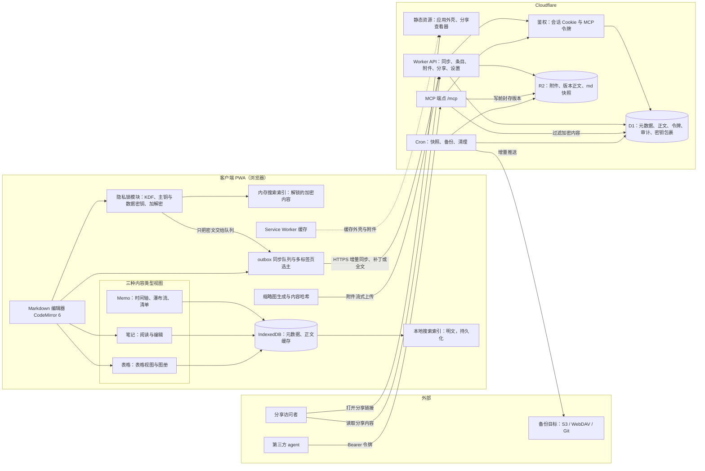
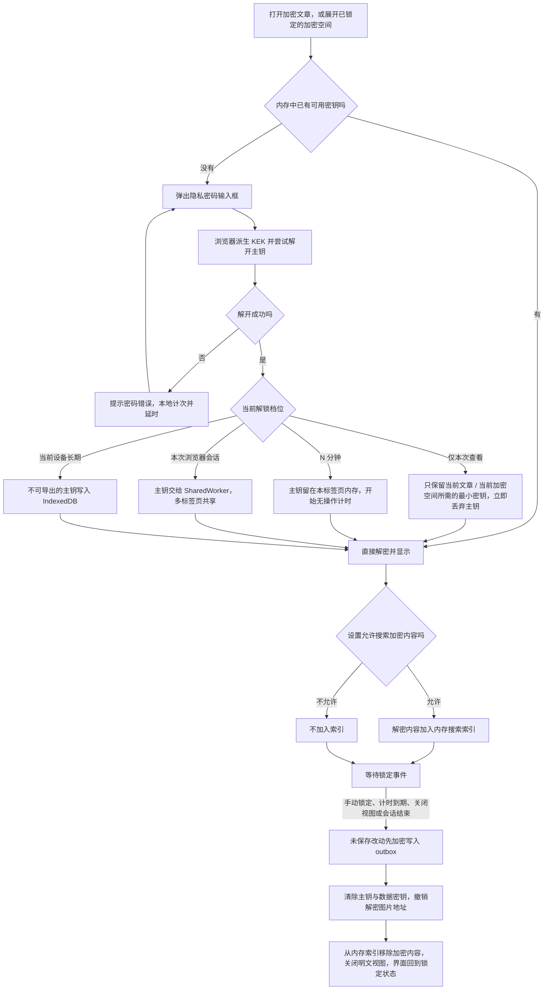
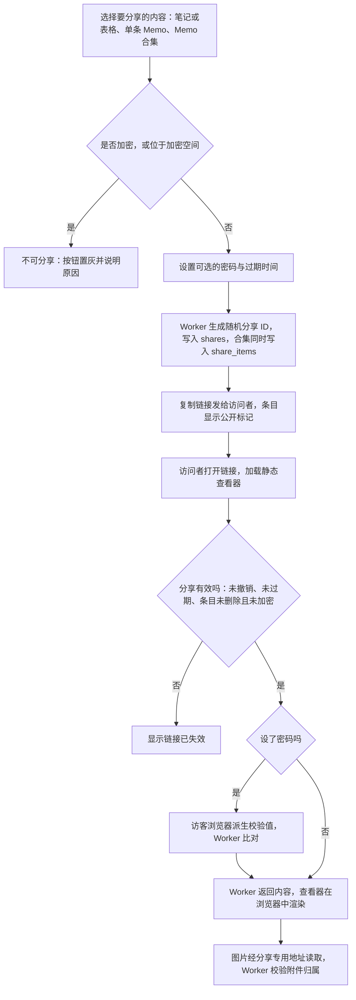

# Menote 产品设计（v7.3）

> 项目名：Menote
> 定位：个人自用的轻量笔记工具，以 Markdown 为基底，附带少量图片或小文件附件；可供 3–5 位家人各自独立使用。
> 参照项目：https://github.com/shuaiplus/inkstone （v0.8.0，本地 clone，见第二十一节，随时可查）
> 浏览器打开即可使用（PWA），数据在自己手里，随时可以通过 md 导出或 S3 / WebDAV / Git 备份拿走。

| 项 | 内容 |
|---|---|
| 文档版本 | v7.4（Memo 隐私模型重构：取消 Memo 逐条加密，改为明文存储 + 账户级"隐私浏览"界面门禁（默认开启、可在设置修改），写入永远免密；v7.3 产品评审后修订：明确“轻”的三层含义、文件夹最多三层、加密模型改为单一内置加密空间＋单篇加密＋Memo 逐条加密、初始管理员恢复为首位注册者即 owner；v7.2 在 v7.1 基础上小修订：永久删除范围与孤儿文件检查、外部备份删除策略、单条尺寸提示阈值、后续深入设计清单等；v7.1 在 v7 基础上合入用户对 14 条待决事项的决定，并新增功能架构图与操作流程图；v7 在 v6 边界讨论稿基础上改写） |
| 日期 | 2026-09-25 |
| 性质 | 设计文档，只讨论方案，不含应用代码；表结构以 SQL DDL 草案表示 |
| 部署目标 | Cloudflare 免费版：Workers + D1 + R2（静态资源由 Workers Static Assets 提供） |

### 标注约定

| 标注 | 含义 |
|---|---|
| 【已定】 | v6 已确定、v7 保留（可能修正了表述或细节） |
| 【v7 定】 | 本轮评审中用户已接受的修改 |
| 【v7.1 定】 | 用户对 v7 待决事项作出的决定，或随之确定的设计 |
| 【v7.2 定】 | 用户对 v7.1 及其 review 作出的决定 |
| 【v7.3 定】 | 本轮产品评审后用户更新的设定与决定 |
| 【v7.4 定】 | Memo 隐私模型修订中用户确定的设定与决定 |
| 【推荐，细则后续定】 | 当前给出的推荐写法；属于功能细则，在该功能做闭环设计时再定（见附一前的“后续深入设计清单”） |
| 【待核实】 | 依赖外部事实（平台限额、浏览器支持等），尚未从官方来源确认 |

---

## 一、定位、设计原则、全局约束与功能架构

> v6 的“〇、全局约束前提”和“一、设计原则”内容重复，v7 合并为本节。

### 1.1 定位【已定】

Menote 是用户自用的轻量笔记应用，目标是做一个比 Inkstone 形式更丰富的替代品：除长文笔记外，还提供表格（多维清单）和 Memo（碎片时间线）两种内容形态。

“轻”的具体含义【v7.3 定】：

1. **内容轻**：不做复杂笔记体系——无块化存储、无双链/反链图谱、无数据库式关系；三种内容类型都从 Markdown 自然延伸。
2. **数据轻**：受 Cloudflare 免费额度约束，数据以 md 为基准，附件 ≤ 20 MB、单条 ≤ 约 2MB，正文单独成表，版本与附件放 R2。
3. **交互轻**：交互逻辑简单直接——离线优先、乐观 UI、筛选/搜索/视图切换本地完成；不为省额度牺牲体验，也不为功能堆砌增加操作层级。

功能目标是**尽可能从 md 形式延伸，覆盖日常使用情境**（长文、碎片、清单、表格、隐私、分享、备份、AI 接入），但不引入超出 md 表达能力的内容体系。

### 1.2 设计原则

1. **Markdown 是所有数据的最终规范形式**【已定】。每一条内容在库里都是一篇完整的 md 原文（加密内容是 md 原文的密文），随时可以导出为 .md 文件；导出结果就是数据的最终形态。
2. **视图都是派生的**【已定】。表格视图、图册、瀑布流、看板、日历等都是前端对同一份 md 的不同渲染，新增视图不改数据模型。
3. **冲突不静默覆盖**【已定】。所有写入带期望版本号（乐观锁）；版本不一致时生成冲突副本或返回冲突错误，由人决定取舍。
4. **体验优先，只避开会爆额度的写法**【v7 定】。v6 的“免费额度内运行”原则保留为目标，但不再为省额度牺牲体验；设计上只禁止那些会让免费额度真正耗尽的写法（清单见第十九节）。
5. **重活放浏览器**【v7 定】。免费版 Worker 每个请求只有 10 ms CPU 时间（见第十九节），因此缩略图生成、密码哈希与密钥派生、加解密、压缩、ZIP 打包、Markdown 渲染、差异计算、全文检索都在浏览器端完成；Worker 只做鉴权、读写数据库和对象存储、转发字节流。

### 1.3 使用规模假设【v7 定】

- 1 位主要用户（重度使用），最多扩展到 3–5 位家人（轻度使用）。
- 每人独立空间，互不可见。
- 暂不做每用户配额（存储、请求数都不限），实例整体用量由 owner 在“数据管理”页面观察。

### 1.4 网络约束（大陆访问）【已定，v7 细化】

项目部署在 Cloudflare，大陆访问的连通性可能不稳定，网络波动是常态而不是异常。对所有功能的统一要求如下，具体机制见第十五节：

1. **离线优先**：打开过的内容、全部元数据缓存在浏览器本地（IndexedDB），界面先读本地、后台再与服务端对齐。
2. **交互本地化**：筛选、排序、搜索、视图切换在浏览器本地完成，不发网络请求。
3. **写入先落本地**：所有改动先写入本地 outbox 队列，再由后台按序上传，失败时带退避重试。
4. **乐观 UI**：弱网下操作立即在界面生效，同步状态以小标记显示（已同步 / 待上传 / 冲突）。
5. **减少往返**：打开文档一次读取；自动保存防抖；同步只拉增量。
6. **PWA 缓存**：应用外壳由 Service Worker 缓存，离线也能打开应用。
7. **冲突处理**：乐观锁 + 冲突副本，不静默覆盖。

**暂不考虑**：绑定自定义域名、备案、接入国内 CDN 等需要外部操作的网络优化，记入第二十节“暂不考虑”。

### 1.5 数据约束【已定】

数据以 md 为基准，永远可导出。数据库里的其他结构化字段（标签、任务字段、置顶等）要么能从 md 重新推导，要么是与内容无关的管理信息（如分享链接、令牌）。

### 1.6 功能架构设计图【v7.1 新增】

下图展示客户端（PWA）、Cloudflare 侧与外部参与方之间的模块关系。实线表示主要的数据或调用方向，虚线表示缓存或静态资源加载。



### 1.7 操作流程图索引【v7.4 修订】

| 流程 | 所在位置 |
|---|---|
| ① 解锁与锁定（解锁档位、超时、搜索索引加入与移除） | 6.8 |
| ② 分享 | 16.1 |

其余流程（隐私密码设置与恢复码、加密转换、保存与同步、自动备份、MCP 令牌调用）偏技术细节，产品文档不再配图，待技术文档阶段绘制。总架构图见 1.6。

---

## 二、内容体系总览（三类型 + 标记 + 派生视图）【已定】

### 2.1 三个内容类型（决定存储形态和主编辑器）

| 类型 | 一句话定位 | 主展示形态 | 可加密 |
|---|---|---|---|
| 笔记 | 长文知识 | 文章阅读 / 编辑 | 可以 |
| 表格 | 多维清单 | 表格 / 图册（日历、看板等衍生视图后期再议） | 可以 |
| Memo | 碎片流水 | 时间轴 / 图片瀑布流 / 清单（列表、看板） | 内容明文不加密；浏览受"隐私浏览"门禁保护（8.9） |

### 2.2 标记是叠加的开关（不改变类型本身）

- **加密标记**：标识单篇加密的笔记/表格，或位于加密空间内的内容；两者相互独立（详见第六节）。Memo 不使用加密标记：其隐私保护是账户级的"隐私浏览"界面门禁（见 8.9）。
- **公开标记**：创建分享链接后产生，取消分享即移除。它是附加动作的结果，不是状态分类。加密内容不能分享。
- **清单标记**：加在 Memo 上，使其成为任务条目，附加状态 / 日期 / 优先级三个可选字段。
- **附件标记**：区分原图 / 缩略图。缩略图不算独立附件，不进统计，生命周期跟随原图。

### 2.3 视图是派生的（纯前端渲染，不动数据模型）

- 表格 → 图册模式（已定）→ 后期可衍生日历视图（有时间字段）、看板视图（有状态字段）。
- Memo → 瀑布流（图片网格）、清单界面（列表 / 看板，筛选出带清单标记的条目）。
- 每加一种视图 = 纯前端渲染 + 一份 YAML 配置，存储模型不变。

---

## 三、存储架构【已定，v7 修正细节】

D1 为主、R2 为辅。

### 3.1 分工

| 存储 | 存什么 | 说明 |
|---|---|---|
| D1 | 用户、文件夹、每条内容的**当前稿**（md 原文整篇存一个字段，不打散；正文单独存放在只含“ID + 正文”的表中，单条上限约 2MB）、元数据（标签、任务字段、置顶等）、版本元数据、令牌、审计日志、密钥包裹、设置 | 数据库即真相。单库上限 500 MB（免费版），是全系统最紧的存储上限，所以大体量数据不放 D1 |
| R2 | 附件与缩略图、**版本历史正文**（压缩后）、md 快照目录 | 免费 10 GB-月，按对象存取，适合大块数据 |
| 浏览器 IndexedDB | 元数据与内容的本地副本、outbox 队列、明文内容的本地搜索索引 | 离线优先的基础；加密内容的明文永不写入 |

v7 相对 v6 的调整：版本历史正文从 D1 移到 R2（D1 只留版本元数据），原因是版本数据会持续累积，放在 500 MB 上限的 D1 里是唯一可能把 D1 存储撑满的来源（估算见第十九节）。

### 3.2 md 快照目录（备份与导出的统一格式）

快照是按统一目录结构组织的一组 md 文件，WebDAV / S3 / Git 备份与 ZIP 导出都使用这一格式：

```
menote-snapshot/
├── manifest.json          # 清单：内容列表、附件列表、每个文件的哈希、快照格式版本
├── notes/                 # 一篇一个 .md（笔记、表格），按文件夹层级组织
│   └── 读书/书单.md
├── memos/                 # 按月（或按周，可配置）收纳，如 memos/2026-09.md
├── _attachments/          # 附件与缩略图，按内容哈希命名
│   └── enc/               # 加密附件（密文，随机 ID 命名）
└── _keys/keys.json        # 加密内容的密钥包裹（见第六节），不含任何明文密钥
```

v7 的三处修正：

1. **R2 内的快照不复制附件**。附件本来就以内容哈希命名、写入后不可变，R2 中的快照只物化文本文件和 manifest，manifest 通过哈希引用附件；`_attachments/` 目录只在推送到外部备份目标或打包 ZIP 时才物化。否则每张图片在 R2 里会存两份，直接把 R2 存储用量翻倍。
2. **快照是增量维护的**。不做“定时全量重新生成”，而是由变更队列驱动（见 16.3）：某条内容变化后，只重写它对应的那个文件（Memo 则重写它所在的月份文件）。
3. **ZIP 导出在浏览器组装**，与服务端快照共用同一套格式和同一份格式生成代码（前后端共享一个 TypeScript 模块），但不一定共用 R2 里的同一份文件。

### 3.3 加密内容与存储架构

隐私锁（第六节）不影响存储架构：加密内容在 D1 中就是密文 blob，快照和备份里也是密文，服务端不需要知道隐私密码。

---

## 四、数据骨架【已定，开发中走版本化迁移】

### 4.1 实体

v6 列了五样实体，v7 按实际需要补全为下表（新增的都是 v6 中已隐含存在的东西，如文件夹、分享链接）：

| 实体 | 说明 |
|---|---|
| 用户 | 每人独立账号 |
| 文件夹 | 笔记和表格的组织结构；可加密 |
| 条目（item） | 笔记、表格、Memo 三种类型共用一张表，用类型字段区分；笔记与表格是一等公民，Memo 共用存储体系；正文单独存放在正文表中 |
| 附件 | 图片、小文件，挂在条目下；缩略图从属于原图 |
| 版本记录 | 按规则生成的历史版本（不再是“每次保存留一份”，见第十二节） |
| 分享链接 | 单篇只读分享，存在即代表“公开标记” |
| 密钥包裹 | 隐私锁的主钥包裹与每个加密对象的数据密钥包裹 |
| MCP 令牌 / 审计日志 | 第三方 agent 访问凭据与写操作记录 |
| 设置 / 备份目标 | 用户设置、备份配置与增量状态 |

### 4.2 归属关系

- 附件 → 条目（图册、瀑布流、孤儿清理、备份依赖这层关系；引用关系由客户端显式上报，因为服务端读不懂加密条目的正文）。
- 条目 → 文件夹（Memo 不进文件夹树，属于时间线）。
- 条目 / 文件夹 → 用户（每人各管各的，互不可见）。
- 版本记录 → 条目（找回旧版本）。

### 4.3 类型标记

| 类型 | 说明 |
|---|---|
| 普通笔记 | 默认，纯 Markdown |
| 表格 | 带表格标记（YAML 中 `type: table`）的 md，定制化编辑/展示；格式坏了可降级回普通笔记 |
| Memo | 带 memo 标记的碎片短文，可叠加清单标记 |

### 4.4 演进规则

- 开发中增加字段或表，走版本化、幂等的迁移（每次改动有版本号、可重复执行）；借鉴 Inkstone 的“自愈 schema”做法（见第二十一节）。
- 不追求一次想全，但骨架（实体关系、关键标记字段、快照结构）不在开发中推翻。

### 4.5 文件夹层级限制【v7.3 定】

- 文件夹树最多三层：根目录 / 第一层文件夹 / 第二层文件夹 / 条目。即文件夹最多两层嵌套，条目可位于根目录、第一层或第二层文件夹中。
- 加密空间内部适用同一限制（空间 / 第一层文件夹 / 第二层文件夹 / 条目）。
- 服务端在校验文件夹创建与移动时强制执行；界面在第二层文件夹上不再提供“新建子文件夹”入口，避免用户先操作再撞错误提示。

---

## 五、用户模式与部署【已定，v7 修正注册与认证】

### 5.1 核心设定

- 认证方式：用户名 + 登录密码。
- 每人独立存储空间，各管各的内容，互不可见，互不干扰。
- 不需要权限管理，不存在共享文件夹，不存在团队空间，不做邀请与审批流程。

### 5.2 部署形态与注册开关【v7 定】

| 形态 | 说明 |
|---|---|
| 单人部署 | 只有 owner 一个账号，注册开关保持关闭 |
| 家庭部署 | owner 临时打开注册开关，家人注册后关闭 |

- **开放注册是一个开关，默认关闭**。只有 owner 能在后台切换。开关支持“到期自动关闭”（如 24 小时后），避免忘记关【v7.1 定】。
- 两种形态只差这一个开关，核心体验一致。

### 5.3 初始管理员【v7.3 定：沿用 Inkstone 做法】

- 库中没有用户时，第一个注册的账号自动成为 owner（与 Inkstone 一致，源码见第二十一节）。
- 注册开关默认关闭（5.2）：部署完成后 owner 应尽快注册自己的账号；从部署完成到 owner 注册之间存在被他人抢注的理论窗口，家庭自用 + 及时注册的场景下可接受——这是 Inkstone 同样接受的取舍。
- 家人注册：owner 临时打开注册开关，家人注册后关闭，支持到期自动关闭。
- v7 曾设计一次性初始化令牌（`SETUP_TOKEN`）以消除抢注窗口，v7.3 按用户决定取消，恢复首位注册者即 owner 的方案。

### 5.4 登录密码的处理（重活放浏览器）【v7 定】

免费版 Worker 每请求 10 ms CPU，在 Worker 里跑 PBKDF2（数十万次迭代）或 Argon2 会超时，因此密码的慢哈希放在浏览器端：

1. 登录时浏览器先按用户名取回盐值和 KDF 参数（对不存在的用户名，服务端用 `HMAC(服务端密钥, 用户名)` 生成确定性的假盐，避免借此探测用户名是否存在）。
2. 浏览器用 Argon2id（wasm）或 PBKDF2 派生出登录密钥，提交给服务端。
3. 服务端只做一次 `HMAC-SHA256(AUTH_PEPPER, 登录密钥)` 并与库中存储的校验值比较，CPU 开销可以忽略。`AUTH_PEPPER` 存 Worker Secret，不进数据库。
4. 库被拖走时，攻击者既要离线爆破慢哈希，又缺少 pepper。

说明：浏览器派生出的登录密钥在传输中相当于密码（依赖 HTTPS 保护），这与传统“明文密码经 HTTPS 提交、服务端哈希”的安全性相当，只是把慢哈希的计算位置从服务端挪到了客户端。

- 会话：登录成功后下发随机 256 位会话令牌（Cookie：HttpOnly、Secure、SameSite=Lax），库里只存其 SHA-256；有效期滑动 30 天，`last_seen_at` 每天最多更新一次，避免每个请求都写库。
- 限速：登录失败按“用户名 + IP”计数，只在失败时写库；连续失败后指数延长冷却时间。
- 登录密码与隐私密码（第六节）是两个独立的密码，界面上提示用户不要设成相同。

### 5.5 内容归属与分享

- 内容默认是个人的，仅自己可访问，无需任何标记。
- 分享是附加动作：创建分享链接时才生成（可设密码 + 过期时间），产生公开标记；取消分享，标记移除，链接失效。
- 分享权限只读，对方不可编辑。
- 笔记、表格、单条 Memo 和 Memo 合集都可以分享（16.1）。
- **加密文章、加密空间内的所有文章都不能分享**（服务端在创建分享时强制校验；已分享的内容被加密或移入加密空间时，相关分享自动撤销并提示）。Memo 明文存储，分享不受隐私浏览门禁影响（8.9）。
- 文件夹仅自己可访问，天然是个人空间，无需权限设计。

---

## 六、隐私锁（加密）【v7.3 修订】

### 6.1 定位

隐私锁用于在不够私人的场合（例如在公司、在别人面前打开 Menote）保护私密内容（例如个人日记）：查看这些内容需要输入第二个密码（隐私密码）。

- 它**不是端到端加密**，文档中不使用“端到端”的说法。威胁模型是“身边的人看到屏幕或借用已登录的设备”。它不以对抗恶意服务端为目标（例如被篡改的前端代码可以在用户输入时截获隐私密码）。
- 实现上，加解密在浏览器端完成，服务端只存密文。这样做的好处是：备份天然是密文；服务端和实例管理员都拿不到隐私密码；数据库或备份泄露时私密内容仍受保护。

### 6.2 隐私锁的三个机制【v7.4 定】

| 机制 | 作用对象 | 说明 |
|---|---|---|
| 加密空间 | 账户内置的单一空间（含内部文件夹层级） | 始终存在、不可删除、不能创建第二个；空间内的文件夹名、标题、正文、附件全部加密 |
| 单篇加密 | 任意一篇笔记/表格 | 独立开关，创建时或之后随时勾选/取消；不在加密空间内时标题明文 |
| Memo 隐私浏览 | 账户的全部 Memo | 账户级设置（默认开启）：内容明文存储，写入免密，浏览是否需要隐私密码可配置（8.9） |

设计变化（v7.3）：取消 v6–v7.2"任意文件夹可设为加密 + 加密根子树"的模型（原 6.3 的 12 种移动/嵌套场景矩阵随之删除），不再有加密根、子树归属、跨根移动等概念；文件夹级加密能力收敛为一个内置的加密空间。简化理由：威胁模型是"身边的人看到屏幕"，单一空间 + 单篇开关已覆盖日记等典型场景，避免子树转换与移动矩阵的长期维护成本。

设计变化（v7.4）：Memo 取消逐条加密，删除"锁定时写入需输入隐私密码验证"的仅写入模式与输入框加密开关；Memo 改为明文存储 + 隐私浏览界面门禁，详见 8.9。

### 6.3 加密空间【v7.3 定】

**基本规则**

- 每个账户有一个内置的加密空间，始终存在，不可删除，也不能创建第二个。侧边栏中作为固定顶级节点，名称明文、可重命名（默认“加密空间”）。
- 空间内同样最多三层：加密空间 / 第一层文件夹 / 第二层文件夹 / 条目，层级限制与普通文件夹树一致（见 4.5）。
- 空间内的文件夹名称、文章标题、正文、附件全部加密：标题与名称用空间密钥（DEK_s），正文用文章自己的数据密钥（DEK），见 6.6。
- 锁定状态：空间节点显示锁图标，不可展开、不显示条目数，点击弹出解锁框；解锁后作为普通文件夹树使用。

**移入与移出**

| 操作 | 处理 |
|---|---|
| 把文章移入加密空间 | 生成 DEK 加密正文与附件，标题用 DEK_s 加密；经本地批量转换任务逐篇完成（6.4），全部完成后提交移动；转换期间该条目立即对 MCP 不可见 |
| 把文章移出加密空间 | 提示“移出后将以明文保存”；逐篇解密为明文；若该文章同时开启了单篇加密，则正文保持加密、标题变回明文 |
| 在空间内新建、同层或跨层移动 | 与其他文件夹规则一致；空间内文章天然处于加密状态，无需单独勾选 |

（所有涉及加密或解密的操作都要求处于解锁状态，并在浏览器端完成。）

### 6.4 批量转换

涉及多篇文章的加密/解密（移入/移出加密空间、勾选或取消单篇加密）在浏览器中生成一个本地转换任务（存 IndexedDB），逐篇加密或解密并经 outbox 以 `base_rev` 条件上传，界面显示进度（如“加密中 12 / 40”）；中断后在下次解锁时继续。每篇文章在任一时刻要么是完整的明文，要么是完整的密文；移动或标记变更在全部转换完成后最后提交。转换过程中带加密标记的条目立即对 MCP 不可见。

### 6.5 标题与名称规则【v7.3 定】

| 对象 | 标题/名称 |
|---|---|
| 不在加密空间内的单篇加密文章 | 明文 |
| 加密空间的名称 | 明文 |
| 加密空间内的文件夹名称与文章标题 | 用空间密钥 DEK_s 加密 |
| Memo | 无独立标题；隐私浏览锁定时整条以占位显示（8.9） |

理由同 v7.1：锁定是浏览器端状态，服务端不知道某个会话是否已解锁；只有把空间内的标题和名称也加密，锁定时客户端拿到的才只是密文，"锁定时内容不可访问"才真正成立。已知的元数据泄露（接受）：条目与文件夹的数量、大小、修改时间、置顶/收藏标记、附件数量、层级结构在服务端可见。Memo 的隐私浏览是界面门禁，其内容在服务端、本地缓存与备份中均为明文（8.9）。

### 6.6 密钥结构【v7.3 修订】

```
隐私密码 ──(浏览器端 KDF：Argon2id，兜底 PBKDF2)──> 密码包裹钥 KEK ─┐
恢复码   ──(HKDF-SHA256)──────────────────────────> 恢复包裹钥 ───┤ 任一可解开
                                                                   ▼
                                                    主钥 MK（随机 256 位，账户内唯一）
                                                                   │ 解开
                        ┌──────────────────────────────────────────┼─────────────────────────┐
                        ▼                                          ▼                         ▼
            每篇加密文章的数据密钥 DEK                     加密空间的数据密钥 DEK_s      （附件使用所属文章的 DEK）
            → 加密正文、附件、缩略图                       → 加密空间内的标题与文件夹名
```

- 隐私密码派生包裹钥 KEK，KEK 解开随机生成的主钥 MK；改隐私密码只需重新包裹 MK；恢复码同样依赖不变的 MK，否则改密码后恢复码会失效。
- 每篇加密文章（单篇加密或加密空间内文章）各有一把随机数据密钥 DEK，用 MK 包裹后存在 `data_keys`（scope = 'item'）；Memo 不加密，不涉及数据密钥。
- 加密空间有一把空间数据密钥 DEK_s，用 MK 包裹（scope = 'space'），只加密空间内的标题与文件夹名；空间内移动文章不涉及重新加密，移入/移出空间才需要逐篇转换（6.3、6.4）。
- 内存中的密钥一律为不可导出（non-extractable）的 CryptoKey；正文、附件、标题、名称用 AES-256-GCM（每次新随机 96 位 IV，AAD 绑定“对象 ID + 密钥 ID + 格式版本”）；密钥包裹用 AES-KW 或 AES-GCM wrapKey。

**KDF 参数**：同 v7.1——Argon2id m = 64 MiB、t = 3、p = 1；wasm 加载失败或设备内存不足时退回 PBKDF2-SHA256 600,000 次迭代。KDF 只在解锁那一刻运行一次。

### 6.7 设置隐私密码与恢复码【v7.1 定】

1. 用户在设置中开启隐私锁，输入两次隐私密码；界面提示不要与登录密码相同，并说明隐私锁的作用范围。
2. 浏览器生成随机主钥 MK 和一次性恢复码（128 位随机数，编码为 8 组 4 位的 base32 字符串，如 `K7QM-3X2P-…`）。
3. **强制保存恢复码**：显示恢复码并提供“下载为文本文件”“复制”两种方式；用户必须勾选“我已妥善保存恢复码”，并回填恢复码中随机抽取的两组字符，校验通过后才能继续。未完成这一步，隐私锁不会启用，也不能加密任何内容。
4. 明确告知（红色提示，需勾选确认）：**隐私密码和恢复码都丢失时，加密内容将永久无法恢复**，服务端和管理员都无能为力。
5. 浏览器用 KEK 和恢复包裹钥分别包裹 MK，连同 KDF 参数与盐上传；服务端写入 `user_crypto`。此后才可以开始加密内容。

**重新生成恢复码**：需先解锁。浏览器生成新恢复码，同样走“保存 + 回填确认”，再用新恢复码包裹 MK 并替换服务端的旧包裹；旧恢复码立即作废。适用于怀疑恢复码泄露或找不到恢复码但仍记得隐私密码的情况。设置页显示恢复码的生成时间，提醒用户确认自己仍保存着它。

说明：恢复码确认是启用隐私锁的前置条件，这一步保证不会出现“用户从来没保存过恢复码就开始加密”的情况。

### 6.8 解锁状态与时限（可在设置里修改）

| 选项 | 行为 | 密钥存放位置 |
|---|---|---|
| 仅本次查看 | 解开当前这一篇或当前加密空间所需的最小密钥后立刻丢弃 MK，只在内存中保留所需的 DEK；关闭或离开即重新锁定 | 当前标签页内存 |
| N 分钟（如 5 分钟） | 解锁后 N 分钟内无需再次输入；按无操作时间计时，到期自动锁定 | 当前标签页内存（不可导出 CryptoKey） |
| 本次浏览器会话 | 同一浏览器的多个标签页共享解锁状态，所有 Menote 标签页关闭后失效 | SharedWorker 的内存中（不可导出 CryptoKey），各标签页通过它加解密；SharedWorker 在最后一个标签页关闭时销毁【浏览器支持待核实：Safari 16 起支持 SharedWorker】 |
| 当前设备长期 | 该设备上一直保持解锁 | 不可导出的 CryptoKey 存入 IndexedDB。界面明确说明：**这等于在该设备上关闭隐私保护**，任何能打开这个浏览器的人都能看到私密内容（虽然无法导出原始密钥字节）；提供“锁定此设备”按钮删除它 |

- 由于整个账户只有一个隐私密码，在"N 分钟 / 本次会话 / 当前设备长期"三个档位下，一次解锁即解开该账户的全部加密内容；"仅本次查看"档位只解开当前文章或当前加密空间。Memo 的隐私浏览门禁跟随解锁状态：除"仅本次查看"外，解锁后 Memo 可见，锁定后隐藏（8.9）。
- 任何时候都可以点“立即锁定”。
- 锁定时：先把正在编辑的加密内容的未保存改动加密后写入 outbox，再清除内存中的 MK 和所有 DEK，撤销已生成的解密图片 `blob:` URL，从内存搜索索引中移除加密内容，关闭已打开的明文视图。
- 解密后的明文**永远不写入** IndexedDB、Cache Storage、localStorage 或 Service Worker 缓存；加密文章的离线草稿在进入 outbox 之前先加密。
- 输错隐私密码时在本地计次并逐次增加等待时间（服务端不参与密码校验，因此这只是界面层面的减速）。



说明：四个档位只决定密钥在哪里、保留多久；锁定时的清理步骤对所有档位都相同。

### 6.9 加密状态的界面标识【v7.3 修订】

所有状态标识同时使用图标、文字和颜色，不单靠颜色区分。

**全局状态胶囊（顶栏右侧，所有页面可见）**

| 状态 | 显示 | 点击行为 |
|---|---|---|
| 未启用隐私锁 | 不显示 | — |
| 已锁定 | 灰色锁形图标 + “已锁定” | 打开解锁框 |
| 已解锁 · N 分钟档 | 琥珀色开锁图标 + “已解锁 · 4:32”（倒计时，每秒刷新；无操作才计时，有操作时重置） | 菜单：立即锁定 / 更改档位 |
| 已解锁 · 本次会话 | 琥珀色开锁图标 + “已解锁 · 本次会话” | 同上 |
| 已解锁 · 当前设备长期 | 红色开锁图标 + “本设备始终解锁” + 警示角标 | 同上，另有“锁定此设备” |
| 仅本次查看 | 在编辑器顶部显示（见下），全局胶囊仍为“已锁定” | — |

倒计时剩余 30 秒时胶囊闪烁一次，并在编辑器顶部提示“即将自动锁定，未保存的内容会先加密保存”。

**侧边栏（文件夹树）**

- 加密空间：固定顶级节点，名称明文（可重命名，默认“加密空间”），名称前显示锁形图标。锁定时为实心灰锁，不显示展开箭头和条目数，点击即弹出解锁框；解锁后为开锁图标，作为普通文件夹树展开使用。
- 加密空间内的文件夹：锁定时随空间整体隐藏；解锁后显示，名称前带一个小的锁角标。
- 批量转换进行中：空间名或文件夹名后显示进度环与“加密中 12/40”。

**列表（文章列表、搜索结果、最近、收藏）**

- 锁定的单篇加密文章：明文标题 + 锁图标，摘要位置显示“已加密”，不显示字数。
- 解锁后的加密文章：开锁图标 + 在内存中解密得到的摘要。
- 锁定的加密空间被打开时：列表区域只显示占位“此空间已锁定”和“解锁”按钮，不显示任何条目，也不显示条目数量。
- 搜索结果中来自加密内容的命中：带开锁图标和“解锁期间可见”标注；锁定后这些结果立即从列表中消失。
- 置顶、收藏、最近列表中出现的加密空间内文章，以及隐私浏览锁定时的 Memo：锁定时以"已锁定的条目"占位显示，不显示内容。
- 隐私浏览开启且锁定时：Memo 时间轴、瀑布流与清单界面整体显示锁定占位与"解锁"按钮，不显示内容、标签与图片（8.9）。

**编辑器顶部状态条（打开加密文章时常驻）**

| 状态 | 显示 |
|---|---|
| 单篇加密 · 已解锁（N 分钟档） | 琥珀色条：“加密笔记 · 已解锁 · 4:32 后自动锁定”，右侧“立即锁定” |
| 加密空间内 · 已解锁 | 琥珀色条：“加密空间 · 已解锁 · 本次会话”，右侧“立即锁定” |
| 仅本次查看 | 琥珀色条：“仅本次查看 · 关闭即锁定” |
| 当前设备长期 | 红色条：“本设备始终解锁”，右侧“锁定此设备” |
| 锁定后 | 编辑区替换为锁定占位页（标题按规则显示或隐藏），中间是“输入隐私密码解锁”按钮 |

编辑器保存状态标记（已同步 / 待上传 / 冲突）旁额外显示“已加密保存”，让用户确认离线草稿也是密文。

### 6.10 搜索、分享、导出、备份

- **搜索**：解锁期间，加密内容解密后加入一个只存在于内存中的独立索引，可以被搜到；重新锁定后从索引中移除，搜不到。这个索引绝不持久化。设置里提供开关"解锁时可以搜索加密内容"。加密内容的标签只在解锁后于浏览器内可见，服务端不保存加密条目的标签。
- **Memo 隐私浏览**：Memo 明文存储并进入本地持久搜索索引；隐私浏览开启且锁定时，Memo 不出现在搜索结果中，解锁后恢复（8.9）。导出与备份不受门禁影响。
- **分享**：加密文章以及加密文件夹（含子文件夹）里的所有文章都不能分享（见 5.5、16.1）。
- **导出**：加密内容只能在解锁状态下导出，导出的是明文；锁定状态下不能导出，也不能分享。全量 ZIP 导出时如果仍处于锁定状态，加密条目会被跳过并列出清单，提示用户解锁后再导出。
- **自动备份**：S3 / WebDAV / Git 备份在服务端后台进行，此时没有解锁，所以备份中是密文（外加 `_keys/keys.json` 中的密钥包裹，包括密码包裹与恢复码包裹）。恢复时把备份导回 Menote，再用隐私密码或恢复码解锁即可，**不需要离线解密小工具**。加密空间在快照中以空间的明文名称作为目录名，其下的文件夹和文章以 ID 命名（名称与标题在密文中）。
- 备份包含“密码包裹的主钥”，意味着拿到备份的人可以离线尝试爆破隐私密码；这是“备份可独立恢复”的代价，由 KDF 强度抵御（恢复码为 128 位随机数，不可爆破）。

### 6.11 附件、版本历史与加密转换

- **附件**：加密文章里的图片、附件和缩略图也在浏览器端用该文章的 DEK 加密后上传。它们不使用内容哈希命名（明文哈希会暴露“两份文件相同”），而是随机 ID 命名；不走公开缓存，解锁后在浏览器内解密显示。密文本身可以由浏览器私有缓存（`Cache-Control: private`），解密后的明文只存在于内存。
- **版本历史**：加密文章的版本也是密文（先压缩再加密）；查看差异时在解锁后于浏览器端解密两个版本再计算 diff。
- **加密时的旧明文清理**：把明文文章加密（勾选单篇加密或移入加密空间）时，服务端上已有的明文版本历史和明文附件也必须处理，否则明文仍残留在服务端：
  - 旧版本：默认由浏览器下载、加密后替换；用户也可以选择直接删除旧版本；
  - 明文附件：改为加密副本，原明文对象若不再被其他条目引用则删除；
  - 相关分享链接自动撤销；
  - 提示：**已经推送到外部备份目标的旧明文副本无法由 Menote 收回**，需要用户自行清理外部备份。
- **解除加密**：确认“将以明文保存”后，浏览器逐篇解密并以明文上传；密文版本默认解密后以明文替换（保持历史可被正常查看、搜索和 MCP 读取），加密附件改为明文附件；最后删除不再使用的数据密钥包裹。

### 6.12 忘记隐私密码：恢复码【v7.1 定】

- 恢复方式只有恢复码。管理员**不能**查询或重置任何人的隐私密码。
- 忘记隐私密码时：在解锁框点“忘记隐私密码” → 输入恢复码 → 浏览器用恢复码解开 MK → 设置新隐私密码 → 用新 KEK 重新包裹 MK；同时强制生成新的恢复码（走“保存 + 回填确认”），旧恢复码作废。原有加密内容不受影响。
- **隐私密码和恢复码都丢失时，加密内容永久无法恢复。** 这一点在启用隐私锁、重新生成恢复码、忘记密码三个界面上都明确写出。
- 恢复码记得、隐私密码也记得，只是恢复码丢了：解锁后在设置里“重新生成恢复码”。

说明：整个过程中主钥只在用户自己的浏览器里出现，服务端只保存和替换包裹。

管理员后台恢复（重置隐私密码）的方案在本版中删除，以后再议。

### 6.13 MCP 与加密内容

加密内容（单篇加密文章与加密空间内文章）对 MCP 一律不可见，与令牌权限无关：服务端对 MCP 的所有查询都附加"既非单篇加密、也不在加密空间内"的条件（第十七节）。Memo 不加密，其可见性由令牌的"包含 Memo"配置控制（17.3）；隐私浏览门禁不改变 MCP 的权限模型。


---

## 七、功能形态

### 7.1 核心

1. **Markdown 编辑器**：基于 CodeMirror 6；三种编辑模式可切换——**双栏实时预览（默认）**、仅编辑 / 仅预览、**即时渲染**【v7.4 定】：类 Typora / Obsidian Live Preview，正文直接呈现渲染样式，光标所在处显示 Markdown 源码，不再有独立预览栏。GFM、快捷键、大纲、预览同步滚动、自动保存。v7 去掉了打字机模式、专注模式这类编辑器功能。
   - 即时渲染在此只定功能需求：覆盖哪些语法元素、GFM 表格与图片在即时渲染中的交互方式等细则，以及性能要求与实现约束，在编辑器闭环设计与技术文档中再定。该模式是纯展示层，不改变"整篇 md"的编辑粒度（第十一节）。
2. **文件夹树 + 本地全文搜索**：搜索在浏览器本地完成（第十三节）。
3. **标签、置顶、收藏**：全站共用一套标签体系；标签来自 md 本身（YAML `tags` 字段或正文中的 `#标签`），服务端只保存派生出的标签列表。
4. **附件管理**：图片粘贴/拖入自动上传、附件列表、按引用关系统计并清理孤儿附件（v6 此条标题误写为“私密文件夹”，v7 更正；详见第十四节）。
5. **版本历史**：可查看、恢复历史版本，附简易 diff（第十二节）。
6. **回收站**：删除先进回收站，默认保留 30 天后永久删除（天数可设置）；MCP 的“移到回收站”权限即对应这里。永久删除会一并删除该条目的全部版本、R2 快照中的对应文件和不再被引用的附件，另有定期孤儿文件检查清理残留（14.4）【v7.2 定】。

### 7.2 分享与输出

- 公开分享链接（只读，可设密码 + 过期时间，对方不可编辑）：单篇笔记 / 表格、单条 Memo、Memo 合集；加密内容不可分享。
- 导出：单篇 md / 全量 ZIP / 推送到 Git 仓库。
- WebDAV 备份 + S3 协议备份 + Git 备份 + R2 内的增量快照，共用同一快照格式。
- WebDAV / S3 / Git 都是**单向备份目标**：Menote 向它们写入，不从它们同步回改动（仅在用户主动“从备份恢复”时读取）；Menote 自身也不提供 WebDAV 服务端接口供外部编辑。每个备份目标可以选择“同步删除（镜像）”或“只增不删”（16.3）【v7.2 定】。（v6 写作“WebDAV 只做备份/只读，不开放写入”，含义容易误解，v7 改为此表述。）

详见第十六节。

### 7.3 锦上添花（可选模块）

每日随机回顾、笔记模板、RSS 输出公开笔记、AI 辅助（摘要、标签建议）。

### 7.4 界面布局【v7.4 定：整体设想，细则后续定】

**整体结构**：左右两栏。左侧为功能栏（固定），右侧为主操作区，内容跟随功能栏当前选择变化。

**功能栏（自上而下）**

| 区域 | 内容 |
|---|---|
| 新建笔记按钮 | **一键新建笔记并打开编辑器**，不弹出分类选择；表格与文件夹的新建入口在笔记本视图中提供 |
| 待办按钮 | 功能栏单独放置；点击后快速录入框切换为待办录入（见下） |
| 快速录入框 | 多行文本输入框，默认为 **Memo** 录入；模式由入口按钮决定（见下） |
| 导航 | 首页（启用时显示，见下）、最近编辑、收藏、笔记本（即文件夹树）、标签、隐私空间（即加密空间，锁定状态与图标见 6.9） |
| 底部 | 设置入口（7.5） |

**快速录入框的录入模式（由入口按钮决定）**

| 入口 | 行为 |
|---|---|
| 快速录入框（默认） | 等同 8.7 的快速输入框：Ctrl+Enter 发布，进时间轴；写入永远免密（8.9） |
| 待办按钮 | 等同 Memo + 清单标记（9.2），提供日期与优先级的快捷选择【细则后续定】 |

笔记由"新建笔记按钮"一键创建；表格需要先定义列结构（10.2），表格与文件夹的新建入口在笔记本视图中提供。

**主操作区（跟随功能变化）**

| 功能栏选择 | 主操作区 |
|---|---|
| 首页 | 概括预览 + 快捷方式 + 快速导航（见下） |
| 最近编辑 / 收藏 / 标签 | 条目列表（笔记与表格混排，图标区分类型），点开进入阅读或编辑 |
| 笔记本 | 选中文件夹后：**笔记列表 + 正文双栏**（借鉴 Inkstone）；表格与笔记在同一列表混排，点击表格进入表格编辑视图 |
| 隐私空间 | 锁定时不可展开、不显示条目（6.9）；解锁后布局同笔记本 |
| Memo 视图 | 时间轴 / 瀑布流 / 清单（8.4、9.4） |

**首页**【v7.4 定：功能需求，细则后续定】

- 主操作区的落地视图之一，内容暂定三类：**概括预览**（条目统计、今日待办、最近动态等概览卡片）、**快捷方式**（常用内容或操作的快捷入口）、**快速导航**（文件夹、标签与常用视图的入口）。
- 概览数据由客户端从本地元数据计算，不发额外网络请求（与 19.5 的行读写约束一致）。
- 是否使用首页由设置控制（7.5 通用）：**启动视图**可选首页 / 最近编辑 / 收藏【推荐默认：首页】；未选首页时功能栏不显示首页项，启动后直接显示所选的最近编辑或收藏。

**表格与笔记的关系**：表格条目与笔记放在同一文件夹与列表中，仅编辑样式不同——存储同为"一篇 md"（10.2）；笔记用 CodeMirror 编辑器（7.1），表格用增强表格编辑模式（10.7）。交互形态类似 Notion 的数据库表格：一张表格 = 一个条目 = 一篇 md，图册等视图是表格内部的切换（10.8）。

**滑出详情侧栏**【推荐，细则后续定】：部分模式（如最近编辑、收藏、搜索结果、清单看板卡片）点击后从右侧滑出侧边栏显示详情，按需使用；哪些场景用滑出、哪些进入全页，做各功能闭环设计时再定。

窄屏（PWA 移动端）的布局适配暂不细化，列入后续深入设计清单。

### 7.5 设置【v7.4 定：按分类分子页面】

借鉴 Inkstone 的组织方式：设置为独立区域，**按功能域分子页面**，左列分类导航、右侧为当前分类的设置内容（与主界面一致的左右结构）。入口位于功能栏底部（7.4）。

**两级归属**：设置默认为个人设置（存 `user_settings`，18.2，带 `rev` 乐观锁，家人各自独立）；仅 owner 可见可改的实例级设置单独归入"实例管理"子页面。

子页面划分（第一版，随各功能闭环设计调整）：

| 子页面 | 收录的设置 | 依据 |
|---|---|---|
| 账户与安全 | 修改登录密码；登录设备与会话管理 | 5.4；后续深入设计清单 2、4 |
| 通用 | 启动视图（首页 / 最近编辑 / 收藏，推荐默认首页）；时区（默认 Asia/Shanghai）；界面偏好【细则后续定】 | 7.4、8.2 |
| 编辑器 | 默认编辑模式（双栏 / 仅编辑 / 仅预览 / 即时渲染） | 7.1 |
| 隐私锁 | 启用 / 关闭隐私锁；修改隐私密码；重新生成恢复码；解锁档位默认值；"解锁时可以搜索加密内容"开关；"Memo 浏览需要隐私密码"开关 | 6.7、6.8、6.10、8.9 |
| 版本与回收站 | 版本封存间隔；保留策略（密度、每条条数、最长时长）；回收站保留天数 | 7.1、12.2、12.3 |
| 备份 | 备份目标管理（增删改、启用）；删除策略（镜像 / 只增不删）；立即备份与进度 | 16.3 |
| 分享 | "我的分享"列表；撤销；修改密码与过期时间 | 16.1 |
| MCP | 令牌管理（创建、权限、范围、过期、撤销）；审计日志查看 | 17.2、17.3 |
| 数据管理 | 个人用量概览；附件管理（占用空间、孤儿附件清理） | 14.3、19.4 |
| 实例管理（仅 owner） | 注册开关（含到期自动关闭）；成员账户管理；实例总用量 | 5.2、1.3；后续深入设计清单 3 |

设置项的保存方式（即时生效并同步，还是显式保存）【推荐：即时生效并同步，细则后续定】。

---

## 八、Memo（碎片流水）【已定，v7 修正录入与图片规则】

### 8.1 基本定位

碎片化记录。想到什么记什么，以一次输入为单位。

### 8.2 存储

- 一条 Memo = 一个带 memo 标记的 md 条目，存储 / 搜索 / 标签 / 备份 / 版本历史全部复用主体系。
- 同一天里不同时间输入的内容分开记录，各自独立，不合并；每条有自己的时间戳，可各自编辑 / 删除。
- Memo 不进文件夹树，按时间戳（`memo_at`）组织。日期分组使用用户设置的时区（默认 Asia/Shanghai）。
- 月度快照：`memos/` 目录按月收纳（如 `memos/2026-09.md`），文件内部每条 Memo 用时间标题隔开，同天多条各占各的位置。按周还是按月收纳是配置项，默认按月。
- 快照文件内每条 Memo 的格式如下（清单字段、标签、ID 放在一个 `yaml menote` 代码块里，保证纯文本可读、恢复时可解析）【v7.1 定】：

````markdown
## 2026-09-25 19:44

```yaml menote
id: m_01J8Z6Q7
tags: [读书]
task: { status: 待办, due: 2026-09-30, priority: 高 }
```

想到一个点子……
````

- 导出 md：按日期范围选择或多条勾选，拼成一个 md 文件，格式与月度快照一致（导出和备份共用一套格式代码）。

### 8.3 图片

- 支持图片附件，包括“只粘贴一张图”的场景。
- **单条上限 5 张图片**。
- **超过 5 张时直接提示，不自动拆分**【v7 定】：输入框提示“单条 Memo 最多 5 张图片，请删减或分成多条发布”，在图片数降到 5 张以内之前发布按钮不可用。（v6 的“按 5 张一组自动拆分成多条”已删除。）
- 显示：默认显示浏览器端生成的缩略图，点击查看原图（复用全站原图/缩略图管线，第十四节）。
- 清单标记的 Memo 不支持图片。

### 8.4 展示形态

- 时间轴（默认）：按天分组倒序，正文渲染 + 标签 + 时间。
- 图片瀑布流：图片网格展示，点开看该条 Memo 内容；与表格图册模式共用组件（图片网格 + 点开看详情）；懒加载，翻到哪加载到哪。
- 只展示 Memo 自己的图片，不是全局图库。

### 8.5 标签

复用全站标签体系，支持输入框里的 `#标签` 语法，不需要单独的标签功能。

### 8.6 内容格式

支持 Markdown 原生的清单与复选框语法（`- [ ]` / `- [x]`），编辑器提供快捷按钮和渲染样式。

### 8.7 录入【v7 定】

- 快速录入框（功能栏顶部，见 7.4，默认为 Memo 录入）：**Ctrl+Enter（macOS 为 Cmd+Enter）发布**，Enter 换行；移动端使用发送按钮。
- 支持 `#标签` 语法。
- 输入框没有加密开关：Memo 的隐私由账户级"隐私浏览"设置统一控制（8.9），写入永远免密。
- 发布是乐观的：点击后立即出现在时间轴上（标记“待上传”），由 outbox 在后台上传。
- 首页信息流（可选）。

### 8.8 转化【v7.3 修订】

- 单向：Memo → 笔记（内容、图片、标签原样带走）。不支持反向：笔记不转回 Memo。
- 加密不是转化路径上的固定一步：新建笔记/表格时可直接勾选"加密"；任何已有文章（包括从 Memo 转来的）可随时勾选或取消单篇加密，也可移入/移出加密空间。

### 8.9 隐私浏览【v7.4 定：明文存储 + 界面门禁】

- Memo 的隐私保护是**账户级设置**："Memo 浏览需要隐私密码"（默认开启）。开启的前提是已启用隐私锁（第六节）；未启用隐私锁时该设置不可用，关闭隐私锁时门禁随之失效。
- **内容明文存储**：Memo 的正文、标签、清单字段、图片引用在 D1、本地 IndexedDB、快照与备份中均为明文，不加密。这是有意的取舍：隐私锁的威胁模型是"身边的人看到屏幕"（6.1），Memo 属于日常碎片记录，界面门禁已够用，不为它引入密钥管理，也不追求设备级与数据库级的机密性。
- **写入完全免密**：无论锁定与否、无论设置如何，写 Memo 都不需要隐私密码，录入流程与普通内容完全一致（8.7）。v7.3 的"锁定时写入需密码验证"模式删除。
- **浏览门禁**：隐私浏览开启时，锁定状态下 Memo 时间轴、瀑布流、清单界面的条目以占位显示（"已锁定的 Memo"，不显示内容、标签与图片），搜索结果中不出现 Memo；点击解锁（输入隐私密码，与 6.8 的解锁界面相同，但不涉及密钥操作）后正常显示。解锁状态结束（手动锁定、计时到期、会话结束）后重新隐藏。
- **解锁档位**：跟随隐私锁的解锁状态（6.8）；"仅本次查看"档位不解除 Memo 门禁（该档位只针对当前打开的加密文章）。
- **关闭门禁**：在设置中关闭"Memo 浏览需要隐私密码"后，Memo 与普通内容一样随时可见。此开关只是界面行为，不改变存储——不发生批量加密或解密转换。
- **与分享、MCP 的关系**：隐私浏览不影响分享（Memo 分享规则见 16.1，门禁开启时仍可分享）；不影响 MCP（Memo 对 MCP 的可见性由令牌"包含 Memo"配置控制，17.3）。
- 界面在隐私浏览开启时于 Memo 区域显示锁标识与"已锁定"提示（6.9）。


---

## 九、清单功能（Memo 的标记 + 派生视图）【已定】

### 9.1 定位

清单不是独立类型，是加在 Memo 上的“清单标记”。任务也是碎片记录的一种，留在时间轴里，避免内容割裂，不增加记录的心智负担。

### 9.2 记录入口

- 统一在快速录入框（7.4）：点击功能栏"待办"按钮进入待办录入，或在 Memo 录入中打开"清单"开关，这条 Memo 即成为任务条目。
- 正文中写了 `- [ ]` 时，输入框**提示**“设为清单？”，由用户确认，不自动强制加标记。（v7 修正：v6 写的是“自动识别”，但 8.6 允许普通 Memo 使用复选框，且清单 Memo 不支持图片——自动加标记会让“带图片又带复选框”的普通 Memo 自相矛盾。带图片的 Memo 不出现此提示。）
- 普通 Memo 与清单可以随时互相切换（加 / 去标记）；带图片的 Memo 要先移除图片才能设为清单。

### 9.3 任务字段（仅清单 Memo 有，存于该条 Memo 的 YAML front matter）

| 字段 | 类型 | 取值 |
|---|---|---|
| 状态 | 单选 | 待办 / 进行中 / 已完成 |
| 日期 | 时间 | 截止或目标日期（ISO 格式，如 2026-09-30） |
| 优先级 | 单选 | 高 / 中 / 低 |

服务端把这三个字段冗余存成派生列（`task_status` 等），仅用于 MCP 的筛选；规范数据仍是 md 中的 YAML。Memo 明文存储，字段照常派生（8.9）。

### 9.4 展示

| 场景 | 表现 |
|---|---|
| Memo 时间轴 | 照常出现，带待办小图标区分 |
| 清单界面 | 筛选出带清单标记的 Memo，列表 / 看板切换 |
| 全站搜索 | 和其他内容一起被搜到 |

- 列表视图：按状态 / 日期 / 优先级排序筛选（纯本地操作）。
- 看板视图：按状态分列（待办 / 进行中 / 已完成），点卡片换状态或拖到另一列。
- 看板是纯视图，不动数据模型（与表格图册同一套路）。

### 9.5 规则

- 清单 Memo 不支持图片（保持清单轻量；真需要贴图就写笔记或普通 Memo）。
- 清单条目可单向转成笔记（如把想法清单整理成文章）。
- 月度快照照常收纳，字段在 YAML 中体现，导出无特殊处理。

### 9.6 明确不做

项目管理、多层嵌套等复杂功能。

---

## 十、表格模式【已定框架，v7 补充行 ID、单元格限制与大小上限】

### 10.1 定位

多维度列表清单工具。一张表格 = 一个 md 条目（`type: table`），和笔记同样的管理方式。前端提供表现丰富的增强编辑模式，存储层保持 md 兼容的标准表格格式。

### 10.2 存储结构

- **正文主体**：GFM 标准表格（管道表格语法），保证纯文本可读、diff 友好、导出无损。
- **YAML front matter**：文档属性（列类型定义、行 ID 列、视图配置等）。
- **复杂数据分章节存**：md 表格承载不了的内容（如附件）在同一文档中另开章节记录；单元格只引用名称，前端渲染时表现为“就在表格里”。
- 示例（书单）：

```markdown
---
menote:
  type: table
  row_id_column: _id
  columns:
    书名: { type: text }
    作者: { type: text }
    评分: { type: number }
    状态: { type: status, options: [待读, 在读, 已读] }
    封面: { type: image }
    标签: { type: tags }
  views:
    gallery: { image: 封面, title: 书名 }
---

| _id | 书名 | 作者 | 评分 | 状态 | 封面 | 标签 |
|---|---|---|---|---|---|---|
| r7k2qa | 三体 | 刘慈欣 | 9 | 已读 | santi.jpg | 科幻, 长篇 |
| r7k2qb | 活着 | 余华 | 8 | 在读 | huozhe.jpg | 小说 |

## 附件

- santi.jpg → _attachments/3a7bd3e2360a3d29eea436fcfb7e44c7….jpg
- huozhe.jpg → _attachments/9f86d081884c7d659a2feaa0c55ad015….jpg
```

### 10.3 稳定的行 ID【v7 定】

每行有一个稳定的行 ID，用于：附件与行的对应、MCP 按行更新（第十七节）、未来可能的行级冲突合并、编辑器中的选中状态与撤销。

- **存放方式（推荐）**：表格的第一列 `_id`，值为 6–8 位短 ID（base36 随机）；YAML 用 `row_id_column` 声明。编辑器默认隐藏这一列。
- 备选方案及不采用的原因：
  - 放在 YAML 里按顺序列出行 ID：外部编辑器调整行顺序后映射就错了；
  - 放在单元格里的 HTML 注释：纯文本可读性差，其他 Markdown 工具渲染不一致。
- 代价：用其他 Markdown 工具打开时会看到一列 ID，可以接受（它本身就是有意义的数据）。
- 容错（读宽容、写规范）：缺少 ID 的行在下次保存时补发新 ID；重复 ID（例如在外部复制粘贴整行）保留第一行，后面的行重新分配。

### 10.4 字段类型（十种）

| 类型 | GFM 单元格承载方式 | 容错说明 |
|---|---|---|
| 文字 | 纯文本 | 原样显示 |
| 纯数字 | 数字 | 不是数字就当文字显示 |
| 单选 | 选项文本 | 对不上选项时显示原文，灰色提示 |
| 多选 | 英文逗号 + 空格分隔 | 拆开解析，空项忽略 |
| 复选 | 规范写法 `[x]` / `[ ]` | 常见写法（`- [x]`、勾叉、x、1、0 等）都认；写回时统一为规范写法（v7 修正：GFM 的任务列表语法 `- [x]` 在表格单元格里不会被渲染为复选框，所以规范写法去掉前面的 `- `） |
| 状态 | 单选变体（如 待读/在读/已读） | 同单选 |
| 超链接 | `[文字](url)` | 纯网址自动识别 |
| 图片附件 | 文件名引用 + 文档内附件章节 | 找不到附件时显示文件名 |
| 时间 | ISO 格式（2026-01-15） | 认不出当文字，不参与排序但不丢失 |
| 标签 | 同多选 | 同多选 |

### 10.5 单元格限制【v7 定】

GFM 表格的单元格只能容纳单行行内内容，因此：

- 单元格内不能换行；需要换行时写入 `<br>`，编辑器里显示为换行。
- 竖线 `|` 必须转义为 `\|`，编辑器自动处理。
- 不支持块级元素（列表、代码块、引用、标题）；只支持行内格式（粗体、斜体、行内代码、链接）。
- 单个单元格建议不超过 2,000 字符，超过时编辑器提示“长文本建议写成笔记并在单元格中链接”。
- 列数建议不超过 50 列（界面提示，不硬性拒绝）。

### 10.6 序列化规则

- 总原则：读宽容、写规范。单个单元格出错只坏这一格，不坏整张表。
- 读取端：每个单元格独立解析，不认识的降级为纯文本。
- 写入端：编辑器操作后保存为统一标准格式，存量数据用着用着自动规整。
- 规则开放：YAML 未声明类型的列按文字处理，不因缺声明而失败。

### 10.7 前端能力

- 行内快捷操作：点单元格直接切换单选、勾/取消复选、增删标签、弹日历选日期，改完统一保存。
- 筛选排序：简单版——按列值过滤 + 按列排序，纯本地操作，零网络请求。
- 分组、多视图：暂不做，后期按需衍生。

### 10.8 图册模式（表格的展示形态之一）

- 表格内部提供“表格视图 / 图册视图”切换。
- 图册：以图片为主体的网格（取图片附件类型字段的缩略图）。
- 点开详情：侧滑窗口展示该行的所有属性。
- 与 Obsidian 的区别：Obsidian 的 gallery 是一张图 = 一个独立文件；这里的 gallery 是同一张表格的不同视图，所有记录共享一篇 md。
- 不做全局图片浏览；图册仅限表格内部。

### 10.9 视图衍生框架

表格 + 不同展示模式是一套可扩展框架（日历、看板等衍生视图暂不讨论，后期再议，见 20.2）：表格视图（默认）、图册模式（已定），后期可衍生日历视图（有时间字段时）、看板视图（有状态字段时）等。每加一种视图 = 纯前端渲染 + 一份 YAML 配置，存储模型不变。

### 10.10 行数与大小上限【v7.1 定；提示阈值 v7.2 修订、v7.4 改为软上限】

v6 写的是“不设行数上限，分页加载”，这与存储方式冲突：整张表是一篇 md，存在 D1 的一行里，而 D1 单行（以及单个字符串/BLOB）最大 2,000,000 字节（第十九节）。另外“分页加载”也不成立——整篇 md 总是一次读取，分页只可能发生在渲染层。

方案：

1. **单条内容上限约 2MB**：硬上限 1,900,000 字节（UTF-8 字节数；加密内容按密文字节数），对笔记和表格同样适用。正文单独存放在只含“ID + 正文”的表中（第十八节），留出的余量用于行格式和密文信封开销。不做分块存储。
2. **按行数估算**：书单这类每行约 150–300 字节的表格，软上限 1MB 约容纳 3,000–6,000 行，硬上限约 2MB 约容纳 6,000–12,000 行，个人使用足够。
3. **大小显示与提示【v7.4 定】**：编辑界面常驻显示当前大小（如状态栏显示"1.2 MB / 2 MB"），笔记和表格都一样。**软上限 1MB**：超过后该显示变色，并提示"文档内容过大，建议按年份或类别拆成多张表"（笔记则提示拆分为多篇），但仍可继续编辑与保存；**硬上限 1,900,000 字节（约 2MB）**：达到后阻止保存——这是 D1 单行 2,000,000 字节的物理限制，超限写入会失败，界面对应提示"已达硬上限"。
4. **渲染层虚拟滚动**：大表在前端用虚拟列表渲染，只绘制可见的行，替代 v6 的“分页加载”说法。
5. **大表保存**：64 KB 以上的明文表格按增量补丁保存（15.7），弱网下编辑大表不需要反复上传整张表。
6. MCP 的表格按行工具只处理 256 KB 以内的表格（17.4）。

### 10.11 容错

格式损坏后降级为普通笔记（移除类型标记，按纯 md 打开，不静默改数据）。

---

## 十一、编辑粒度【已定】

- 先做 A：整篇纯 md 编辑。
- 按需升级 C：前端分块操作（段落/列表可拖拽），存储不分块。
- 永不做 B：块化存储（块 ID、块引用等）。
- A 升级到 C 无需迁移（存储格式不变），可随时平滑升级。
- 注：10.3 的表格行 ID 是表格数据本身的一列，不属于 B 所说的块化存储。

---

## 十二、版本历史【v7 定】

### 12.1 自动保存与版本生成分开

v6 把版本记录定义为“每次保存留下的历史版本”。在自动保存每几秒触发一次的情况下，这会产生大量几乎相同的版本。Inkstone 的做法是在保存时顺带生成版本（距上一个版本超过 5 分钟或改动超过 400 字符），版本以未压缩全文存在 D1，每篇最多 50 个、超出按条数截断，没有近密远疏的保留策略。v7 把两件事分开：

| | 自动保存 | 版本 |
|---|---|---|
| 做什么 | 只更新“当前稿”（`items` 表中的那一行），`rev` 加 1 | 把某一时刻的内容封存为一个不可变的历史版本 |
| 频率 | 停止输入约 2 秒后防抖触发；持续输入时最长每 30 秒保存一次（256 KB 以上的大文档见 15.7） | 按下列规则触发，一般一段编辑只产生一个版本 |
| 存哪里 | D1（正文表 `item_bodies`） | 正文存 R2（压缩），元数据存 D1 |

### 12.2 版本生成规则

1. **停止编辑一段时间后**：最后一次改动后 10 分钟无新改动，封存当前稿为版本（原因 `idle`）。标签页被隐藏或关闭时，如有未封存的改动，也立即封存。间隔可设置。
2. **手动存版本**：用户点“存为版本”，可填写备注；手动版本默认“永久保留”，不参与稀疏化（原因 `manual`）。
3. **跨会话**：在另一台设备、或距离上次编辑超过 1 小时后开始编辑某条内容，且当前稿尚未被封存过时，先封存一次再开始编辑（原因 `session`）。这能防止跨设备编辑时覆盖掉对方最后一段未封存的内容。
4. **破坏性操作之前**：恢复历史版本、处理冲突、MCP 修改或替换正文、表格降级为普通笔记、加密/解密转换之前，先封存当前稿（原因分别为 `pre_restore`、`conflict`、`mcp`、`pre_convert`）。同一条内容由 MCP 连续修改时，10 分钟内最多封存一次。
5. **去重**：若待封存内容的哈希与最近一个版本相同，则不生成新版本。

### 12.3 保留策略（近期密集、远期稀疏，可设置）

默认规则如下，全部可在设置中修改：

| 版本年龄 | 保留密度 |
|---|---|
| 24 小时内 | 全部保留 |
| 1–7 天 | 每 6 小时保留 1 个 |
| 7–30 天 | 每天保留 1 个 |
| 30 天–1 年 | 每周保留 1 个 |
| 1 年以上 | 每月保留 1 个 |

- **每条内容最多保留条数**：默认 100（可设 20–500），超出时删除最旧的非手动版本。
- **最长保留时长**：默认不限，可设置（如 2 年），到期删除非手动版本。
- 手动版本和标记为“保留”的版本不参与稀疏化，但计入界面上的统计。
- 执行时机：每次新增版本时，对该条内容做一次稀疏化（只读取这一条内容的版本元数据，开销很小）；另有每日维护任务分批处理跨越了年龄档位的旧版本。删除 R2 对象在 R2 中属于免费操作。

### 12.4 存储方式：全文压缩 vs diff

| | 全文 + 压缩（推荐） | diff 链 |
|---|---|---|
| 存储量 | 每个版本约为原文的 20–35%（gzip 对中文 md 的典型压缩比，经验值） | 更小，每个版本只存改动 |
| 恢复 / 查看 | 取一个对象、解压即可 | 需要从基准版本起逐个应用 diff |
| 与稀疏化的配合 | 任何版本可以独立删除 | 删除中间版本需要重新计算后续 diff（或定期存关键帧），实现复杂、容易出错 |
| 与加密的配合 | 先压缩再加密，简单 | diff 必须在明文上计算，加密条目只能在浏览器端解锁时生成 diff，后台稀疏化无法重算 |
| 服务端 CPU | 浏览器压缩后上传，Worker 只转发字节流 | 若在服务端计算 diff 容易超 10 ms |

**推荐全文 + gzip 压缩**。个人笔记单篇通常只有几 KB 到几十 KB，压缩后一个版本约几 KB；按第十九节的估算，版本数据每年只有几十 MB，放在 R2 中远低于免费额度。diff 链节省的空间不值得它带来的复杂度，尤其是与稀疏化和加密结合时。

实现要点：

- 客户端封存版本时，在浏览器中用 `CompressionStream('gzip')` 压缩（加密条目再加密），直接上传；Worker 把请求体流式写入 R2，并在 D1 中插入一行元数据。
- 服务端发起的封存（MCP 写入前、恢复前）：内容不超过 256 KB 时 Worker 用 `CompressionStream` 压缩，否则以 `codec = 'none'` 原样存入；元数据中记录编码方式。
- diff 查看在浏览器端计算（取两个版本，解压、必要时解密后比较）。
- **大文档**【v7.1 定】：版本正文存在 R2，`item_versions` 表只有元数据，因此版本不受 D1 单行上限约束；约 2MB 的明文压缩后通常只有几百 KB。客户端封存大文档版本时仍由浏览器压缩（加密条目再加密）后上传；服务端封存超过 256 KB 的正文时不压缩，直接转存。增量补丁只用于当前稿的保存，版本始终是完整的全文快照。

---

## 十三、搜索【v7 定】

### 13.1 本地搜索为主

- 搜索放在浏览器本地，使用 MiniSearch（推荐，体积小、支持前缀与模糊匹配、索引可序列化）；FlexSearch 性能更高但 API 与序列化较复杂，作为备选。
- **中文分词**：两者默认都不能正确切分中文。推荐用浏览器原生的 `Intl.Segmenter`（`granularity: 'word'`，支持中文词语切分）作为分词器，并对中文片段附加二元组（bigram）作为兜底，保证未登录词也能搜到。【各浏览器 `Intl.Segmenter` 的中文分词质量待核实】
- 明文内容的索引序列化后存入 IndexedDB，启动时直接加载，增量更新；在新设备上首次同步完成后后台建索引。
- 加密内容的索引只在内存中（见 6.10）。
- 搜索范围：标题、正文、标签；可按类型、文件夹、标签、时间过滤；结果高亮片段。

### 13.2 服务端只做兜底

- 服务端**不建全文索引**（不使用 D1 的 FTS5：每次保存都要写入大量索引行，徒增行写入）。
- 兜底场景只有两个：MCP 的 `search` 工具，以及新设备尚未完成本地索引时的临时搜索。
- 兜底实现：D1 中用 `instr(body, ?)` 做子串扫描，只扫描该用户的非加密、未删除条目，按更新时间排序并限制结果条数；结果片段在 SQL 中用 `substr()` 截取，正文不会被整篇取回 Worker。行读取数等于该用户的条目数（几千行量级），远低于每日额度。
- 注意：D1 的 `LIKE`/`GLOB` 模式最长 50 字节（第十九节），因此兜底搜索用 `instr()` 而不是 `LIKE '%…%'`。

---

## 十四、附件与图片管线【v7 定】

### 14.1 基本规则

- 单个附件上限 **20 MB**（保留 v6），覆盖截图、照片、小配置文件、短 PDF；超限提示压缩或拆分。不做大附件，不往网盘方向走。
- **明文附件按内容哈希命名**：浏览器计算 SHA-256，对象键为 `a/{user_id}/{sha256}`。同一用户重复上传同一文件时直接复用，不重复存储。去重只在同一用户内进行，不跨用户（跨用户去重会泄露“别人也有这个文件”）。
- **长期缓存**：内容哈希命名的对象内容永不改变，响应头为 `Cache-Control: private, max-age=31536000, immutable`。用 `private` 而不是 `public`，因为附件需要登录才能访问，不应进入共享缓存；这不影响浏览器缓存，而 Workers 运行在 Cloudflare 缓存之前，CDN 缓存本来也省不了 Worker 请求数。Service Worker 也按哈希缓存图片，离线可看。
- **加密笔记的附件例外**（见 6.11）：浏览器端加密后上传，随机 ID 命名（`e/{user_id}/{id}`），不使用内容哈希；解锁后解密显示，明文只在内存。

### 14.2 上传流程（重活放浏览器）

1. 浏览器读取文件，计算 SHA-256，生成缩略图（Canvas / OffscreenCanvas，最长边约 400 px，WebP 格式），加密条目则再加密原图与缩略图。
2. 先询问服务端该哈希是否已存在（存在则跳过上传）。
3. 原图与缩略图分别以流式请求体上传；Worker 不缓冲整个文件，直接把请求体流写入 R2，并把浏览器算出的 SHA-256 作为 R2 `put()` 的 `sha256` 校验参数，由 R2 在服务端校验完整性，Worker 自己不计算哈希（大文件哈希会超出 10 ms CPU）。
4. 上传成功后，引用关系随条目保存一起上报（`attachment_refs`）。
5. 弱网下上传进入 outbox，可重试；未上传完成的图片在编辑器中以本地 `blob:` URL 显示。

已知限制：部分浏览器无法解码 HEIC 格式照片，此时无法生成缩略图，列表中以文件图标代替，原图照常保存【浏览器支持情况待核实】。

### 14.3 孤儿附件清理

本节针对编辑过程中不再被引用的附件（例如从正文中删掉了一张图）；条目永久删除时的清理见 14.4。


- 引用关系由客户端显式上报（服务端读不懂加密条目的正文，无法自己解析引用）。
- 附件不再被任何条目（包括回收站中的条目和保留中的历史版本）引用时，标记 `orphaned_at`；超过 30 天仍为孤儿则由每日维护任务删除 R2 对象和记录。
- 附件管理页列出所有附件、占用空间和孤儿附件，支持手动清理。

### 14.4 永久删除与孤儿文件检查【v7.2 定】

**永久删除的范围**：条目被永久删除时（回收站到期自动删除，或用户在回收站手动永久删除），以下内容一并删除：

1. 条目本身：D1 中的条目记录与正文（`item_bodies`），以及标签、分享、数据密钥包裹等附属记录；
2. 该条目的全部版本：D1 中的版本元数据与 R2 中的版本对象；
3. R2 快照中该条目对应的文件（Memo 则从所在月份文件中移除该条并重写该文件）；
4. 不再被任何其他条目或其他条目的版本引用的附件（含缩略图；加密附件随条目一起删除）。

外部备份目标上的副本按该目标的删除策略处理（16.3）。回收站的“永久删除”确认框写明上述范围。

**定期孤儿文件检查**：每日维护任务检查并清理残留——没有任何引用的附件、没有对应元数据或所属条目已不存在的版本对象、没有对应条目的快照文件等，以防删除过程中断或出错留下的文件。

实现上，永久删除先在一个 D1 batch 中删除记录并登记待清理的 R2 对象，再由 Cron 分批删除 R2 对象；孤儿检查也按游标分批扫描，每轮只处理一小批，以适应 Cron 每次调用 10 ms CPU 的限制。

---

## 十五、同步、离线与弱网【v7 定】

### 15.1 本地数据

- IndexedDB 保存：全部元数据（文件夹树、条目列表、标签、任务字段）、已打开过的条目正文（可设置为“全部离线缓存”）、明文搜索索引、outbox 队列、同步游标。
- 加密条目的正文在本地只以密文形式缓存。

### 15.2 增量同步

- 每个用户有一个单调递增的同步序号 `sync_seq`；每次写入条目或文件夹时，把该行的 `sync_seq` 设为新值（与写入在同一个 batch 中完成）。
- 客户端拉取：`WHERE user_id = ? AND sync_seq > 本地游标 ORDER BY sync_seq LIMIT 200`，走索引，只读取变化的行；删除以墓碑（`deleted_at`）表示。
- 触发时机：应用打开、标签页重新可见、网络恢复、写入成功后，以及前台每隔几分钟一次。不做实时推送（不使用 WebSocket / Durable Objects）。

### 15.3 outbox 队列

- 所有写操作先写入 IndexedDB 中的 outbox，界面立即更新（乐观 UI），后台按顺序上传。
- 同一条目的多次待上传保存会合并为最新一次，并保留最早一次的基准版本号 `base_rev`。
- 新建条目使用客户端生成的 ID（UUIDv7 / ULID），重复提交天然幂等（`INSERT ... ON CONFLICT(id) DO NOTHING` 后比对内容）。
- 更新靠 `base_rev` 保证安全重试：若第一次请求实际已成功但响应丢失，重试会收到版本冲突；此时比对服务端返回的内容哈希，与本地待上传内容相同即视为成功（借鉴 Inkstone 的做法）。
- 重试与退避：请求超时 15 秒（`AbortController`），失败后按 1、2、4、8… 秒指数退避并加随机抖动，最长 60 秒；`online` 事件、标签页可见时立即重试；支持的浏览器上使用 Background Sync。
- 状态展示：每条内容显示“已同步 / 待上传 / 上传失败 / 冲突”，顶部显示队列长度。

### 15.4 多标签页

- 使用 Web Locks API（`navigator.locks.request('menote-sync', …)`）选出唯一的同步主标签页，只有它负责上传 outbox 和拉取增量；其他标签页通过 BroadcastChannel 接收结果。主标签页关闭后锁自动释放，另一标签页接任。
- 这比 Inkstone 用 BroadcastChannel 广播“认领”并靠定时器判断的做法更简单可靠。

### 15.5 冲突：真正生成冲突副本

Inkstone 的离线重放遇到版本冲突时，会把本地排队的写入改为基于服务端最新版本重新提交（`rebaseQueuedWrite`），结果是后写者覆盖。Menote 的规则：

1. 服务端对每次正文写入校验 `base_rev`；不一致返回 409，并附带服务端当前版本（内容与 `rev`）。
2. 客户端比较：若服务端内容与本地待上传内容相同，视为成功；否则：
   - 服务端版本保留为原条目（客户端采纳它作为当前稿）；
   - 本地内容另存为一条新条目，标题为“原标题（冲突副本 2026-09-25 19:44 · 设备名）”，放在同一文件夹，打上冲突标记；
   - 通知栏提示，提供“对比两者”（浏览器端 diff）和“保留某一份”操作。
3. 冲突发生前，服务端版本按规则封存为版本（原因 `conflict`），任何一方的内容都不会丢。
4. 加密条目的冲突副本在浏览器端用新 DEK 加密后创建。
5. **元数据与正文分开计版本**：标题、文件夹、标签、置顶、收藏等元数据使用单独的 `meta_rev`。元数据冲突不生成副本，客户端在最新状态上重新应用自己的意图（例如再移动一次）；这样一台设备移动文件、另一台设备编辑正文时不会产生无谓的冲突副本。

### 15.6 PWA 与弱网体验

- 应用外壳（HTML/JS/CSS/字体）由 Service Worker 预缓存；版本更新时后台下载，下次打开生效，并提示“有新版本”。静态资源请求在 Workers 上免费且不限量（第十九节）。
- 打开过的内容弱网下先显示本地缓存，后台刷新；有更新时静默替换（正在编辑时不替换，改为提示）。
- 首屏只需要“元数据增量 + 当前条目”，不等待全量同步。

### 15.7 大文档保存：全文与增量补丁【v7.1 定】

单条内容上限约 2MB（1,900,000 字节）。在弱网下，每次自动保存都上传整篇 2MB 并不可行：按有效带宽 50 KB/s 估算，一次上传需要约 40 秒，比“持续输入时最长 30 秒保存一次”还长，队列会不断积压。因此即使上限只有 2MB，仍然需要对较大的文档发送增量补丁。

**推荐规则【推荐，细则后续定】**

| 情况 | 保存方式 |
|---|---|
| 明文，正文小于 64 KB | 全文（简单、健壮；64 KB 在弱网下 1–2 秒可传完） |
| 明文，正文不小于 64 KB，且补丁总大小小于正文的 25%、操作数不超过 20 个 | 增量补丁 |
| 明文，改动过大或操作过多（如整篇粘贴替换） | 全文 |
| 加密内容（任意大小） | 全文密文（每次加密使用新 IV，密文整体变化，无法打补丁） |
| 补丁执行后服务端返回的长度与客户端预期不符 | 立即改用全文保存修正 |

**补丁的生成与执行**

- 客户端从 CodeMirror 的变更集（ChangeSet）得到自上次成功保存以来的改动，合并后转换为按码点计的“替换区间”列表；outbox 中同一条目的多次待上传补丁会合并为一个。
- 服务端不解析、不加载正文：把每个区间替换翻译为一条 `UPDATE item_bodies SET body = substr(...) || ? || substr(...)` 语句，在同一个 D1 batch 中执行，并以 `rev` 为条件（见 18.3）。拼接由 D1 完成，Worker 的 CPU 开销与文档大小无关。
- 新内容的哈希和字节数由客户端计算并随补丁提交；服务端返回实际的码点数和字节数，客户端核对。数据库的大小 `CHECK` 保证补丁不会让正文超过上限。
- 补丁以 `base_rev` 为前提，冲突处理与全文保存完全相同（15.5）。

**全文保存的传输方式**：请求体直接是正文原文（明文为 `text/markdown`，密文为 `application/octet-stream`），`rev`、哈希等元数据放在请求头里，不包在 JSON 中，避免 Worker 解析 2MB 的 JSON。

**大文档的自动保存节奏**：正文超过 256 KB 时，防抖间隔从 2 秒放宽到 5 秒，持续输入时最长 60 秒保存一次；加密的大文档同样适用（因为每次都要上传全文密文）。本地 IndexedDB 草稿仍然每 2 秒写一次，不会因为上传间隔放宽而丢内容。

**取舍**

| | 只发全文 | 大文档发补丁（推荐） |
|---|---|---|
| 实现复杂度 | 低 | 中：需要码点换算、补丁合并、长度核对与全文回退 |
| 弱网体验 | 大文档保存慢、队列积压、耗流量 | 大文档每次只传几百字节到几 KB |
| 服务端 CPU | 需要接收并转存 2MB 字符串 | 与文档大小无关 |
| 加密内容 | 相同（都发全文） | 相同（都发全文） |
| 出错风险 | 低 | 位置换算错误会导致内容错位，靠长度核对 + 全文回退兜底，并需要专门测试 |

---

## 十六、分享、导出与备份【已定，v7 细化】

### 16.1 分享【v7.1 更新：Memo 可分享】

**通用规则**

- 只读分享：随机分享 ID（≥128 位），可设密码与过期时间；分享页是一个静态查看器，由访问者的浏览器渲染 md（不在 Worker 中做服务端渲染，省 CPU）。
- 分享密码在访客浏览器中做慢哈希，服务端只比对校验值。
- 分享页中的图片通过分享专用地址访问，Worker 校验该附件确属被分享的条目。
- 加密内容（单篇加密的文章、加密空间内的所有文章）不能分享；已分享的内容被加密或移入加密空间时，相关分享自动撤销并提示。Memo 不加密，分享不受隐私浏览门禁影响（8.9）。
- 被分享的条目移入回收站时，分享立即失效（访问显示“链接已失效”）；从回收站恢复后分享不会自动恢复，需要重新创建。
- 每条内容和设置中的“我的分享”页都列出现有分享，可以随时撤销或修改密码、过期时间。

**分享形态**

| 形态 | 说明 | 推荐【推荐，细则后续定】 |
|---|---|---|
| 单篇笔记 / 表格 | 与 v6 相同 | 提供 |
| 单条 Memo | 分享一条 Memo，包含其图片；清单 Memo 以只读方式显示状态、日期、优先级 | 提供 |
| Memo 合集（固定） | 在时间轴中按日期范围、按标签筛选或手动勾选多条 Memo，生成一个合集分享；**条目列表在创建时固定**，之后新写的 Memo 即使符合同样条件也不会自动加入；合集内某条 Memo 被编辑后，分享页显示最新内容；被删除的条目从分享页消失 | 提供 |
| Memo 动态订阅（按标签或日期自动更新） | 分享某个标签下的全部 Memo，以后新写的也自动出现 | **不推荐**：以后写下的 Memo 会在不经意间被公开，与“分享是一次明确的附加动作”相冲突 |

- 合集分享页按天分组倒序展示，与时间轴样式一致；可选填写合集标题。
- Memo 本身不支持加密，因此 Memo 分享不存在“加密内容不可分享”的情况；清单与普通 Memo 都可以分享。
- 公开标记：条目只要出现在任一有效分享中（单篇或合集），就显示公开标记。



说明：每次访问都实时检查分享和条目的状态，因此撤销、过期、删除或加密后，链接立即失效。

### 16.2 导出

- 单篇 md 导出、按条件导出 Memo、全量 ZIP：都在浏览器端组装（ZIP 用 fflate 之类的库），数据来自本地缓存，缺失的部分按需拉取。
- 加密条目：仅在解锁状态下导出，导出为明文；锁定时跳过并列出清单（6.10）。

### 16.3 R2 快照与外部备份

- **变更队列**：条目写入时，在同一个 batch 中向 `export_queue` 写入（或更新）一条记录“某文件需要重写，版本号为 N”。Memo 的队列键是它所在的月份文件。
- **快照维护**（Cron，每 15 分钟）：每次取一小批队列记录，生成对应的 md 文件写入 R2，然后**按版本号条件删除**队列记录（`DELETE ... WHERE key = ? AND rev = ?`）。如果处理期间该文件又被修改，版本号已变，记录不会被误删，下一轮会再处理（借鉴 Inkstone 带版本校验的索引队列）。
- **外部备份**（WebDAV / S3 / Git）：每个目标记录每个文件已推送的哈希（`backup_state`），每轮只推送哈希有变化的文件；附件按哈希只推送一次。同步删除（镜像）目标在删除目标上的文件后，同时删除 `backup_state` 中对应的记录，避免该表随时间无限增长（"只增不删"目标同样删除记录，目标上的文件按策略保留）。
- **删除策略【v7.2 定】**：每个备份目标在配置中选择一种，默认“同步删除（镜像）”：
  - **同步删除（镜像）**：R2 快照中的文件被删除后（例如条目永久删除，14.4），下一轮备份也删除目标上的对应文件，备份内容与 Menote 保持一致；
  - **只增不删**：目标上已有的文件从不删除，适合需要防误删、保留历史副本的场景；
  - Git 目标即使选择同步删除，也只能在最新提交中删除文件，**历史提交中的内容无法清除**，配置界面对此明确提示。
- **免费版约束**：Cron 触发的调用同样只有 10 ms CPU，且每次调用最多 50 个外部子请求（第十九节）。因此备份必须是“小批量、I/O 为主”的：
  - 每轮最多处理约 20–40 个文件；
  - S3 签名使用 `UNSIGNED-PAYLOAD`，避免在 Worker 中对大文件计算 SHA-256；
  - Git 目标通过托管平台的 HTTP API（如 GitHub / Gitea 的 contents 或 git data API）推送，不在 Worker 中运行 git 实现；
  - 首次全量备份或“立即备份”由浏览器驱动：浏览器循环调用“备份一批”接口直到完成，每个请求只处理一小批，显示进度。
- **凭据**：备份目标的凭据（S3 密钥、WebDAV 密码、Git 令牌）用 Worker Secret 中的密钥（`BACKUP_CRED_KEY`）以 AES-GCM 加密后存入 D1；界面只显示是否已配置，不回显。
- **恢复**：从备份目录导入，按 manifest 校验；加密条目以密文导入，之后用隐私密码解锁。


---

## 十七、MCP【v7.1 定】

### 17.1 接入方式

- 提供一个固定的远程 MCP 地址：`https://<部署地址>/mcp`，传输方式为 **Streamable HTTP**。
- 用户在设置里创建令牌，把“地址 + 令牌”交给任何第三方 agent（Cursor、Claude Code、Codex、自写脚本等）即可使用；通过给不同令牌配置不同权限，分别给不同位置的 agent 使用。
- **不做 OAuth**。将来如果要接入只支持 OAuth 的网页端客户端，可以在同一套令牌体系上加一层 OAuth 2.1 + PKCE（授权完成后签发的仍是本节的令牌），列入“暂不考虑”（20.2）。
- 推荐实现为**无状态**的 Streamable HTTP：每个 POST 请求携带一个 JSON-RPC 消息，服务端直接以 `application/json` 返回结果，不维持会话、不使用 SSE 长连接，因此不需要 Durable Objects。实现上尽量轻量（手写 JSON-RPC 分发或选用轻量库），避免在 Worker 全局作用域做重型初始化（Worker 启动时间上限 1 秒）。

### 17.2 令牌放在哪里

- **主方式：请求头** `Authorization: Bearer mn_xxxxxxxx…`。
- **兜底：URL 带令牌**（形如 `https://<部署地址>/mcp/k/<令牌>`），仅用于只能填写 URL 的客户端。风险：
  - URL 会出现在各种日志里：Cloudflare 的请求日志、Workers Logs、客户端自身的日志与配置同步、代理服务器日志；
  - URL 容易被截图、粘贴到聊天或提交到代码仓库的配置文件中；
  - 请求头方式没有这些问题。
- **规则【v7.1 定】**：提供 URL 方式，默认关闭，需在创建令牌时单独勾选“允许通过 URL 使用”，勾选时显示风险说明；建议这类令牌只给只读权限并设置较短的过期时间；Menote 自己的审计日志不记录完整 URL；一旦怀疑泄露就撤销重建。

### 17.3 令牌设计

| 属性 | 设计 |
|---|---|
| 命名 | 必填，如“公司电脑 Cursor”“家里 NAS 脚本” |
| 权限分级 | 勾选：只读（始终包含）/ 新建和追加 / 修改和移动 / 移到回收站。**永久删除不开放** |
| 范围 | 全部内容，或限定若干文件夹（含子文件夹）；另有“包含 Memo”勾选项（Memo 不在文件夹树中） |
| 过期时间 | 可选：7 天 / 30 天 / 90 天 / 自定义 / 永不过期 |
| 显示方式 | 只在创建时显示一次完整令牌；库里只存 SHA-256 哈希，界面只显示前缀（如 `mn_3fK2…`） |
| 格式 | `mn_` 前缀 + 32 字节随机数的 base64url；高熵随机串用 SHA-256 即可，无需慢哈希 |
| 最近使用 | 显示最近使用时间；为节省行写入，最多每 10 分钟更新一次（借鉴 Inkstone） |
| 审计日志 | 所有写操作记录：令牌、工具、条目、结果、写前/写后版本号、幂等 ID、时间；保留 90 天，在令牌详情页可查看 |
| 撤销 | 随时撤销，立即生效 |
| 限速 | 每个令牌默认每分钟 60 次调用（可调）。优先使用 Workers Rate Limiting 绑定（文档未注明计划限制，免费版可用性待核实）；不可用时用 D1 中按分钟窗口的计数（每次调用多一行写入，个人用量下可接受） |
| 隔离 | 每个用户（包括家人）只能看到和管理自己的令牌；令牌只能访问其所属用户的内容；owner 也不能用自己的令牌访问家人的内容 |
| 加密内容 | 一律不可见，与权限无关（指单篇加密文章与加密空间内文章；Memo 不加密，可见性由 include_memos 控制） |
| 数量 | 每个用户最多 20 个有效令牌 |

权限说明：

- “只读”之外的三个级别相互独立勾选，例如可以只给“新建和追加”而不给“修改和移动”，适合只负责往 Menote 里记东西的 agent。
- 范围限定为文件夹时：范围外的内容不可见；新建只能落在范围内；不能把内容移出或移入范围。
- 与令牌权限无关的硬性限制：加密内容不可见；永久删除、分享、附件上传、设置修改、备份操作都不通过 MCP 开放。

### 17.4 写操作的安全机制

- **乐观锁**：修改类操作必须带 `expected_rev`（从读取结果中获得）。版本不一致时，默认返回冲突错误（工具结果 `isError: true`，附带当前 `rev` 与提示“请重新读取后再修改”），由 agent 重新读取后重试；可选参数 `on_conflict: "copy"` 改为生成冲突副本。追加类操作不要求 `expected_rev`，服务端在最新版本上追加（条件写入失败时自动重试一次）。
- **幂等 ID**：新建、追加、移到回收站必须带 `operation_id`；服务端记录 7 天内的 `operation_id` 与请求摘要，重复调用直接返回第一次的结果，同一 ID 配不同参数则报错（借鉴 Inkstone 的 `runIdempotent`）。修改类操作由乐观锁保证重试安全，`operation_id` 可选。
- **写前封存版本**：MCP 修改或替换正文前，服务端先封存当前稿为版本（同一条目 10 分钟内最多一次），任何 agent 的修改都可以在版本历史中撤回。
- **有界读取**：单次读取正文默认最多 8,000 字符，上限 20,000 字符，超出部分返回 `next_cursor` 分页续读；列表与搜索每页最多 50 条，搜索片段每条不超过 200 字符；单次写入内容不超过 256 KB。避免 agent 一次把整库灌进上下文，也把单个请求的 CPU 控制在范围内。
- **表格大小限制**：按行操作表格需要在 Worker 中解析 GFM 表格；为控制 CPU，表格超过 256 KB 时按行工具返回“表格过大，请在应用中编辑”。
- **大条目的处理【v7.1 定】**：单条内容最大约 2MB，而 Worker 每请求只有 10 ms CPU。为此：
  - `read_item` 用 SQL 的 `substr()` 只取所需区间，Worker 不加载整篇正文；按 Markdown 小节读取需要解析标题，只对 512 KB 以内的条目提供，更大的条目改用区间或游标读取；
  - `search` 的片段用 SQL 截取（`substr(body, instr(...) - 80, 200)`），不把正文取回 Worker；
  - `append_to_item` 的文本追加用 SQL 拼接（`body = body || ?`），任意大小的条目都可以；
  - `edit_item` 的 `replace_text` 对 512 KB 以内的条目在 Worker 中执行；更大的条目在 SQL 中完成，并用 `instr()` 与 `replace()` 在同一条件中校验“待替换文本恰好出现一次”；
  - `replace_section`、`replace_all`（写入内容本身受 256 KB 限制）、`merge_properties`、`restore_version` 以及表格按行工具，只对 512 KB 以内的条目（表格 256 KB）开放，超出时返回“条目过大，请在应用中编辑”；
  - 写前封存版本需要把当前正文写入 R2：Worker 只做转存，不做处理；超过 256 KB 时不压缩（`codec = 'none'`）。

### 17.5 工具集（11 个）【v7.1 定】

| # | 工具名 | 用途 | 所需权限 | 关键参数 |
|---|---|---|---|---|
| 1 | `search` | 关键词搜索（服务端兜底实现，见 13.2），返回条目 ID、标题、类型、片段、`rev` | 只读 | `query`、`type?`、`folder_id?`、`tag?`、`limit?`、`cursor?` |
| 2 | `list_folders` | 返回令牌范围内的文件夹树（含条目数）和标签列表（含使用次数） | 只读 | 无 |
| 3 | `list_items` | 按文件夹、类型、标签、清单状态、更新时间筛选列出条目（只返回元数据） | 只读 | `folder_id?`、`type?`、`tag?`、`task_status?`、`updated_after?`、`limit?`、`cursor?` |
| 4 | `read_item` | 读取一条内容：整篇的一个范围、某个 Markdown 小节或续读游标；也可读取某个历史版本 | 只读 | `id`、`section?`、`cursor?`、`max_chars?`、`version_id?` |
| 5 | `list_versions` | 列出某条内容的历史版本（时间、原因、大小、备注） | 只读 | `id`、`limit?`、`cursor?` |
| 6 | `create_item` | 新建笔记、表格或 Memo（Memo 可带清单字段） | 新建和追加 | `type`、`title?`、`content`、`folder_id?`、`tags?`、`task?`、`operation_id` |
| 7 | `append_to_item` | 向笔记末尾或某小节末尾追加文字；对表格则追加若干行（按列名给值，服务端分配行 ID） | 新建和追加 | `id`、`text?`、`section?`、`rows?`、`operation_id` |
| 8 | `edit_item` | 修改正文：唯一精确文本替换、替换某个小节、整篇替换、合并 YAML 属性（含清单字段），或恢复到某个历史版本 | 修改和移动 | `id`、`expected_rev`、`mode`（`replace_text` / `replace_section` / `replace_all` / `merge_properties` / `restore_version`）、对应参数、`on_conflict?`、`operation_id?` |
| 9 | `edit_table_rows` | 按行 ID 更新或删除表格行 | 修改和移动 | `id`、`expected_rev`、`updates?`（行 ID → 列值）、`deletes?`（行 ID 列表）、`operation_id?` |
| 10 | `organize_item` | 移动到其他文件夹、改标题、增删标签、置顶/收藏 | 修改和移动 | `id`、`expected_meta_rev`、`folder_id?`、`title?`、`add_tags?`、`remove_tags?`、`pinned?`、`starred?` |
| 11 | `trash_item` | 移到回收站（不提供永久删除） | 移到回收站 | `id`、`expected_rev`、`operation_id` |

说明：

- 所有工具只作用于该令牌所属用户、令牌范围内、非加密的内容。
- 文件夹必须已存在，`create_item` 不自动创建文件夹（创建文件夹属于管理操作，留在界面中完成）。
- 工具描述中写明“先 `search` / `list_items` → 再 `read_item` → 修改时带上读到的 `rev`”的推荐调用顺序。

### 17.6 与 Inkstone 工具的对照：借鉴了什么、为什么砍掉其他

Inkstone 的 MCP 注册了 39 个工具（`src/worker/mcp/server.ts`）。Menote 的取舍：

| Inkstone 工具 | Menote 处理 | 理由 |
|---|---|---|
| `search_notes`、`list_notes`、`read_note`（有界范围/小节/游标） | 借鉴为 `search`、`list_items`、`read_item` | 有界读取与游标续读是防止灌爆上下文的关键设计 |
| `list_folders`、`list_tags` | 合并为 `list_folders` | 减少工具数量，一次调用拿到组织结构 |
| `create_note`（带 `operation_id`） | 借鉴为 `create_item` | 幂等新建 |
| `edit_note`（唯一精确文本/小节/追加/整篇替换，带 `expected_rev`） | 拆为 `append_to_item`（新建和追加级）与 `edit_item`（修改级） | 追加风险低，单独成一个权限级别，才能实现“只许记、不许改”的令牌 |
| `get_note_properties`、`update_note_properties` | 并入 `read_item` 返回值与 `edit_item` 的 `merge_properties` 模式 | 属性就是 md 的 YAML，不必单独成工具 |
| `organize_note` | 借鉴为 `organize_item` | 移动与标记操作 |
| `trash_note`（独立的 trash 权限） | 借鉴为 `trash_item` | 回收站权限独立、永不开放永久删除 |
| `list_note_versions`、`read_note_version`、`restore_note_version` | 合并为 `list_versions` + `read_item(version_id)` + `edit_item(restore_version)` | 功能保留，工具数减少 |
| — | 新增 `edit_table_rows`，`append_to_item` 支持表格行 | Menote 有表格类型和稳定行 ID |
| `search` + `fetch` | 砍掉 | 这一对主要为 ChatGPT 类客户端的连接器规范设计，与 `search_notes`/`read_note` 重复；Menote 不做 OAuth 网页客户端 |
| `get_note_context`、`explore_note_graph` | 砍掉 | 依赖双链/反链图谱，Menote 没有双链功能 |
| `query_note_properties` | 砍掉 | 由 `list_items` 的筛选参数覆盖常见需求 |
| `restore_note`、`duplicate_note` | 砍掉 | 从回收站恢复、复制是低频管理操作，留在界面 |
| `create_folder`、`update_folder`、`preview_folder_removal`、`remove_folder_and_promote_contents` | 砍掉 | 文件夹结构管理属于管理类操作，误操作影响面大 |
| `create_tag`、`update_tag`、`preview_tag_change`、`delete_tag` | 砍掉 | 标签来自 md 本身，重命名/删除标签会批量改写多篇内容，属于管理类操作 |
| `bulk_organize_notes` | 砍掉 | 批量操作放大误操作风险；agent 可逐条调用 `organize_item` |
| `list_attachments`、`read_attachment`、`upload_attachment`、`delete_attachment` | 砍掉 | 附件经 MCP 需要 base64 编解码，大文件会超出 Worker 的 CPU 与请求体合理范围；附件管理留在界面 |
| `get_note_share`、`create_note_share`、`revoke_note_share` | 砍掉 | 分享等于对外公开内容，不应由 agent 决定 |
| `list_backup_runs`、`run_backup` | 砍掉 | 运维类操作 |

另外两处与 Inkstone 不同的设计：Inkstone 的 API key 权限来自账户级偏好设置，所有 key 共用同一套 scope；Menote 的权限、文件夹范围、过期时间都是**按令牌**设置的。Inkstone 的 MCP 鉴权建立在 OAuth provider 之上（授权状态存 KV `OAUTH_KV`），实时同步另用 Durable Objects；Menote 的无状态令牌方案不需要 KV，也不做实时同步，因此两者都不用。


---

## 十八、D1 表结构草案

### 18.1 通用约定

- 主键使用客户端或服务端生成的时间有序 ID（UUIDv7 / ULID，文本）；时间一律为 Unix 毫秒整数（UTC），显示时按用户时区换算。
- 所有用户数据表都带 `user_id`（正文表通过条目 ID 关联），所有查询都以 `user_id` 开头过滤，索引也以 `user_id` 开头。
- **乐观锁字段**：正文用 `rev`，元数据用 `meta_rev`（见 15.5），设置用 `rev`。写入语句一律带条件 `WHERE id = ? AND user_id = ? AND rev = ?`，根据受影响行数判断是否冲突。
- **单行大小控制【v7.1 定】**：D1 单行（以及单个字符串或 BLOB）最大 2,000,000 字节（第十九节）。因此：
  - **正文单独放在 `item_bodies` 表**，该表每行只有“条目 ID + 正文”，其余元数据都在 `items` 表，保证正文所在行几乎没有其他字段；
  - **单条内容硬上限 1,900,000 字节**（对用户称“约 2MB”），按 UTF-8 字节数计算；加密内容按密文信封的字节数计算。预留约 100 KB 给行内的 ID、SQLite 行格式开销和密文信封头部；
  - 明文正文存 `TEXT`，密文存 `BLOB`（避免 base64 带来的约 33% 膨胀）；
  - 上限由数据库 `CHECK` 约束兜底（`length(CAST(body AS BLOB))` 取字节数），客户端在保存前先行拦截；
  - **不做正文分块存储**；
  - 版本正文存 R2（`item_versions` 只有元数据），附件存 R2，因此都不受 D1 单行上限约束；审计日志、幂等记录只存摘要，不存完整请求体。
- 索引会增加行写入（每个包含被修改列的索引多写一行，见第十九节），所以只为确实会用到的查询建索引。
- 迁移：`app_meta` 中记录 `schema_version`；每个 Worker isolate 首次处理请求时读取这一个值（1 行读取），低于代码期望值时按顺序执行幂等迁移，并在迁移后校验必需的表与索引是否存在（借鉴 Inkstone 的自愈 schema）。

### 18.2 DDL 草案

```sql
-- ========== 实例级 ==========
CREATE TABLE app_meta (
  key   TEXT PRIMARY KEY,          -- schema_version / initialized_at / registration_open / registration_close_at
  value TEXT NOT NULL
);

-- ========== 用户与会话 ==========
CREATE TABLE users (
  id            TEXT PRIMARY KEY,
  username      TEXT NOT NULL UNIQUE COLLATE NOCASE,
  role          TEXT NOT NULL CHECK (role IN ('owner','member')),
  auth_salt     BLOB NOT NULL,
  auth_kdf      TEXT NOT NULL,       -- JSON，如 {"alg":"argon2id","m":65536,"t":3,"p":1}
  auth_verifier BLOB NOT NULL,       -- HMAC-SHA256(AUTH_PEPPER, 浏览器派生的登录密钥)
  status        TEXT NOT NULL DEFAULT 'active',
  sync_seq      INTEGER NOT NULL DEFAULT 0,   -- 该用户的同步序号计数器
  created_at    INTEGER NOT NULL,
  updated_at    INTEGER NOT NULL
);

CREATE TABLE sessions (
  token_hash   BLOB PRIMARY KEY,     -- SHA-256(会话令牌)
  user_id      TEXT NOT NULL,
  device_label TEXT,
  created_at   INTEGER NOT NULL,
  expires_at   INTEGER NOT NULL,
  last_seen_at INTEGER NOT NULL      -- 每天最多更新一次
);
CREATE INDEX idx_sessions_user ON sessions(user_id);
CREATE INDEX idx_sessions_expires ON sessions(expires_at);

CREATE TABLE auth_throttle (         -- 登录失败计数，只在失败时写
  key          TEXT PRIMARY KEY,     -- 'login:<username>' / 'login-ip:<ip>'
  window_start INTEGER NOT NULL,
  failures     INTEGER NOT NULL,
  locked_until INTEGER
);

CREATE TABLE user_settings (
  user_id    TEXT PRIMARY KEY,
  json       TEXT NOT NULL DEFAULT '{}',   -- 解锁策略默认值、搜索加密内容开关、版本保留规则、Memo 快照周期、时区等
  rev        INTEGER NOT NULL DEFAULT 1,
  updated_at INTEGER NOT NULL
);

-- ========== 内容 ==========
CREATE TABLE folders (
  id            TEXT PRIMARY KEY,
  user_id       TEXT NOT NULL,
  parent_id     TEXT,                  -- NULL = 顶级；加密空间是内置固定记录（is_enc_space = 1）
  is_enc_space  INTEGER NOT NULL DEFAULT 0,   -- 1 = 内置加密空间（每用户恰好一条，不可删除）
  in_enc_space  INTEGER NOT NULL DEFAULT 0,   -- 1 = 位于加密空间内的文件夹
  name          TEXT,                  -- 明文名：普通文件夹与加密空间；空间内文件夹为 NULL
  name_enc      BLOB,                  -- 空间内文件夹名的密文（DEK_s）
  depth         INTEGER NOT NULL CHECK (depth BETWEEN 0 AND 2),  -- 0 = 加密空间；1/2 = 层级
  position      REAL NOT NULL DEFAULT 0,
  meta_rev      INTEGER NOT NULL DEFAULT 1,
  sync_seq      INTEGER NOT NULL,
  created_at    INTEGER NOT NULL,
  updated_at    INTEGER NOT NULL,
  deleted_at    INTEGER,
  CHECK ((is_enc_space = 1 AND name IS NOT NULL AND name_enc IS NULL)
      OR (is_enc_space = 0 AND in_enc_space = 1 AND name IS NULL AND name_enc IS NOT NULL)
      OR (is_enc_space = 0 AND in_enc_space = 0 AND name IS NOT NULL AND name_enc IS NULL))
);
CREATE INDEX idx_folders_sync ON folders(user_id, sync_seq);
CREATE INDEX idx_folders_parent ON folders(user_id, parent_id);

CREATE TABLE items (                 -- 条目元数据（不含正文）
  id            TEXT PRIMARY KEY,
  user_id       TEXT NOT NULL,
  type          TEXT NOT NULL CHECK (type IN ('note','table','memo')),
  folder_id     TEXT,                -- Memo 为 NULL
  title         TEXT,                -- 明文标题；位于加密文件夹内时为 NULL
  title_enc     BLOB,                -- 用加密空间的 DEK_s 加密的标题（空间内文章）
  enc_self      INTEGER NOT NULL DEFAULT 0,   -- 1 = 单篇加密（仅笔记/表格；Memo 不加密，见 8.9）
  in_enc_space  INTEGER NOT NULL DEFAULT 0,   -- 1 = 位于加密空间内
  key_id        TEXT,                -- 本条目的数据密钥（正文加密时）
  size_bytes    INTEGER NOT NULL CHECK (size_bytes <= 1900000),   -- 正文 UTF-8 字节数或密文字节数
  content_hash  TEXT NOT NULL,       -- 正文（或密文）的 SHA-256，客户端计算
  tags          TEXT NOT NULL DEFAULT '[]',   -- 派生：JSON 数组；加密条目恒为 '[]'
  memo_at       INTEGER,             -- Memo 时间戳
  is_task       INTEGER NOT NULL DEFAULT 0,   -- 派生：清单标记
  task_status   TEXT,                -- 派生：待办/进行中/已完成
  task_due      TEXT,                -- 派生：ISO 日期
  task_priority TEXT,                -- 派生：高/中/低
  pinned        INTEGER NOT NULL DEFAULT 0,
  starred       INTEGER NOT NULL DEFAULT 0,
  rev           INTEGER NOT NULL DEFAULT 1,   -- 正文乐观锁
  meta_rev      INTEGER NOT NULL DEFAULT 1,   -- 元数据乐观锁
  sealed_rev    INTEGER,             -- 最近一次封存为版本时的 rev
  sync_seq      INTEGER NOT NULL,
  created_at    INTEGER NOT NULL,
  updated_at    INTEGER NOT NULL,
  deleted_at    INTEGER,             -- 回收站
  CHECK ((in_enc_space = 0 AND title IS NOT NULL AND title_enc IS NULL)
      OR (in_enc_space = 1 AND title IS NULL AND title_enc IS NOT NULL)),
  CHECK (type <> 'memo' OR in_enc_space = 0),              -- Memo 不进加密空间
  CHECK (type <> 'memo' OR enc_self = 0)                   -- Memo 不使用单篇加密
);
CREATE INDEX idx_items_sync   ON items(user_id, sync_seq);
CREATE INDEX idx_items_folder ON items(user_id, folder_id, updated_at DESC);
CREATE INDEX idx_items_memo   ON items(user_id, memo_at DESC) WHERE type = 'memo';
CREATE INDEX idx_items_task   ON items(user_id, task_status, task_due) WHERE is_task = 1;
CREATE INDEX idx_items_trash  ON items(user_id, deleted_at) WHERE deleted_at IS NOT NULL;

CREATE TABLE item_bodies (           -- 正文单独成表：每行只有 ID + 正文
  item_id  TEXT PRIMARY KEY,         -- = items.id
  body     TEXT,                     -- 明文 md（未加密条目）
  body_enc BLOB,                     -- 密文信封：格式版本 | key_id | IV | 密文 | 认证标签（加密条目）
  CHECK ((body IS NULL) <> (body_enc IS NULL)),
  CHECK (COALESCE(length(CAST(body AS BLOB)), length(body_enc)) <= 1900000)
);

CREATE TABLE item_versions (         -- 版本元数据；版本正文在 R2，不受单行上限约束
  id           TEXT PRIMARY KEY,
  item_id      TEXT NOT NULL,
  user_id      TEXT NOT NULL,
  rev          INTEGER NOT NULL,     -- 封存时条目的 rev
  reason       TEXT NOT NULL,        -- idle / manual / session / pre_restore / conflict / mcp / pre_convert
  label        TEXT,                 -- 手动版本备注（加密条目不填或加密）
  keep         INTEGER NOT NULL DEFAULT 0,   -- 1 = 不参与稀疏化
  r2_key       TEXT NOT NULL,        -- v/{user_id}/{item_id}/{version_id}
  codec        TEXT NOT NULL,        -- 'gzip' / 'none'
  encrypted    INTEGER NOT NULL DEFAULT 0,
  size_bytes   INTEGER NOT NULL,     -- 解压后的大小
  content_hash TEXT NOT NULL,
  title        TEXT,                 -- 明文标题快照；加密条目为 NULL
  created_at   INTEGER NOT NULL
);
CREATE INDEX idx_versions_item ON item_versions(item_id, created_at DESC);

-- ========== 附件 ==========
CREATE TABLE attachments (
  id          TEXT PRIMARY KEY,
  user_id     TEXT NOT NULL,
  kind        TEXT NOT NULL CHECK (kind IN ('original','thumb')),
  parent_id   TEXT,                  -- 缩略图指向原图
  sha256      TEXT,                  -- 明文附件的内容哈希；加密附件为 NULL
  r2_key      TEXT NOT NULL,         -- 明文 a/{user_id}/{sha256}；加密 e/{user_id}/{id}
  encrypted   INTEGER NOT NULL DEFAULT 0,
  key_id      TEXT,                  -- 加密附件使用所属条目的 DEK
  mime        TEXT NOT NULL,
  size_bytes  INTEGER NOT NULL CHECK (size_bytes <= 20971520),
  width       INTEGER,
  height      INTEGER,
  filename    TEXT,                  -- 加密附件为 NULL（文件名放在密文元数据中）
  created_at  INTEGER NOT NULL,
  orphaned_at INTEGER
);
CREATE UNIQUE INDEX idx_att_hash ON attachments(user_id, sha256, kind) WHERE sha256 IS NOT NULL;
CREATE INDEX idx_att_orphan ON attachments(orphaned_at) WHERE orphaned_at IS NOT NULL;

CREATE TABLE attachment_refs (       -- 由客户端随条目保存上报
  item_id       TEXT NOT NULL,
  attachment_id TEXT NOT NULL,
  PRIMARY KEY (item_id, attachment_id)
);
CREATE INDEX idx_refs_att ON attachment_refs(attachment_id);

-- ========== 隐私锁 ==========
CREATE TABLE user_crypto (
  user_id       TEXT PRIMARY KEY,
  kdf           TEXT NOT NULL,       -- JSON 参数
  kdf_salt      BLOB NOT NULL,
  mk_wrapped_pw BLOB NOT NULL,       -- 隐私密码派生的 KEK 包裹的主钥
  mk_wrapped_rc BLOB NOT NULL,       -- 恢复码派生的包裹钥包裹的主钥（启用隐私锁时必须存在）
  rc_created_at INTEGER NOT NULL,    -- 恢复码生成时间（设置页显示）
  rev           INTEGER NOT NULL DEFAULT 1,
  updated_at    INTEGER NOT NULL
);

CREATE TABLE data_keys (
  id          TEXT PRIMARY KEY,
  user_id     TEXT NOT NULL,
  scope       TEXT NOT NULL CHECK (scope IN ('item','space')),
  owner_id    TEXT NOT NULL,          -- items.id，或固定值 'enc_space'（空间密钥）
  wrapped_key BLOB NOT NULL,          -- 主钥包裹的数据密钥
  created_at  INTEGER NOT NULL
);
CREATE INDEX idx_keys_owner ON data_keys(user_id, owner_id);

-- ========== 分享 ==========
CREATE TABLE shares (
  id          TEXT PRIMARY KEY,       -- 链接中的随机 ID（≥128 位）
  user_id     TEXT NOT NULL,
  kind        TEXT NOT NULL CHECK (kind IN ('item','memo_set')),  -- 单篇（笔记/表格/单条 Memo）或 Memo 合集
  item_id     TEXT,                   -- kind = 'item' 时
  title       TEXT,                   -- Memo 合集的标题（可选）
  pw_salt     BLOB,
  pw_kdf      TEXT,
  pw_verifier BLOB,                   -- 访客浏览器派生后，服务端 HMAC 比对
  expires_at  INTEGER,
  created_at  INTEGER NOT NULL,
  revoked_at  INTEGER
);
CREATE INDEX idx_shares_item ON shares(item_id);
CREATE INDEX idx_shares_user ON shares(user_id);

CREATE TABLE share_items (            -- Memo 合集包含的条目（创建时固定）
  share_id TEXT NOT NULL,
  item_id  TEXT NOT NULL,
  position INTEGER NOT NULL,
  PRIMARY KEY (share_id, item_id)
);
CREATE INDEX idx_share_items_item ON share_items(item_id);

-- ========== MCP ==========
CREATE TABLE api_tokens (
  id            TEXT PRIMARY KEY,
  user_id       TEXT NOT NULL,
  name          TEXT NOT NULL,
  token_hash    BLOB NOT NULL UNIQUE,  -- SHA-256(令牌)
  token_prefix  TEXT NOT NULL,         -- 仅用于界面显示
  perms         INTEGER NOT NULL,      -- 位掩码：1 只读 | 2 新建和追加 | 4 修改和移动 | 8 移到回收站
  folder_scope  TEXT,                  -- NULL = 全部；否则 JSON 数组（文件夹 ID，含子文件夹）
  include_memos INTEGER NOT NULL DEFAULT 1,
  allow_url     INTEGER NOT NULL DEFAULT 0,
  rate_per_min  INTEGER NOT NULL DEFAULT 60,
  expires_at    INTEGER,
  created_at    INTEGER NOT NULL,
  last_used_at  INTEGER,               -- 最多每 10 分钟更新一次
  revoked_at    INTEGER
);
CREATE INDEX idx_tokens_user ON api_tokens(user_id);

CREATE TABLE audit_log (               -- 仅记录写操作，保留 90 天
  id           TEXT PRIMARY KEY,
  user_id      TEXT NOT NULL,
  token_id     TEXT,
  tool         TEXT NOT NULL,
  item_id      TEXT,
  rev_before   INTEGER,
  rev_after    INTEGER,
  result       TEXT NOT NULL,           -- ok / conflict / denied / error
  operation_id TEXT,
  at           INTEGER NOT NULL
);
CREATE INDEX idx_audit_token ON audit_log(user_id, token_id, at DESC);
CREATE INDEX idx_audit_at ON audit_log(at);

CREATE TABLE mcp_operations (          -- 幂等记录，保留 7 天
  user_id      TEXT NOT NULL,
  operation_id TEXT NOT NULL,
  tool         TEXT NOT NULL,
  request_hash TEXT NOT NULL,
  response     TEXT NOT NULL,           -- 结果摘要（ID、rev 等），不存正文
  created_at   INTEGER NOT NULL,
  PRIMARY KEY (user_id, operation_id)
);
CREATE INDEX idx_ops_created ON mcp_operations(created_at);

-- ========== 快照与备份 ==========
CREATE TABLE export_queue (            -- 带版本校验的变更队列
  user_id   TEXT NOT NULL,
  key       TEXT NOT NULL,              -- 'item:<id>' / 'memo:<YYYY-MM>' / 'keys'
  rev       INTEGER NOT NULL,           -- 每次入队递增；处理完按 rev 条件删除
  queued_at INTEGER NOT NULL,
  PRIMARY KEY (user_id, key)
);

CREATE TABLE backup_targets (
  id          TEXT PRIMARY KEY,
  user_id     TEXT NOT NULL,
  kind        TEXT NOT NULL CHECK (kind IN ('webdav','s3','git')),
  name        TEXT NOT NULL,
  config_enc  BLOB NOT NULL,            -- 用 BACKUP_CRED_KEY 加密的配置与凭据
  delete_mode TEXT NOT NULL DEFAULT 'mirror' CHECK (delete_mode IN ('mirror','append_only')),  -- 同步删除 / 只增不删（16.3）
  enabled     INTEGER NOT NULL DEFAULT 1,
  last_run_at INTEGER,
  last_status TEXT,
  created_at  INTEGER NOT NULL
);

CREATE TABLE backup_state (             -- 每个目标每个文件已推送的哈希
  target_id    TEXT NOT NULL,
  path         TEXT NOT NULL,
  content_hash TEXT NOT NULL,
  pushed_at    INTEGER NOT NULL,
  PRIMARY KEY (target_id, path)
);
```

### 18.3 关键写法示例

**（1）全文保存：条件 batch（mutation guard）**

一次正文保存在一个 D1 batch（事务）中完成。主写入是 `items` 上带 `rev` 条件的更新；正文表与其他附带写入都以“主写入已生效”为前提，版本冲突时整批不产生任何改动。

```sql
-- 1) 主写入：仅当 rev 匹配时更新元数据
UPDATE items SET size_bytes = ?2, content_hash = ?3, tags = ?4,
       rev = rev + 1, updated_at = ?5,
       sync_seq = (SELECT sync_seq + 1 FROM users WHERE id = ?6)
 WHERE id = ?1 AND user_id = ?6 AND rev = ?7;

-- 2) 正文：仅当第 1 步已生效（rev 已变为 ?7 + 1 且哈希匹配）
UPDATE item_bodies SET body = ?8
 WHERE item_id = ?1
   AND EXISTS (SELECT 1 FROM items WHERE id = ?1 AND rev = ?7 + 1 AND content_hash = ?3);

-- 3) 同步计数器与快照队列：同样以第 1 步生效为条件
UPDATE users SET sync_seq = sync_seq + 1
 WHERE id = ?6
   AND EXISTS (SELECT 1 FROM items WHERE id = ?1 AND rev = ?7 + 1 AND content_hash = ?3);

INSERT INTO export_queue (user_id, key, rev, queued_at)
SELECT ?6, 'item:' || ?1, 1, ?5
 WHERE EXISTS (SELECT 1 FROM items WHERE id = ?1 AND rev = ?7 + 1 AND content_hash = ?3)
ON CONFLICT(user_id, key) DO UPDATE SET rev = export_queue.rev + 1, queued_at = excluded.queued_at;
```

第 1 步受影响行数为 0 即为冲突，Worker 再读取当前版本返回 409。若第 2 步违反大小 `CHECK`，整个 batch 回滚，返回“超出单条上限”。以上为示意写法，参数编号与条件细节在实现时再定。

**（2）增量补丁：在 D1 里拼接，Worker 不加载正文**

补丁由若干“把第 a 到第 b 个字符替换为某段文字”的操作组成，按位置从后往前依次执行（前面的操作不影响后面操作的位置）。每个操作是 batch 中的一条语句，全部以“`rev` 仍为基准版本”为条件，最后一条语句更新 `items` 的 `rev`：

```sql
-- 对每个操作（从文末往前）：
UPDATE item_bodies
   SET body = substr(body, 1, ?2) || ?3 || substr(body, ?4 + 1)
 WHERE item_id = ?1
   AND EXISTS (SELECT 1 FROM items WHERE id = ?1 AND user_id = ?5 AND rev = ?6);

-- 最后：推进 rev、写入客户端算好的新哈希与新大小，并返回服务端实际的长度供客户端核对
UPDATE items SET rev = rev + 1, content_hash = ?7, size_bytes = ?8, updated_at = ?9,
       sync_seq = (SELECT sync_seq + 1 FROM users WHERE id = ?5)
 WHERE id = ?1 AND user_id = ?5 AND rev = ?6;
SELECT length(body) AS chars, length(CAST(body AS BLOB)) AS bytes FROM item_bodies WHERE item_id = ?1;
```

要点：SQLite 的 `substr()` 对 TEXT 按 Unicode 码点计数，而 JavaScript 字符串按 UTF-16 编码单元计数，客户端生成补丁时必须把位置换算为码点（否则遇到 emoji 等字符会错位）。服务端返回的码点数与字节数若与客户端预期不符，客户端立即改用全文保存覆盖修正（仍带 `rev` 条件）。详见 15.7。

---

## 十九、Cloudflare 免费额度与用量估算【v7 新增】

### 19.1 核实过的免费额度（查询日期：2026-09-25）

| 产品 | 项目 | 免费额度 | 来源 |
|---|---|---|---|
| Workers | 请求数 | 100,000 次/天（UTC 0 点重置；超出返回错误 1027） | [Workers Limits](https://developers.cloudflare.com/workers/platform/limits/)、[Workers Pricing](https://developers.cloudflare.com/workers/platform/pricing/) |
| Workers | 每请求 CPU 时间 | 10 ms（HTTP 请求与 Cron 触发都是 10 ms；偶尔超出有少量弹性，持续超出会被终止，返回错误 1102） | 同上 |
| Workers | 内存 | 128 MB / isolate | Workers Limits |
| Workers | 子请求 | 50 次/请求（外部 fetch）；访问 Cloudflare 内部服务（D1、R2、KV 等）1,000 次/请求 | Workers Limits |
| Workers | Cron Triggers | 每账户 5 个 | Workers Limits |
| Workers | 请求体大小 | 100 MB（Cloudflare Free 计划） | Workers Limits |
| Workers | 启动时间 | 1 秒 | Workers Limits |
| Workers | 静态资源请求 | 免费且不限量 | Workers Pricing |
| D1 | 读取行数 | 500 万行/天 | [D1 Pricing](https://developers.cloudflare.com/d1/platform/pricing/) |
| D1 | 写入行数 | 10 万行/天 | D1 Pricing |
| D1 | 存储 | 账户合计 5 GB；单库最大 500 MB；最多 10 个数据库 | D1 Pricing、[D1 Limits](https://developers.cloudflare.com/d1/platform/limits/) |
| D1 | 单行 / 单个字符串或 BLOB | 2,000,000 字节（2 MB） | D1 Limits |
| D1 | 单条 SQL 语句长度 | 100 KB | D1 Limits |
| D1 | 每次调用的查询数 | 50 次（免费版） | D1 Limits |
| D1 | 绑定参数 | 每条查询最多 100 个 | D1 Limits |
| D1 | LIKE / GLOB 模式长度 | 50 字节 | D1 Limits |
| D1 | Time Travel（时间点恢复） | 7 天 | D1 Limits |
| R2 | 存储 | 10 GB-月/月（仅标准存储） | [R2 Pricing](https://developers.cloudflare.com/r2/pricing/) |
| R2 | A 类操作（写入、列举等） | 100 万次/月 | R2 Pricing |
| R2 | B 类操作（读取等） | 1,000 万次/月 | R2 Pricing |
| R2 | 删除操作 / 出站流量 | 免费 | R2 Pricing |
| KV | 读取 | 10 万次/天 | [KV Limits](https://developers.cloudflare.com/kv/platform/limits/) |
| KV | 写入（不同键） | 1,000 次/天；同一键每秒 1 次 | KV Limits |
| KV | 存储 | 1 GB | KV Limits |
| Durable Objects | 请求 | 10 万次/天 | [Durable Objects Pricing](https://developers.cloudflare.com/durable-objects/platform/pricing/) |
| Durable Objects | 时长 | 13,000 GB-s/天 | 同上 |
| Durable Objects | SQLite 存储 | 读 500 万行/天、写 10 万行/天、存储合计 5 GB（免费版只能用 SQLite 后端） | 同上 |

**待核实**：

- D1 的“每次调用 50 次查询”中，一个 `batch()` 里的多条语句是按一次还是按多次计算，文档没有写明；设计上按“每条语句都算”来控制（单次请求语句数保持在 50 以内）。
- Cron 触发的调用是否计入每日 100,000 次请求额度，文档未明确；按计入处理（每天约 100 次，影响可以忽略）。
- Workers Rate Limiting 绑定在免费版上是否可用，文档未注明计划限制。
- 绑定参数是否计入“SQL 语句长度 100 KB”，文档未明确；按“正文一律用参数绑定、不拼接进 SQL 文本”设计，并以单行 2 MB 为准。

说明：D1 行读取按“扫描的行数”计算，而不是返回的行数；写入时每个包含被修改列的索引会额外计一次行写入（D1 Pricing）。

### 19.2 估算假设

| 假设项 | 重度用户（1 人） | 轻度家人（每人，共 4 人） |
|---|---|---|
| 内容规模 | 3,000 篇笔记/表格（平均 4 KB）+ 5,000 条 Memo（平均 300 B） | 300 篇笔记 + 1,000 条 Memo |
| 每天打开应用 | 20 次（多设备合计） | 3 次 |
| 每天自动保存 | 400 次（约 2 小时编辑） | 20 次 |
| 每天新 Memo | 20 条 | 5 条 |
| 每天上传图片 | 5 张，原图平均 2 MB | 1 张 |
| 每天生成版本 | 30 个 | 3 个 |
| 每天 MCP 调用 | 200 次（其中写 50 次、搜索 50 次） | 0 |
| 每天查看附件（缓存未命中） | 50 次 | 10 次 |

### 19.3 估算结果

| 指标 | 重度用户 | 4 位家人合计 | 后台任务 | 合计 | 免费额度 | 占比 |
|---|---|---|---|---|---|---|
| Worker 请求/天 | 约 1,300（打开 20×7 + 保存 400 + Memo 20 + 上传 10 + 版本 30 + 附件 50 + MCP 200 + 其他同步 ~450） | 约 600 | 约 100（Cron 每 15 分钟一次） | **约 2,000** | 100,000 | 约 2% |
| D1 读取行/天 | 常规请求约 2.6 万（每请求约 20 行）+ MCP 兜底搜索 50 × 3,000 = 15 万 | 约 1.2 万 | 约 1 万 | **约 20 万** | 5,000,000 | 约 4% |
| D1 写入行/天 | 保存 400 × 约 5 行 + Memo 20 × 约 6 行 + 版本 30 × 约 3 行 + MCP 写 50 × 约 8 行 ≈ 2,600 | 约 800 | 约 1,500（快照队列、备份状态、稀疏化） | **约 5,000** | 100,000 | 约 5% |
| D1 存储 | 首年约 20 MB（当前稿 + 元数据 + 索引），之后每年约 +10 MB | 首年约 10 MB | 审计日志、幂等记录定期清理 | **首年约 30 MB** | 500 MB/库 | 约 6% |
| R2 存储增长 | 附件约 10 MB/天 ≈ 3.6 GB/年 | 4 × 2 MB/天 ≈ 2.9 GB/年 | 缩略图约为原图的 5%；版本约 30–50 MB/年；快照文本约 50 MB | **约 6.8 GB/年** | 10 GB-月 | 约 1.5 年后接近上限 |
| R2 A 类操作/月 | 上传约 300 + 版本约 900 | 约 600 | 快照与备份写入约 3,000 | **约 5,000** | 1,000,000 | <1% |
| R2 B 类操作/月 | 附件读取约 1,500 + 版本查看少量 | 约 1,200 | 备份读取约 3,000 | **约 6,000** | 10,000,000 | <1% |

每次自动保存约 5 行写入的构成：`items` 1 行 + 受影响的索引约 2 行（`updated_at`、`sync_seq`）+ `users.sync_seq` 1 行 + `export_queue` 1 行。

### 19.4 结论

- **唯一需要持续注意的是每请求 10 ms 的 CPU 时间**。请求数、行读写、R2 操作数在上述假设下都只用到额度的个位百分比，即使用量放大 10 倍也在额度内；而 CPU 限制是逐请求生效的，任何一个在 Worker 里做重计算的接口都会在个人用量下直接失败。所以“重活放浏览器”是架构层面的硬约束，不是优化项。
- **需要定期观察（非紧迫）的是 R2 存储**：以照片为主的附件按上述假设约 1.5 年后接近 10 GB-月的免费额度（家人少传照片则可延长到 2–3 年）。在“数据管理”页显示实例总用量；接近上限时的选择是清理孤儿附件与旧版本，或接受超出部分按量计费（标准存储 $0.015/GB-月，来源 R2 Pricing）。
- D1 存储在把版本正文移到 R2 之后不再是问题。
- 不使用 KV（免费版每天只有 1,000 次写入，不适合存会话之类的高频写入数据）和 Durable Objects（不做实时推送）。

### 19.5 避免爆额度的写法清单

**CPU（10 ms/请求）**

1. 不在 Worker 中做慢哈希（登录密码、分享密码、隐私密码的 KDF 都在浏览器端）。
2. 不在 Worker 中处理图片（缩略图在浏览器生成）。
3. 不在 Worker 中对大文件计算哈希（用 R2 `put()` 的 `sha256` 参数由 R2 校验；S3 签名用 `UNSIGNED-PAYLOAD`）。
4. 不在 Worker 中打包 ZIP、渲染 Markdown、计算 diff（都在浏览器端；分享页也由浏览器渲染）。
5. 上传与下载流式转发，不把整个请求体读进内存再处理。
6. 控制单次请求的大小与解析量：正文上限约 2MB，全文保存以原文作为请求体而不是 JSON，64 KB 以上的明文大文档发增量补丁并在 D1 中拼接；MCP 写入上限 256 KB；MCP 按行操作的表格上限 256 KB；MCP 读取用 SQL 截取区间。
7. 服务端版本压缩只对 256 KB 以内的内容进行。
8. 备份与快照每轮只处理一小批，以 I/O 为主。
9. 不在 Worker 全局作用域做重型初始化（启动时间上限 1 秒）；MCP 用轻量实现。

**D1 行读写**

10. 所有查询带 `user_id` 并命中索引，不做无索引的全表扫描；列表查询带 `LIMIT`。
11. 不在每个请求里 `COUNT(*)` 统计数量；计数由客户端从本地元数据算出。
12. 增量同步按 `sync_seq` 拉取，不定期全量拉取。
13. 不每次按键保存（防抖 2 秒，持续输入时最长 30 秒一次）。
14. 不在每个请求中更新“最后访问时间”（会话每天最多一次，令牌每 10 分钟最多一次）。
15. 不使用 D1 FTS5 全文索引（每次保存会写入大量索引行）。
16. 派生数据只写有变化的部分（例如标签存为 JSON 列，而不是每次保存“删除全部关联行再重新插入”）。
17. 审计日志只记录写操作；审计日志、幂等记录、过期会话定期分批清理。

**R2**

18. 附件按内容哈希命名并设置 `immutable` 长期缓存，不使用 `no-store`（否则每次查看都重新读取）。
19. R2 中的快照不复制附件；后台任务不调用 `ListObjects`（A 类操作），需要的状态记在 D1 中。

**请求数**

20. 不做短间隔轮询（前台同步间隔为分钟级，标签页隐藏时停止）。
21. 多标签页只由主标签页同步。


### 19.6 单条约 2MB 在 10 ms CPU 下的可行性与风险【v7.1 新增】

原则：**服务端不解析大正文，只做转存、拼接与校验**。各环节的处理方式与风险如下（CPU 耗时为经验估计，待开发时用 Workers 的 CPU 计量实测）：

| 环节 | 处理方式 | 风险评估 |
|---|---|---|
| 全文保存（最大约 2MB） | 请求体为原文，不用 JSON；Worker 读取请求体后作为参数绑定写入 D1 | 需要一次 UTF-8 解码与向 D1 传递 2MB 参数，估计为数毫秒，接近上限但低于 10 ms；只有大文档的全文保存才会触及 |
| 增量补丁保存 | 拼接在 D1 中完成，Worker 只转发几 KB 的补丁 | 低，与文档大小无关 |
| 读取整篇（打开文档、首次同步） | 从 D1 取出 2MB 字符串，以原文作为响应体返回 | D1 结果反序列化与响应编码估计为数毫秒，与全文保存同级 |
| MCP 读取、搜索片段 | SQL `substr()` 只取需要的部分 | 低 |
| 大小校验 | 由 D1 的 `CHECK` 约束完成 | 无 |
| 内容哈希 | 客户端计算；Worker 不对大正文计算哈希 | 无 |
| 快照与备份 | 把正文从 D1 转存到 R2 / 外部目标，不做处理；每轮少量文件 | 中低，单个 2MB 文件与全文保存同级 |
| 服务端封存版本 | 超过 256 KB 时不压缩，直接转存 | 中低 |

结论与应对：

- 在“服务端不解析”的前提下，2MB 上限预计可行，但全文保存与整篇读取是最接近 10 ms 的两条路径。Workers 对偶尔超出有少量弹性，持续超出才会被终止（错误 1102）。
- 客户端对 1102 / 超时错误的处理：大文档全文保存失败时，下次自动转为补丁（明文）或延长重试间隔（密文），并提示用户“该文档较大，建议拆分”。
- 若实测显示 1–2MB 的全文读写经常超限，备选方案（不涉及分块）是：超过一定大小（如 512 KB）的正文改存 R2，D1 只保留指针与哈希，R2 读写以流式转发为主。这会改变存储方式，需要届时由用户决定。

---

## 二十、边界

### 20.1 明确不做

1. 不做实时协同——冲突用乐观锁 + 冲突副本解决；也不做实时推送。
2. 不做团队空间 / 多 workspace / 共享文件夹——每人独立空间，无协作。
3. 不做大附件——不往网盘方向走；单文件上限 20 MB（覆盖截图、照片、小配置文件、短 PDF），超限提示压缩或拆分。
4. 不做超大文档——单条内容上限约 2MB（1,900,000 字节），不做正文分块存储。
5. 不提供 WebDAV 服务端接口，外部备份目标都是单向写入（不从备份同步回改动；删除是否同步由每个目标的删除策略决定，见 16.3）。
6. 隐私锁不是端到端加密；忘记隐私密码只能用恢复码恢复，隐私密码和恢复码都丢失时加密内容永久无法恢复；不提供管理员恢复。
7. 不做块化存储（块 ID、块引用）。
8. 不做全局图片浏览（图册仅限表格内部，瀑布流仅限 Memo 内部）。
9. 清单不做项目管理、多层嵌套。
10. 只有一个内置加密空间，不提供任意文件夹加密；加密空间不可删除、不可创建第二个。
11. 清单 Memo 不支持图片。
12. 不支持笔记转回 Memo（转化仅单向：Memo 转笔记 / 清单转笔记）。
13. 不做邀请制与审批——注册由开关控制，默认关闭，可设到期自动关闭。
14. 不做每用户配额。
15. MCP 不开放永久删除、分享、附件、设置与备份操作；加密内容对 MCP 不可见。
16. 不做打字机模式、专注模式等编辑器功能。
17. 不做服务端全文索引。
18. 不做按标签或日期自动更新的 Memo 动态分享（见 16.1）。
19. 不做 Memo 内容加密：Memo 明文存储，隐私由账户级"隐私浏览"界面门禁提供（8.9），不做逐条加密。

### 20.2 暂不考虑

- 绑定自定义域名、备案、国内 CDN 等需要外部操作的网络优化（大陆访问的问题先用离线优先与弱网设计应对）。
- 移动端原生应用（PWA 先行）。
- 浏览器插件。
- 第三方工具插件。
- MCP 的 OAuth 2.1 + PKCE 层（为只支持 OAuth 的网页端客户端；可建立在现有令牌体系之上）。
- 管理员后台恢复隐私密码（以后再议）。
- 表格的日历、看板等衍生视图与分组：暂不讨论，后期再议（视图框架支持扩展）【v7.2 定】。
- 不提供从 Inkstone 迁移导入【v7.2 定】。
- 双编辑组（左右并排编辑两篇笔记）。
- 基于行 ID 的表格行级冲突自动合并。

---

## 二十一、借鉴 Inkstone

> 来源：https://github.com/shuaiplus/inkstone （v6 中链接误写为 shuaiapiplus，已更正）
> 参考版本：本地 clone 的 v0.8.0（提交 c146593）
> 姿态：借鉴思路和功能设计，代码自己写，部分重新设计。

### 21.1 借鉴清单

| # | 借鉴点 | Inkstone 中的做法 | Menote 中的用法 |
|---|---|---|---|
| 1 | D1 条件 batch 写入（mutation guard） | `src/worker/db/writes.ts`：派生写入都附带 `EXISTS (SELECT 1 FROM notes WHERE id = ? AND rev = ? …)` 条件，与主写入放在同一个 batch 中 | 18.3：保存正文时的计数器、快照队列等附带写入都以主写入生效为条件 |
| 2 | 带版本校验的队列 | `fts_index_queue`：冲突时更新版本号，处理完按版本号条件删除 | 16.3：`export_queue` 驱动 R2 快照与备份 |
| 3 | 客户端 outbox + 多标签页选主 | `src/client/lib/db.ts` 的 outbox；`src/client/lib/sync.ts` 用 BroadcastChannel 认领主标签页、指数退避重连 | 15.3、15.4：outbox 合并与安全重试；选主改用 Web Locks API |
| 4 | 自愈 schema 与版本化迁移 | `src/worker/db/schema.ts`：幂等建表、`schema_migrations`、迁移后校验必需的表与索引 | 18.1：`schema_version` + 幂等迁移 + 校验 |
| 5 | MCP 有界读取、revision-safe 写入、独立的回收站权限、幂等 `operation_id`、可撤销的 API key（只存哈希、最近使用时间限频更新） | `src/worker/mcp/*` | 第十七节；权限改为按令牌设置，并增加文件夹范围与过期时间 |
| 6 | 备份目标系统 | 多目标独立配置、统一 md 快照格式、凭据隔离存放 | 16.3；凭据用 Worker Secret 中的密钥加密后存 D1 |
| 7 | 分享链接 | 密码 + 过期时间双选项 | 16.1 |
| 8 | ZIP 导出与远程备份共用同一快照格式 | — | 3.2 |
| 9 | 数据管理 | 概览页 + 附件管理 | 7.1、14.3 |
| 10 | 编辑器基础 | CodeMirror 6、大纲、同步滚动 | 7.1；**不借鉴**打字机模式、专注模式；双编辑组列入“暂不考虑” |
| 11 | 更新通知只推给实例所有者 | — | 保留 |
| 12 | 设置按分类分子页面 | 设置按功能域分为多个子页面 | 7.5：左列分类导航 + 右侧内容；区分个人设置与 owner 专属的实例管理 |

v6 借鉴清单中的“MCP：OAuth 2.1 + PKCE”已改为“不做 OAuth，令牌 + 请求头”，OAuth 列入“暂不考虑”。

### 21.2 需要避开的问题

| Inkstone 的问题 | 依据 | Menote 的做法 |
|---|---|---|
| 离线冲突实际是后写者覆盖 | 客户端离线重放遇到 409 时，`rebaseQueuedWrite` 把排队写入的基准版本改为服务端最新版本后重新提交，本地内容覆盖服务端内容（服务端旧内容进入版本历史，但没有冲突副本，用户也不会被提示） | 15.5：真正生成冲突副本，服务端版本保留为原条目 |
| 每次保存发全文；版本存未压缩全文且占用 D1 | `routes/notes.ts`：保存时若距上一个版本超过 5 分钟或改动超过 400 字符，就把旧全文 `INSERT INTO note_versions`；每篇最多 50 个，按条数截断 | 12.1：自动保存与版本分离；版本按规则生成、压缩后存 R2、按保留策略稀疏化。64 KB 以上的明文大文档改发增量补丁，拼接在 D1 中完成（15.7） |
| 附件 `no-store` 不缓存 | `src/worker/attachments/backend.ts`、`routes/files.ts` 设置 `Cache-Control: private, no-store` | 14.1：内容哈希命名 + `immutable` 长期缓存 |
| 首个注册者即 owner | `routes/auth.ts`：`userCount === 0` 时角色为 owner | 5.3：一次性初始化令牌 |
| 测试少、无 CI | `tests/` 下只有 2 个测试文件，仓库中没有 CI 配置 | 从开发之初就包含单元测试与 CI；乐观锁、冲突副本、加密、迁移是必测项 |

---

## 后续深入设计清单【v7.2 定】

现阶段只讨论产品形态和明显的逻辑问题，以下事项确定应该有，功能细则在后续针对各功能做闭环设计时再定：

1. **大陆访问与默认域名可达性**：`workers.dev` 在大陆可能无法访问，需要实测；必要时在部署说明中建议绑定自有域名，否则首次登录、新设备和分享链接都可能打不开。
2. **忘记登录密码的找回**：目前没有任何找回路径，owner 或家人忘记登录密码都会被挡在账户外面。
3. **家人账户管理**：成员列表、停用、删除及数据清理，家庭部署中 owner 需要这些手段管理成员账户。
4. **登录设备与会话管理**：查看和登出登录设备，包括长期解锁的设备丢失后的处置，这直接关系到隐私锁要防范的场景。
5. **大文档增量补丁的阈值**：15.7 的阈值（明文 64 KB 以上等）是当前推荐写法，细则在同步功能的闭环设计时再定。
6. **Memo 分享的具体形态**：16.1 的单条分享与"固定合集"分享是当前推荐写法，细则在分享功能的闭环设计时再定。
7. **界面布局细则**：7.4 为整体设想；各视图的具体形态、快速录入框与待办录入的细节（如待办的日期与优先级快捷选择）、表格与文件夹在笔记本视图中的新建入口、滑出详情侧栏的适用场景、窄屏与移动端（PWA）适配，在界面闭环设计时再定。
8. **编辑器与即时渲染**：7.1 的即时渲染模式为功能需求；覆盖的语法元素、GFM 表格与图片在即时渲染中的交互方式、性能要求与实现约束（如 CodeMirror 6 的增量解析与装饰策略），在编辑器闭环设计与技术文档中定。

## 附一：待决事项

v7 的 14 条待决事项已全部由用户决定，移入附二；v7.1 中产生的待决事项已在 v7.2 处理（见附二-3 与上面的“后续深入设计清单”）。仍待处理的事项：

| # | 事项 | 推荐 | 需要用户决定的内容 |
|---|---|---|---|
| 1 | 约 2MB 正文在 Worker 中的 CPU 实测 | 开发早期用 1–2MB 样本实测全文保存与读取的 CPU 时间；若经常超限，备选为大正文改存 R2（19.6）。v7.4 软上限 1MB 后，达到 1.9MB 硬上限的条目预计很少，触发概率降低，但硬上限仍存在，实测仍有价值 | 实测后是否需要启用备选方案 |

## 附二：已决事项速查

### 附二-1：v7 待决事项的决定（v7.1）

| 事项 | 决定 |
|---|---|
| 锁定文件夹内的文章标题 | 随文件夹一起加密；不在加密文件夹里的单篇加密文章标题不加密；界面对锁定、已解锁及剩余时间等状态有明确标识（6.9） |
| 加密文件夹的子文件夹 | 允许；子文件夹的名称、其中文章的标题和内容随加密根一起加密，锁定状态跟随最外层加密文件夹；移入、移出、嵌套等情况按 6.3 处理 |
| 忘记隐私密码 | 只提供恢复码；删除管理员恢复（以后再议）；两者都丢失则永久无法恢复；启用隐私锁前必须保存并确认恢复码；解锁后可重新生成恢复码 |
| MCP 工具集 | 按 17.5 的 11 个工具 |
| URL 带令牌 | 提供，默认关闭，按令牌单独开启并提示风险 |
| 表格行 ID | 隐藏的 `_id` 首列 |
| 单条内容上限 | 约 2MB（硬上限 1,900,000 字节，按 UTF-8 字节或密文字节计算）；编辑界面常驻显示当前大小与上限，超过 1.5MB 变色提醒（v7.2 修订，原为约 1MB 起提示），到上限阻止保存并建议拆分；正文单独成表；不做分块存储 |
| 版本保留策略默认值 | 按 12.3（24 小时内全留、1–7 天每 6 小时、7–30 天每天、30 天–1 年每周、1 年以上每月；每条 100 个；时长不限） |
| 开发分期 | 暂不考虑开发计划分期，按完整形态设计 |
| KDF | Argon2id（64 MiB / 3 / 1），兜底 PBKDF2-SHA256 600,000 次 |
| Memo 分享 | 可以分享（形态见 16.1；具体形态为推荐写法，细则后续定） |
| Memo 快照格式 | 每条一个时间标题 + `yaml menote` 代码块（8.2） |
| 附件引用写法 | 库内统一写成相对路径 `_attachments/<哈希>.<扩展名>`，渲染与导出时按文件层级改写 |
| 注册开关到期自动关闭 | 提供 |

### 附二-3：v7.1 及 review 的决定（v7.2）

| 事项 | 决定 |
|---|---|
| 永久删除 | 条目本身、全部版本（D1 与 R2）、R2 快照中的对应文件、不再被引用的附件一并删除；另有定期孤儿文件检查清理残留（14.4） |
| 外部备份删除策略 | 每个目标可选“同步删除（镜像）”或“只增不删”，默认同步删除；Git 历史提交中的内容无法清除（16.3） |
| 单条尺寸提示 | 硬上限仍为约 2MB（1,900,000 字节）；编辑界面常驻显示当前大小与上限，超过 1.5MB 变色提醒，到上限阻止保存并建议拆分（10.10） |
| 表格衍生视图 | 日历、看板等暂不讨论，后期再议（20.2） |
| 后续深入设计 | 大陆访问与默认域名、忘记登录密码、家人账户管理、登录设备与会话管理：确定应该有，后续再设计 |
| Inkstone 迁移导入 | 不提供（20.2） |
| 补丁阈值、Memo 分享形态 | 属于功能细则，保留当前推荐写法，后续闭环设计时再定 |
| 约 2MB 的 CPU 风险 | 保留为待实测（附一） |

### 附二-4：本轮产品评审后的决定（v7.3）

| 事项 | 决定 |
|---|---|
| “轻”的含义 | 内容轻（无复杂笔记体系/块化/双链）、数据轻（md 为基准、受 Cloudflare 约束）、交互轻（离线优先、乐观 UI、本地交互）；功能从 md 形式延伸覆盖日常场景，不引入超出 md 表达能力的内容体系 |
| 文件夹层级 | 最多三层：根目录 / 第一层 / 第二层 / 条目；服务端强制，界面不提供在第二层再建子文件夹的入口；加密空间内部同样适用 |
| 加密模型 | 取消“任意文件夹加密 + 加密根子树”体系（原 6.3 的 12 种场景矩阵删除）；改为单一内置“加密空间”＋单篇加密开关＋Memo 逐条加密 |
| 加密空间 | 始终存在、不可删除、不能创建第二个；名称明文可重命名；空间内最多三层，文件夹名、标题、正文、附件全部加密；锁定时不可展开 |
| Memo 加密 | 支持逐条加密；锁定时占位显示、可写不可看（写入走隐私密码验证的“仅写入”模式，不展示任何明文）；清单字段不服务端派生；不可分享；快照为 `yaml menote-enc` 密文块 |
| 加密路径 | 新建笔记/表格时可勾选加密；任意已有文章随时加密或解密；与 Memo→笔记 转化路径解耦 |
| 初始管理员 | 首个注册用户即 owner（沿用 Inkstone，参照地址见文档头部与第二十一节）；取消 SETUP_TOKEN 方案；注册开关默认关闭、可设到期自动关闭 |

### 附二-5：本轮修订的决定（v7.4）

| 事项 | 决定 |
|---|---|
| Memo 隐私模型 | 取消逐条加密；Memo 内容明文存储（D1、本地缓存、快照、备份均明文），隐私由账户级"隐私浏览"界面门禁提供；隐私锁的威胁模型是"身边的人看到屏幕"，Memo 不追求设备级与数据库级的机密性 |
| 写入 | 永远不需要隐私密码；删除 v7.3 的"锁定时写入验证"模式与输入框加密开关 |
| 浏览门禁 | 设置项"Memo 浏览需要隐私密码"，默认开启；前提是已启用隐私锁；门禁跟随解锁状态（"仅本次查看"档位不解除门禁）；关闭门禁只是界面行为，不发生批量加密/解密转换 |
| 分享与 MCP | 门禁不影响分享与 MCP；Memo 对 MCP 的可见性由令牌"包含 Memo"配置控制 |
| 单条大小提示 | 软上限 1MB：超过后仍可继续编辑与保存，编辑界面开始提示"文档内容过大"并建议拆分；硬上限 1,900,000 字节保留（D1 单行物理限制，达到时阻止保存） |
| 界面布局 | 左右结构：功能栏（新建笔记按钮 + 待办按钮 + 快速录入框 + 导航）+ 主操作区；新建笔记一键直达、待办按钮单独放置、快速录入框默认 Memo；导航为最近编辑、收藏、笔记本、标签、隐私空间；笔记本用列表 + 正文双栏（借鉴 Inkstone）；表格与笔记混排、仅编辑样式不同（类 Notion 数据库表格）；部分场景用滑出详情侧栏 |
| 图表 | 产品文档保留总架构图（1.6）与两张产品流程图（6.8 解锁与锁定、16.1 分享）；其余技术细节流程图（6.7、6.11、6.12、15.8、16.3、17.7）移至技术文档阶段绘制 |
| 编辑模式 | 三种编辑模式：双栏实时预览（默认）、仅编辑 / 仅预览、即时渲染（类 Typora / Obsidian，功能需求层面）；实现约束与性能要求在技术文档中定 |
| 设置 | 借鉴 Inkstone 分子页面：账户与安全、通用、编辑器、隐私锁、版本与回收站、备份、分享、MCP、数据管理、实例管理（仅 owner）；入口在功能栏底部；个人设置存 `user_settings`，实例级设置仅 owner 可改 |
| 首页 | 主操作区落地视图：概括预览 + 快捷方式 + 快速导航（细则后续定）；设置"启动视图"可选首页 / 最近编辑 / 收藏（推荐默认首页），未选首页时功能栏不显示首页项；概览数据由客户端本地计算 |

### 附二-2：全部已决事项

| 事项 | 结论 |
|---|---|
| 项目名 | Menote |
| 定位 | 个人自用轻量笔记，最多 3–5 位家人各自使用；“轻” = 内容轻、数据轻、交互轻，功能从 md 形式延伸覆盖日常场景 |
| 设计原则 | md 是规范形式、视图派生、冲突不静默覆盖、体验优先只避开爆额度写法、重活放浏览器 |
| 全局约束 | 大陆网络波动为常态：离线优先、outbox、退避重试、乐观 UI、PWA 缓存 |
| 内容体系 | 三类型（笔记 / 表格 / Memo）+ 标记（加密 / 公开 / 清单 / 附件）+ 派生视图 |
| 存储架构 | D1 存元数据与当前稿（正文单独成表）；R2 存附件、版本正文、增量快照 |
| 单条内容上限 | 硬上限 1,900,000 字节（约 2MB，D1 单行物理限制，达到时阻止保存）；软上限 1MB，超过开始提示"文档内容过大"但仍可继续写；不做分块 |
| 大文档保存 | 明文 64 KB 以上发增量补丁（在 D1 中拼接），其余与加密内容发全文 |
| 数据骨架 | 用户、文件夹、条目、正文、附件、版本、分享、密钥包裹、令牌与审计、设置与备份；版本化迁移 + 自愈 schema |
| 用户模式 | 账号 + 密码（浏览器端慢哈希）；每人独立空间；无共享、无团队、无邀请 |
| 注册 | 开关控制，默认关闭，可设到期自动关闭；首个注册用户即 owner（沿用 Inkstone） |
| 配额 | 不做每用户配额 |
| 分享 | 只读，密码 + 过期时间；笔记、表格、单条 Memo、Memo 固定合集；加密内容不可分享 |
| 隐私锁定位 | 二次密码保护，不是端到端加密；浏览器端加解密，服务端只存密文 |
| 隐私锁范围 | 笔记、表格；单篇加密与加密空间（单一内置）相互独立；Memo 不加密，隐私由账户级"隐私浏览"界面门禁提供（默认开启，写入免密） |
| 加密空间 | 单一内置、始终存在、不可删除，最多三层；空间内标题、名称、正文、附件全部加密；锁定时不可展开 |
| 隐私密码 | 每账户一个；服务端不存密码及其哈希 |
| 密钥结构 | 密码 → KEK → 随机主钥 → 每篇文章的数据密钥 DEK ＋加密空间密钥 DEK_s；改密码只重新包裹主钥 |
| KDF | Argon2id 64 MiB / 3 / 1，兜底 PBKDF2 600,000 次 |
| 标题 | 单篇加密文章标题明文；加密空间名称明文；空间内的文件夹名与文章标题加密；Memo 无独立标题，隐私浏览锁定时整条占位 |
| 解锁策略 | 仅本次查看 / N 分钟 / 本次浏览器会话 / 当前设备长期，可设置 |
| 状态标识 | 顶栏全局状态胶囊、侧边栏锁图标、列表占位、编辑器顶部状态条 |
| 加密与搜索 | 解锁期间可搜（内存索引，不持久化），锁定后移除；可关闭 |
| 加密与导出 | 仅解锁时导出明文；锁定时不能导出和分享；自动备份为密文 |
| 加密附件 | 浏览器端加密，随机 ID 命名，不用内容哈希公开缓存 |
| 密码找回 | 只有恢复码；启用前强制保存确认；可重新生成；两者都丢失则永久无法恢复 |
| 加密与 MCP | 加密内容一律不可见；Memo 明文，可见性由令牌"包含 Memo"配置控制 |
| 表格 | GFM 表格 + YAML + 附件章节；十种字段；隐藏的 `_id` 行 ID 列；读宽容写规范 |
| 表格大小 | 同单条内容上限，渲染层虚拟滚动 |
| Memo | 按输入为单位，同天不合并；Ctrl+Enter 发布；≤5 张图，超出提示不拆分 |
| Memo 快照 | 按月收纳（可配置按周），每条时间标题 + `yaml menote` 代码块 |
| Memo 转化 | 单向：Memo 转笔记 |
| 清单 | Memo 上的标记（状态 / 日期 / 优先级）；列表 + 看板；不支持图片；写 `- [ ]` 时提示而非强制 |
| 编辑粒度 | A 先行，按需升 C，不做 B |
| 版本历史 | 自动保存与版本分离；按规则封存；近密远疏保留（默认值见 12.3）；全文 gzip 存 R2 |
| 搜索 | 浏览器本地（MiniSearch + 中文分词）；服务端只做兜底 |
| 附件 | 内容哈希命名、`immutable` 长期缓存、单个 20 MB；浏览器生成缩略图；引用写成 `_attachments/<哈希>.<扩展名>` |
| 冲突 | 乐观锁；正文冲突生成冲突副本；元数据单独计版本 |
| 备份 | R2 增量快照 + WebDAV / S3 / Git；单向写入；每个目标可选同步删除（默认）或只增不删；小批量增量 |
| MCP | 固定地址、Streamable HTTP、令牌 + 请求头（URL 方式可按令牌开启）；按令牌配置权限、范围、过期；11 个工具；不做 OAuth |
| 免费额度 | 唯一需要持续注意的是每请求 10 ms CPU；R2 存储长期观察 |
| 开发分期 | 不做分期，按完整形态设计 |
| 暂不考虑 | 自定义域名等外部网络操作、移动端原生应用、浏览器插件、第三方插件、MCP OAuth、管理员恢复、表格衍生视图（暂不讨论，后期再议）、从 Inkstone 迁移导入等（20.2） |

## 附三：变更记录

### v6 到 v7

#### 结构与笔误

1. Inkstone 链接由 `shuaiapiplus` 更正为 `https://github.com/shuaiplus/inkstone`。
2. v6 的“〇、全局约束前提”与“一、设计原则”内容重复，合并为第一节“定位、设计原则与全局约束”。
3. v6 第七节第 4 条标题“私密文件夹”放错位置，该条内容是附件管理，更正为“附件管理”。
4. 全文去掉“端到端加密”的说法，改为“隐私锁”（v6 第三节末条、第六节标题、附二“加密方案”）。
5. v6 第六节“密钥仅存客户端内存（localStorage 存加密态……）”前后矛盾，且提到的 scrypt 不在 WebCrypto 中；按新的密钥结构与解锁策略重写。
6. v6 第四节把版本记录定义为“每次保存留下的历史版本”，与新的版本规则矛盾，已改。
7. “WebDAV 只做备份/只读，不开放写入”含义模糊，改为“外部备份目标单向写入，不提供 WebDAV 服务端接口”。
8. 清单“正文写 `- [ ]` 自动识别”与“普通 Memo 支持复选框”“清单 Memo 不支持图片”相互矛盾，改为提示确认。
9. 表格复选字段的规范写法由 `- [x]` 改为 `[x]`（GFM 任务列表语法在表格单元格中不生效）。
10. 表格“不设行数上限，分页加载”与 D1 单行 2 MB 上限冲突，改为 1 MiB 单条上限 + 渲染层虚拟滚动（v7.1 改为约 2MB）。
11. 边界第 5 条（前端不支持密码找回）、第 12 条（注册即用）按新规则修改。
12. 附二“开发规划：暂不做”改为分期规划。

#### 按评审建议的修改

13. 免费额度原则改为“体验优先，只避开会爆额度的写法”；写明使用规模（1 人 + 最多 3–5 位家人）。
14. 重活放浏览器：登录密码慢哈希、缩略图、加解密、压缩、ZIP、Markdown 渲染、diff、搜索。
15. 注册开关默认关闭；一次性初始化令牌消除首个注册者抢注风险；每用户配额暂不做。
16. 版本历史：自动保存与版本分离，定义封存规则与近密远疏保留策略，选定“全文 gzip 存 R2”，并比较了 diff 方案。
17. 表格：稳定行 ID、单元格限制、大小上限方案。
18. 搜索改为浏览器本地，服务端只做兜底。
19. 附件按内容哈希命名、`immutable` 长期缓存，20 MB 上限保留；加密附件例外。
20. Memo：Ctrl+Enter 发布；超过 5 张图直接提示，删除自动拆分。
21. 功能分期（v7.1 已取消分期）。
22. 大陆访问：离线优先、outbox、重试退避、乐观 UI、PWA 缓存；域名绑定等写入“暂不考虑”。
23. 借鉴 Inkstone：去掉打字机模式、专注模式；新增条件 batch、带版本校验的队列、outbox + 多标签页选主、自愈 schema；新增“需要避开的问题”。

#### 隐私锁（按用户确定的规则重写第六节）

24. 定位为隐私锁（二次密码），非端到端加密；单篇加密与文件夹加密相互独立；每账户一个隐私密码。
25. 密钥结构：密码派生 KEK → 随机主钥 → 数据密钥（细化了“密码派生主钥”的表述，理由见 6.6）。
26. 标题规则；锁定文件夹内标题加密作为建议方案，待确认（v7.1 已定，见 6.5）。
27. 四种解锁策略；搜索、分享、导出、备份、附件、版本历史、MCP 的规则；取消离线解密小工具。
28. 恢复码 + 管理员重置两种恢复方式（v7.1 删除管理员重置，只保留恢复码）。
29. 新增：加密转换时对旧明文版本与明文附件的处理。

#### MCP（新增第十七节）

30. 固定地址 + Streamable HTTP + 令牌（请求头为主）；不做 OAuth（v7 列入“以后”，v7.1 移入“暂不考虑”）。
31. 令牌命名、分级权限、文件夹范围、过期、只存哈希、最近使用、审计、撤销、限速、按用户隔离。
32. 乐观锁、幂等 ID、有界读取；11 个工具及与 Inkstone 39 个工具的对照。

#### 新增章节

33. 第十二节版本历史、第十三节搜索、第十四节附件、第十五节同步离线、第十八节 D1 表结构草案、第十九节免费额度与用量估算、第二十节分期规划（v7.1 删除）、附一待决事项（重写）、本变更记录、附四参考来源。
34. R2 快照不再复制附件，快照改为增量维护；备份适配免费版 Cron 的 CPU 与子请求限制。

### v7 到 v7.1

#### 用户对 v7 待决事项的决定

1. 加密文件夹内的文章标题随文件夹一起加密，不在加密文件夹里的单篇加密文章标题保持明文；新增 6.9“加密状态的界面标识”（顶栏全局状态胶囊、侧边栏、列表、编辑器顶部状态条）。
2. 加密文件夹可以有子文件夹：引入“加密根”概念，子树的名称、标题、正文一起加密，状态跟随最外层加密文件夹；新增 6.3，列出移入、移出、嵌套、取消加密等情况的处理；`folders` / `items` 表改用 `enc_root_id` 表示所属加密根。
3. 恢复方式只保留恢复码：删除管理员恢复（方案 A、B 及相关表字段 `admin_recovery_keys`、`mk_wrapped_admin`、`reset_wrap` 等），列入“暂不考虑”；写明隐私密码和恢复码都丢失则永久无法恢复；启用隐私锁前强制保存并回填确认恢复码；支持解锁后重新生成恢复码（6.7、6.12）。
4. MCP 工具集按 11 个工具确定。
5. URL 带令牌：提供，默认关闭，按令牌单独开启并提示风险。
6. 表格行 ID：隐藏的 `_id` 首列，确认。
7. 单条内容上限改为约 2MB（硬上限 1,900,000 字节，按 UTF-8 字节数或密文字节数计算）：正文移到只含“ID + 正文”的 `item_bodies` 表，密文用 BLOB；约 1MB 起提示（v7.2 改为常驻显示大小、超过 1.5MB 变色提醒），到上限阻止保存并建议拆分；不做分块存储；新增 15.7“大文档保存：全文与增量补丁”（明文 64 KB 以上发补丁，拼接在 D1 中完成）与 19.6“单条约 2MB 在 10 ms CPU 下的可行性与风险”；表格大小（10.10）、版本历史（12.4）、MCP 读取与写入（17.4）、写法清单（19.5）同步修改。
8. 版本保留策略默认值确认。
9. 不做开发分期：删除 v7 的“二十、分期规划”章节及全文的 MVP / 第二期 / 以后标注；原“以后”中属于完整形态的内容（Git 备份、大文档增量保存）写入正文，超出范围的（MCP OAuth、双编辑组、表格衍生视图与分组、行级冲突自动合并、管理员恢复）移入 20.2“暂不考虑”；原“二十一、边界”“二十二、借鉴 Inkstone”顺延为第二十、二十一节。
10. KDF：Argon2id（64 MiB / 3 / 1），兜底 PBKDF2 600,000 次，确认。
11. Memo 可以分享：新增单条 Memo 分享与 Memo 固定合集分享，不提供动态订阅式分享（16.1）；`shares` 表增加 `kind`，新增 `share_items` 表。
12. Memo 快照格式确认。
13. 附件引用写法确认。
14. 注册开关到期自动关闭：提供。

#### 新增内容

15. 1.6 功能架构设计图（mermaid）。
16. 1.7 操作流程图索引，以及 8 张流程图：编辑保存与同步（15.8）、设置隐私密码与恢复码（6.7）、解锁与锁定（6.8）、加密与解除加密（6.11）、恢复码重置（6.12）、MCP 令牌创建与调用（17.7）、分享（16.1）、自动备份（16.3）。

#### 附录

17. 附一改为本次更新中产生的待确认事项；v7 的 14 条决定移入附二。

### v7.1 到 v7.2

1. 永久删除范围写明：条目本身、全部版本（D1 与 R2）、R2 快照中的对应文件、不再被引用的附件一并删除；新增定期孤儿文件检查，分批进行以适应 Cron 10 ms CPU（新增 14.4；7.1、14.3 相应补充）。
2. 外部备份新增删除策略“同步删除（镜像）/ 只增不删”，按目标配置，默认同步删除；Git 历史提交中的内容无法清除；16.3 流程图增加删除分支；`backup_targets` 增加 `delete_mode` 字段；7.2、20.1 的“单向写入”表述相应补充。
3. 单条尺寸提示：硬上限不变（约 2MB）；提醒阈值由约 1MB 改为 1.5MB；编辑界面常驻显示“当前大小 / 上限”，超过 1.5MB 变色，到上限阻止保存（10.10、附二）。
4. 表格日历、看板等衍生视图：暂不讨论，后期再议；从附一移除，写入 20.2。
5. 新增“后续深入设计清单”：大陆访问与默认域名可达性、忘记登录密码的找回、家人账户管理、登录设备与会话管理，以及补丁阈值、Memo 分享形态两项功能细则。
6. 不提供从 Inkstone 迁移导入，写入 20.2。
7. 附一只保留“约 2MB 的 CPU 实测”；补丁阈值（15.7）与 Memo 分享形态（16.1）标注为“推荐，细则后续定”；附二新增附二-3。


### v7.2 到 v7.3

1. 定位补充“轻”的三层含义：内容轻、数据轻、交互轻；功能目标为从 md 形式延伸覆盖日常使用情境（1.1）。
2. 新增文件夹层级限制：树最多三层（根 / 一层 / 二层 / 条目），服务端强制，加密空间内部同样适用（4.5）。
3. 加密模型重构：删除“任意文件夹设为加密 + 加密根子树”模型及 6.3 的 12 种移动/嵌套场景矩阵；改为单一内置加密空间（6.2、6.3）；密钥结构改为每篇 DEK + 一把空间密钥 DEK_s（6.6）；表结构删除加密根体系（18.2）。
4. Memo 支持加密（8.9 重写）：输入框逐条开关；锁定时占位、可写不可看（写入走隐私密码验证的“仅写入”模式）；清单字段不派生、不参与服务端与 MCP 的筛选；不可分享；月度快照中以 `yaml menote-enc` 密文块存在（8.2）。
5. 加密与转化解耦：新建时可勾选加密；任意已有笔记/表格（含 Memo 转化来的）随时加密或解密（8.8）。
6. 初始管理员恢复为 Inkstone 的首位注册者即 owner，取消 SETUP_TOKEN 初始化令牌（5.3）；Inkstone 参照地址保留在文档头部与第二十一节。
7. 联动更新：标注约定、2.1、2.2、5.5、6.8–6.13、8.7、9.3、16.1、20.1、附二。

### v7.3 到 v7.4

1. Memo 隐私模型重构（8.9 重写）：取消 Memo 逐条加密；删除"锁定时可写不可看"的写入验证模式与输入框加密开关；Memo 内容明文存储，隐私由账户级"隐私浏览"界面门禁提供。
2. 隐私浏览门禁：设置项"Memo 浏览需要隐私密码"（默认开启，前提为已启用隐私锁）；门禁跟随隐私锁解锁状态，"仅本次查看"档位不解除；锁定时时间轴、瀑布流、清单以占位显示，搜索不出现 Memo；导出与备份不受门禁影响。
3. 密钥与存储简化：Memo 不再使用数据密钥（6.6）；快照删除 `yaml menote-enc` 密文块格式（8.2）；`items` 表限定 Memo 不使用 `enc_self`（18.2）；清单字段照常派生（9.3）。
4. 分享与 MCP：Memo 分享不再受隐私保护影响（5.5、16.1）；Memo 对 MCP 的可见性由令牌"包含 Memo"配置控制，隐私浏览门禁不改变 MCP 权限模型（6.13、17.3）。
5. 联动更新：标注约定、2.1、2.2、6.2、6.4、6.5、6.8、6.9、6.10、6.11、8.7、8.8、20.1、附二。
6. 单条大小提示改为软上限 1MB（10.10、附二-5）：超过后仍可继续编辑与保存，编辑界面开始提示"文档内容过大"并建议拆分；硬上限 1,900,000 字节保留（D1 单行物理限制，达到时阻止保存）。
7. 备份状态清理（16.3）：同步删除（镜像）目标在删除目标上的文件后，同时删除 `backup_state` 中对应的记录，避免该表随时间无限增长。
8. 新增 7.4 界面布局：左右结构（功能栏 + 主操作区）；功能栏顶部为新建按钮与快速录入框（模式 Memo【默认】/ 待办 / 笔记）；导航为最近编辑、收藏、笔记本、标签、隐私空间；笔记本为列表 + 正文双栏（借鉴 Inkstone）；表格与笔记混排、仅编辑样式不同（类 Notion 数据库表格）；部分场景用滑出详情侧栏（细则后续定）；窄屏适配列入后续深入设计清单。8.7、9.2 联动更新。
9. 图表精简：保留总架构图（1.6）与两张产品流程图（6.8 解锁与锁定、16.1 分享）；删除偏技术细节的流程图（6.7 隐私密码设置、6.11 加密转换、6.12 恢复码重置、15.8 保存与同步、16.3 备份、17.7 MCP 调用），待技术文档阶段重绘；6.8 图中移除 Memo 门禁分支（门禁为纯界面行为，不涉及密钥）；1.7 索引同步改写。
10. 编辑器新增即时渲染模式（7.1）：类 Typora / Obsidian Live Preview，默认仍为双栏实时预览；产品文档只写功能需求，实现约束与性能要求移至技术文档阶段；后续深入设计清单新增第 8 项。
11. 新增 7.5 设置：借鉴 Inkstone 按功能域分子页面（账户与安全、通用、编辑器、隐私锁、版本与回收站、备份、分享、MCP、数据管理、实例管理）；入口位于功能栏底部（7.4 补充）；区分个人设置（`user_settings`）与仅 owner 可改的实例级设置；保存方式标注为推荐写法、细则后续定。21.1 借鉴清单新增第 12 条。
12. 功能栏交互调整（7.4）：新建按钮改为**一键新建笔记**（不再弹出分类菜单，表格与文件夹的新建入口移至笔记本视图）；待办改为功能栏单独按钮（点击后快速录入框切入待办录入）；快速录入框不再内置模式选择，默认 Memo；8.7、9.2 联动更新。
13. 新增首页（7.4）：主操作区落地视图，内容暂定为概括预览、快捷方式、快速导航三类；概览数据由客户端本地计算；设置新增"启动视图"（首页 / 最近编辑 / 收藏，推荐默认首页），未选首页时功能栏不显示首页项（7.5 通用子页面）。

## 附四：参考来源

Cloudflare 官方文档（均于 2026-09-25 查询）：

- Workers Limits：https://developers.cloudflare.com/workers/platform/limits/ （页面标注更新于 2026-09-05）
- Workers Pricing：https://developers.cloudflare.com/workers/platform/pricing/ （更新于 2026-08-28）
- D1 Limits：https://developers.cloudflare.com/d1/platform/limits/ （更新于 2026-04-21）
- D1 Pricing：https://developers.cloudflare.com/d1/platform/pricing/ （更新于 2026-04-21）
- D1 Database API（batch 为 SQL 事务）：https://developers.cloudflare.com/d1/worker-api/d1-database/
- R2 Pricing：https://developers.cloudflare.com/r2/pricing/ （更新于 2026-08-07）
- R2 Workers API（`put()` 的 `sha256` 完整性校验参数）：https://developers.cloudflare.com/r2/api/workers/workers-api-reference/
- KV Limits：https://developers.cloudflare.com/kv/platform/limits/ （更新于 2026-04-21）
- Durable Objects Pricing：https://developers.cloudflare.com/durable-objects/platform/pricing/ （更新于 2026-08-25）
- Workers Rate Limiting：https://developers.cloudflare.com/workers/runtime-apis/bindings/rate-limit/

Inkstone 源码（本地 clone，v0.8.0，提交 c146593）：`src/worker/db/writes.ts`、`src/worker/db/schema.ts`、`src/worker/mcp/server.ts`、`src/worker/mcp/api-keys.ts`、`src/worker/mcp/operations.ts`、`src/worker/mcp/retrieval.ts`、`src/worker/routes/auth.ts`、`src/worker/routes/notes.ts`、`src/client/lib/sync.ts`、`src/client/lib/db.ts`、`src/client/store/notes.ts`。
