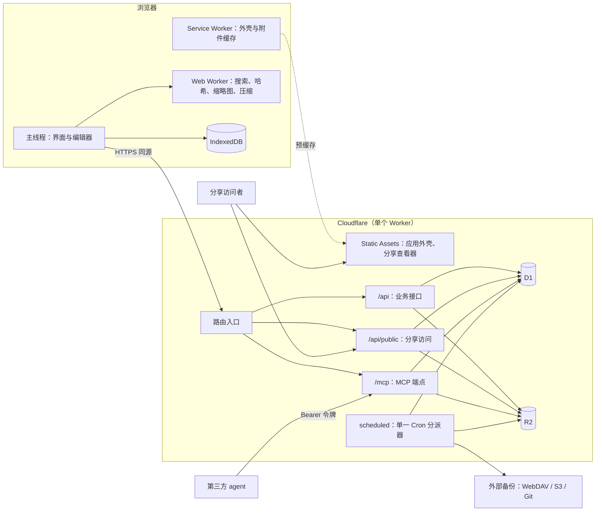
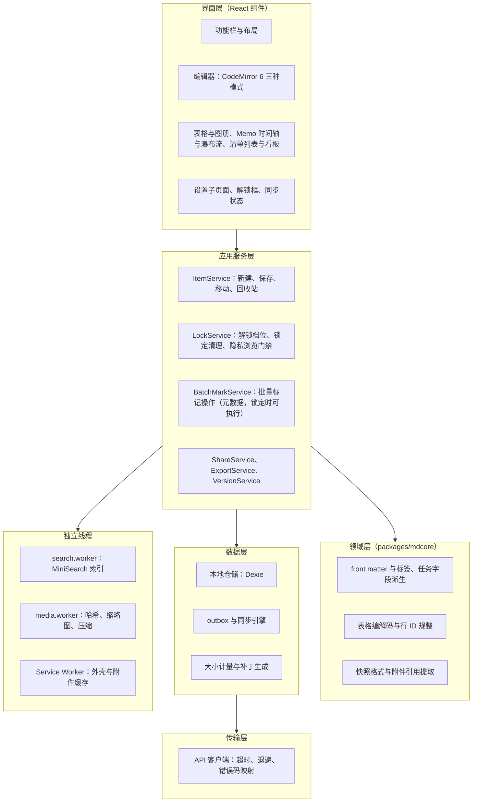
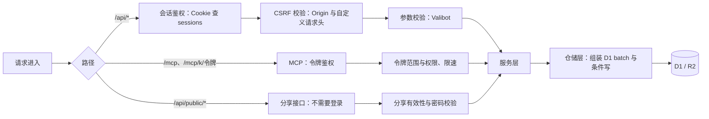
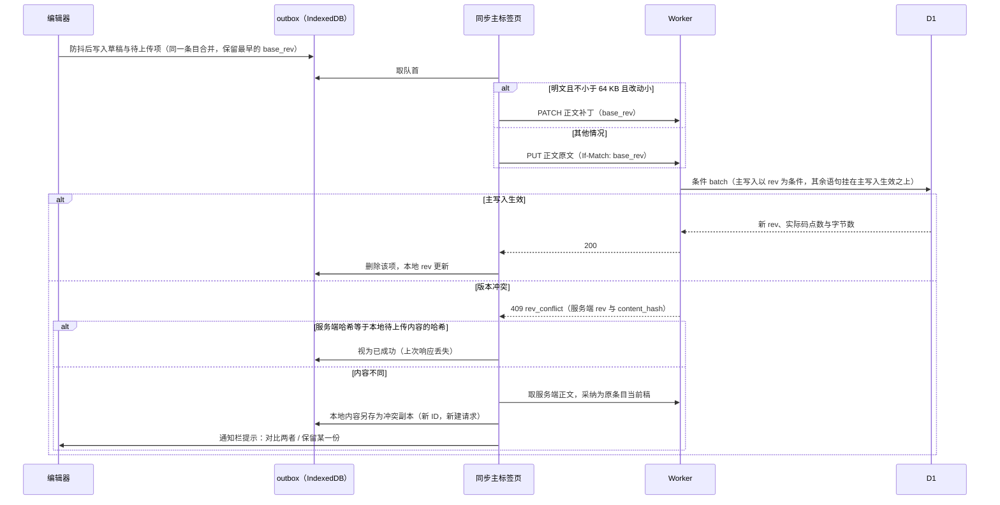
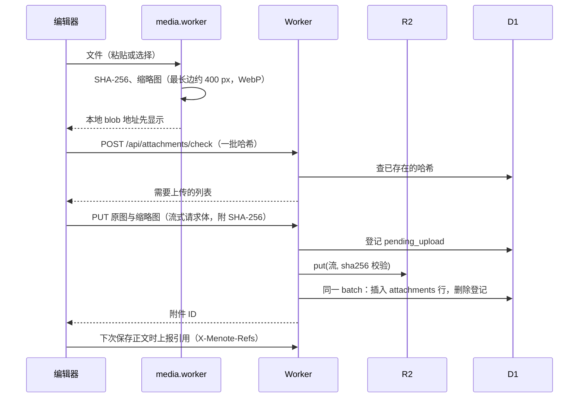

# Menote 项目架构设计（v1）

| 项 | 内容 |
|---|---|
| 文档版本 | v1.1（草案修订，待用户审核） |
| 日期 | 2026-09-25（v1）/ 2026-09-26（v1.1 修订） |
| 基准 | 仓库根目录 `Menote-设计文档-v7.4.md`（下称“需求文档”）。本文只回答“怎么实现”，不改变需求文档中的任何产品决定；引用需求文档章节时写作“需求 x.y” |
| 运行环境 | Cloudflare 免费版：Workers（含 Static Assets、Cron Triggers）+ D1 + R2；客户端为浏览器 PWA |
| 性质 | 架构设计，不含应用代码；接口、表结构、目录结构均为草案，实现时细化 |

### 修订记录

| 版本 | 日期 | 内容 |
|---|---|---|
| v1 | 2026-09-25 | 初稿 |
| v1.1 | 2026-09-26 | ①隐私模型修订【已定·用户确认】：服务端明文存储 + 前端门禁 + 备份导出加密，删除非对称密钥对、数据密钥层级、正文密文信封、批量转换任务与恢复码（第七章重写）；②登录与隐私密码 KDF 统一为 PBKDF2-SHA-256，前端零 wasm；③评审报告（deliverables/gstack/architecture-review-menote-v1-2026-09-26.md）阻塞项 #1、#2 随之失效 |
| v1.2 | 2026-09-26 | 部署方式定稿【已定·用户确认】：从 GitHub 一键部署到 Cloudflare，资源在部署时自动创建并关联，无需提前手动创建（新增 15.5）；§15.2 发布主路径改为 Workers Builds，GitHub Actions 只保留测试职责；§15.3 生产环境落点同步更新 |
| v1.3 | 2026-09-26 | 代码组织定稿【已定·用户确认】：单仓多包确认；新增 2.3.1 入口只装配规则（Workers 无 server.mjs，入口文件内容白名单与行数预算）、2.3.2 功能→代码落点对照表（纵向切片）、2.3.3 防膨胀护栏（依赖方向 lint + 文件行数预算进 CI）；§3.1 分层图中遗留的 ConvertService 更正为批量标记服务 |
| v1.4 | 2026-09-26 | 文档目录定稿【已定·用户确认】：细化 docs/ 结构（新增 2.3.4）——组件规划 components.md、方案讨论草稿 proposals/、归档 archive/、操作指南 guides/；明确每类文档职责边界、生命周期（草稿→定稿→归档）与进入门槛，防止文档混乱增殖 |
| v1.5 | 2026-09-26 | 文档体系对齐 AGENTS.md【已定·用户确认】：改为 wiki/ 定稿区（需求、拆解、架构、组件规划、ADR、指南）+ docs/ 过程区（modules/ 专项设计与草稿、archive/ 归档）两层模型；根目录新增 AGENTS.md / DESIGN.md（视觉源）/ CHANGELOG.md / README.md；proposals/ 并入 modules/（以文档状态头部区分）；补迁移时机注 |
| v1.6 | 2026-09-26 | docs/ 扩充【已定·用户确认】：新增 todo/ 专项计划目录（一个功能/任务一份实施计划，做完归档）与 scratch.md 草稿文件（临时讨论追加区，定期清理）；AGENTS.md「文档放哪」同步 |
| v1.7 | 2026-09-26 | 草稿改为目录【已定·用户确认】：docs/scratch.md 改为 docs/scratch/ 文件夹——临时讨论与方案草稿一份讨论一份文件（`<主题>-<日期>.md`），定稿搬走、过时件清理；AGENTS.md 同步 |
| v1.8 | 2026-09-26 | 文件位置迁移执行完毕【已定·用户确认】：三份主线文档移入 `wiki/`，功能拆解 v1 移入 `docs/archive/`，根目录新增 `README.md`；本文路径变为 `wiki/Menote-项目架构-v1.md` |

### 标注约定

| 标注 | 含义 |
|---|---|
| 【依需求】 | 直接落实需求文档已定的内容 |
| 【架构定】 | 需求文档未涉及的纯技术选择，本文给出方案 |
| 【待确认】 | 会影响用户可感知行为、或需要用户拍板的技术选择；给出推荐项，确认后改为【已确认】 |
| 【待核实】 | 依赖外部事实（平台限额、浏览器支持），开发早期实测或查证 |

---

## 一、环境约束与架构原则

### 1.1 决定架构形状的硬约束

| 约束 | 数值 | 对架构的影响 |
|---|---|---|
| Worker 每请求 CPU | 10 ms（HTTP 与 Cron 相同） | 服务端只做鉴权、条件读写、字节转发；一切计算型工作放浏览器（需求 1.2-5） |
| Worker 启动时间 | 1 秒 | 全局作用域不做重型初始化；不引入大型 SDK；按路由懒加载模块 |
| Worker 内存 | 128 MB | 大请求体一律流式处理，不整体缓冲 |
| 外部子请求 | 50 次/请求 | 备份每轮文件数受限（Git 目标约 40 个） |
| D1 每次调用查询数 | 50 次（免费版） | 单个请求的 SQL 语句总数（含 batch 内）控制在 50 以内 |
| D1 单行 / 单值 | 2,000,000 字节 | 正文硬上限 1,900,000 字节，正文单独成表（需求 18.1） |
| D1 单条 SQL | 100 KB | 正文一律参数绑定，不拼接进 SQL 文本 |
| D1 行读写 | 读 500 万/天、写 10 万/天 | 查询必须命中以 `user_id` 开头的索引；派生写入只写变化部分 |
| D1 单库 | 500 MB | 大体量数据（版本正文、附件、快照）放 R2 |
| Cron Triggers | 每账户 5 个 | 全项目只用 1 个 Cron，在其中按时间片分派任务 |
| R2 | 10 GB-月，A 类 100 万/月 | 附件按内容哈希去重；后台不调用 `ListObjects` |
| 静态资源 | 免费、不限量 | 应用外壳与分享查看器都走 Static Assets，不经过 Worker |

### 1.2 架构原则

1. **胖客户端、瘦服务端**【依需求】：浏览器承担渲染、KDF、哈希、压缩、diff、搜索、ZIP 与备份导出加密；Worker 是“带鉴权的条件存储网关”。
2. **本地优先**【依需求】：界面只读本地数据（IndexedDB）；网络只用于同步。所有写入先进 outbox。
3. **服务端不解析大正文**【依需求】：正文作为不透明字节在 D1 与 R2 之间搬运；需要处理正文的服务端路径（MCP 按小节读写、表格按行操作）设大小门槛。
4. **一份格式代码，前后端共享**【依需求】：Markdown 快照格式、YAML front matter 解析、表格编解码、标签与任务字段派生、接口校验规则写在共享包里，浏览器与 Worker 使用同一份实现。
5. **每个写接口都是条件写**【依需求】：带 `rev` / `meta_rev` 条件，派生写入挂在主写入生效的条件上（mutation guard，需求 18.3）。
6. **后台任务小批、可中断、可重入**【架构定】：Cron 每次只处理一小批，用游标与版本号条件保证中断后下一轮能接着做，重复执行无副作用。
7. **可观测的 CPU 预算**【架构定】：每类接口在开发阶段记录 CPU 耗时，纳入测试门槛（见第十四节）。

---

## 二、总体架构

### 2.1 部署拓扑

一个 Worker 同时提供静态资源、业务 API、MCP 端点与分享接口，同源部署，不拆分多个 Worker【架构定】。理由：免费版额度按账户计，拆分不省额度；同源避免跨域 Cookie 与 CORS 预检（弱网下每次预检都是一次额外往返）。



**Static Assets 路由规则**【架构定】：`not_found_handling = single-page-application`；只有 `/api/*`、`/mcp`、`/mcp/*` 先进入 Worker（`run_worker_first`），其余路径（含分享页 `/s/<分享ID>`）直接由静态资源返回，不消耗 Worker 请求数与 CPU。

### 2.2 技术栈

| 层 | 选型 | 理由 | 状态 |
|---|---|---|---|
| 语言 | TypeScript（严格模式），前后端统一 | 共享包需要同一语言 | 【架构定】 |
| 前端框架 | React 19 + Vite | 与 Inkstone 同栈，参照其实现最直接；生态（虚拟列表、CodeMirror 封装）最全 | 【待确认】备选 Preact（体积约为 React 的十分之一，API 兼容）、Vue、Solid |
| 状态管理 | Zustand（界面状态）+ IndexedDB 作为数据真相 | 轻量；数据状态不放内存 store，避免两份真相 | 【架构定】 |
| 样式 | Tailwind CSS 4 | 与 Inkstone 相同；原子类利于按需裁剪体积 | 【架构定】 |
| 编辑器 | CodeMirror 6 + `@codemirror/lang-markdown`（Lezer 语法树） | 需求 7.1 已定 | 【依需求】 |
| Markdown 渲染 | markdown-it（+ task-lists、footnote 等插件）+ DOMPurify | 速度快、插件全；DOMPurify 防止笔记与分享内容中的 XSS | 【架构定】 |
| 表格虚拟滚动 | TanStack Virtual | 需求 10.10-4 要求虚拟滚动；框架无关 | 【架构定】 |
| 本地数据库 | Dexie（IndexedDB 封装） | 事务、索引、批量写，比 idb-keyval 适合结构化数据 | 【架构定】 |
| 本地搜索 | MiniSearch + `Intl.Segmenter` + 二元组兜底 | 需求 13.1 已定 | 【依需求】 |
| 加密 | WebCrypto（PBKDF2-SHA-256、AES-256-GCM） | 仅用于隐私密码派生与备份导出信封（见 7.2 / 7.3）；不再引入 hash-wasm / Argon2id，前端零 wasm | 【架构定·v1.1 简化】 |
| 压缩 / ZIP | 原生 `CompressionStream`；fflate 打 ZIP | 需求 12.4、16.2 | 【依需求】 |
| PWA | vite-plugin-pwa（Workbox，injectManifest 模式，自写缓存策略） | 预缓存外壳，附件缓存规则需自定义 | 【架构定】 |
| 服务端路由 | Hono | 体积小、启动快，Inkstone 同款 | 【架构定】 |
| 接口校验 | Valibot（前后端共享 schema） | 体积和初始化开销都远小于 Zod，适合 1 秒启动限制 | 【架构定】 |
| MCP | 手写无状态 JSON-RPC 分发（不引入官方 SDK） | 需求 17.1：无状态、轻量；官方 SDK 体积与初始化成本偏高 | 【依需求】 |
| S3 签名 | aws4fetch（`UNSIGNED-PAYLOAD`） | 需求 16.3；体积小 | 【依需求】 |
| 构建部署 | Vite + `@cloudflare/vite-plugin` + Wrangler | 一套构建同时产出前端资源与 Worker；线上部署走 Workers Builds（Git 推送触发，见 15.5） | 【架构定】 |
| 测试 | Vitest；Worker 与 D1 用 `@cloudflare/vitest-pool-workers`；端到端用 Playwright | 需求 21.2：从开发之初就有测试与 CI | 【依需求】 |
| CI | GitHub Actions：类型检查、单元测试、Worker 集成测试、构建、包体积检查 | 同上 | 【依需求】 |

### 2.3 仓库目录结构【已确认·用户确认 2026-09-26：单仓多包】

在现有仓库中采用 pnpm workspace 单仓多包结构，需求文档保留在根目录不动：

```
MeNote/
├── README.md                       # 介绍与怎么跑起来
├── AGENTS.md                       # AI 编程代理规则（文档体系以它 + 本节为准）
├── DESIGN.md                       # 界面与交互唯一视觉源（内容从原型设计令牌落稿）
├── CHANGELOG.md                    # 每次改动一条记录（格式见 AGENTS.md）
├── wiki/                           # 定稿区：写入与修改须经用户明确同意
│   ├── Menote-设计文档-v7.4.md     # 需求文档（只读基准，升版本不改名）
│   ├── Menote-功能拆解-v2.md       # 功能点与验收（v1 已过时，届时移 docs/archive/）
│   ├── Menote-项目架构-v1.md       # 本文（版本在修订记录内演进，文件名不变）
│   ├── components.md               # 组件规划：前端组件清单与复用关系
│   ├── adr/                        # 架构决定记录（每条决定一个短文档）
│   └── guides/                     # 操作指南：开发、部署、测试、迁移演练
├── docs/                           # 过程区：结构与规则见 2.3.4
│   ├── todo/                       # 专项计划：一个功能/任务一份实施计划
│   ├── modules/                    # 专项功能设计文档
│   ├── scratch/                    # 草稿：临时讨论，一份讨论一份文件，定期清理
│   └── archive/                    # 归档：只进不出，默认不读
├── prototype/                      # 现有原型，保留
├── apps/
│   ├── web/                        # PWA 客户端
│   │   ├── index.html              # 主应用入口
│   │   ├── share.html              # 分享查看器入口（同域独立页面，见 §10）
│   │   └── src/
│   │       ├── main.tsx            # 装配：路由表 + Provider + SW 注册，不含业务（见 2.3.1）
│   │       ├── app/                # 路由、布局、功能栏
│   │       ├── features/           # 每个功能一个目录（见 2.3.2 落点表）
│   │       ├── data/               # Dexie 模式、仓储、outbox、同步引擎
│   │       ├── crypto/             # 隐私门禁与备份导出加密（PBKDF2、信封）
│   │       ├── workers/            # search.worker.ts / media.worker.ts（各自独立入口，见 2.3.1）
│   │       └── sw/                 # Service Worker
│   └── worker/                     # Cloudflare Worker
│       └── src/
│           ├── index.ts            # 装配：Hono 实例、挂载子路由、scheduled 分发（见 2.3.1）
│           ├── routes/             # api / public / mcp：校验参数后立刻转服务，不写业务
│           ├── services/           # 领域服务：items、folders、versions、attachments、shares、tokens、backup ...
│           ├── db/                 # SQL 常量、batch 组装、迁移与自愈
│           ├── jobs/               # Cron 任务：snapshot、backup、maintenance、gc
│           └── adapters/           # r2 / webdav / s3 / git 备份适配器
├── packages/
│   ├── shared/                     # 前后端共享：类型、Valibot schema、错误码、常量（上限、阈值）
│   ├── mdcore/                     # front matter、标签与任务字段派生、表格编解码、快照格式、附件引用改写
│   └── crypto-format/              # 备份导出信封格式的编码与解析（纯函数，不含密钥操作）
├── wrangler.jsonc
└── .github/workflows/ci.yml
```

依赖方向：`apps/*` 可以依赖 `packages/*`；`packages/*` 之间只允许 `shared` 被其他包依赖；`packages/*` 不依赖任何浏览器或 Worker 专有 API，保证两端都能运行、都能单测。

#### 2.3.1 入口文件只做装配（不出现 server.mjs）

Workers 项目没有也不需要 `server.mjs` 之类的常驻服务文件——**整个后端只有一个入口 `apps/worker/src/index.ts`**，它是装配壳：创建 Hono 实例、按前缀挂载子路由、注册 `scheduled` 处理器导出默认对象，到此为止。业务代码不存在于入口里的位置。所有入口文件适用同一条白名单规则：

| 入口 | 允许的内容 | 行数预算 |
|---|---|---|
| `apps/worker/src/index.ts` | 创建 Hono、`route()` 挂载子路由、`export default { fetch, scheduled }`、全局错误兜底 | ≤ 100 |
| `apps/web/src/main.tsx` | 创建路由表、挂 Provider（主题/查询/同步）、注册 Service Worker | ≤ 100 |
| `apps/web/share.html` 对应的分享查看器入口 | 挂载 share-viewer 特性根组件 | ≤ 50 |
| `src/workers/*.worker.ts` | `self.onmessage` 分发到处理器模块 | ≤ 50 |

入口超预算或出现 `if (path === ...)`、SQL、状态计算，即视为结构违规（CI 检查，见 2.3.3）。

#### 2.3.2 功能 → 代码落点对照表（纵向切片）

新增任何代码前先查此表：**先定功能，再定层**。同一功能的前端与后端各自纵向切片（路由→服务→仓储），互不横向渗透。

Worker 侧（`apps/worker/src/`）：

| 功能 | 路由 routes/ | 服务 services/ | 其他落点 |
|---|---|---|---|
| 注册 / 登录 / 会话 | `auth.ts` | `tokens.ts`、`sessions.ts` | middleware/session.ts |
| 条目与文件夹（增删改查、移动、回收站、批量标记） | `items.ts`、`folders.ts` | `items.ts`、`folders.ts`、`trash.ts` | db/tables.ts（SQL 常量） |
| 增量同步（拉取 / 推送 / 墓碑） | `sync.ts` | `sync.ts` | — |
| 版本历史 | `versions.ts` | `versions.ts` | — |
| 附件上传 / 下载 / GC | `attachments.ts` | `attachments.ts` | adapters/r2.ts、jobs/gc.ts |
| 分享（创建 / 公开访问 / 撤销） | `shares.ts`、`public.ts` | `shares.ts` | — |
| MCP | `mcp.ts` | `mcp.ts` | middleware/ 下令牌与限速 |
| 设置与隐私标记 | `settings.ts` | `settings.ts` | — |
| Cron：快照 / 外部备份 / 维护 | —（无路由） | `jobs.ts` 调度 | jobs/snapshot.ts、jobs/backup.ts、jobs/maintenance.ts；adapters/webdav.ts、s3.ts、git.ts |
| 迁移与自愈 | — | — | db/migrations/、db/selfheal.ts |

Web 侧（`apps/web/src/`，每个 feature 目录内 `ui/`（组件）+ `model.ts`（状态与动作）两件套，禁止 feature 互相 import）：

| 功能 | 落点 |
|---|---|
| 布局 / 功能栏 / 导航 / 主题 | `app/` |
| 笔记编辑（CodeMirror 封装为公共编辑器组件放 `app/editor/`） | `features/notes/` |
| 表格 / 图册 | `features/tables/` |
| Memo（时间轴 / 瀑布流） | `features/memos/` |
| 待办（列表 / 看板） | `features/tasks/` |
| 首页概括 | `features/home/` |
| 搜索界面 | `features/search/`；索引在 `workers/search.worker.ts` |
| 附件 / 媒体处理 | `features/attachments/`；哈希与缩略图在 `workers/media.worker.ts` |
| 隐私门禁（解锁框、锁定清理、多设备 verifier） | `features/privacy/` + `crypto/keystore.ts` |
| 备份导出（信封打包、外部解密工具说明） | `features/backup/` + `crypto/envelope.ts`（编解码调 packages/crypto-format） |
| 同步引擎 / outbox | `data/sync/`（不属于任何 feature） |
| 本地库 Dexie / 本地仓储 | `data/db/` |
| 设置（含 MCP 配置、备份目标配置） | `features/settings/` |
| 分享查看器 | `features/share-viewer/`（独立入口加载） |

#### 2.3.3 防膨胀护栏

1. **依赖方向**（ESLint `no-restricted-imports` 或 dependency-cruiser 强制）：`routes → services → db`，禁止反向与跨级（路由不得拼 SQL，服务不得 import Hono，仓储不得 import 服务）；前端 feature 之间零互相依赖，跨 feature 复用只走 `app/`（公共组件）或 `data/`（数据层）；`packages/*` 不 import 任何 `apps/*`。
2. **文件行数预算**：入口按 2.3.1 白名单；路由 / 服务 / 仓储单文件 ≤ 300 行——超限按子资源拆（如 `services/items-query.ts` 与 `items-write.ts`），不按"工具函数堆一屋"拆。CI 里以 lint 规则告警（`max-lines`），超 500 行直接失败。
3. **新功能落位流程**：先查 2.3.2 对照表落位；表中没有的新功能，先补表（本文为唯一依据）再写代码——避免"临时先塞 index.ts"的口子。
4. **共享包是逃逸口**：两端都要用的逻辑进 `packages/`，而不是复制或放在某一端"大家来引"。

#### 2.3.4 文档体系：wiki/ 定稿区 + docs/ 过程区【已定·用户确认 2026-09-26，对齐 AGENTS.md】

仓库文档分两层，与 AGENTS.md「文档放哪」一节完全一致：

- **`wiki/` = 定稿区**：已定稿、作为当前实现依据的文档。写入新定稿、修订或删除已有文件，都必须先得到用户明确同意。
- **`docs/` = 过程区**：尚未定稿的设计与过程资料，冲突时以 `wiki/` 为准；`docs/archive/` 默认不读、不作为实现依据。
- 根目录两个特殊文件：`DESIGN.md` 是**唯一视觉源**（内容从原型的设计令牌与界面基线落稿，落稿本身需用户确认）；`AGENTS.md` 是 AI 代理的工作规则。

职责一览：

| 位置 | 放什么 | 命名 |
|---|---|---|
| `wiki/Menote-设计文档-v7.4.md` | 需求文档（只读基准） | 升版本不改名 |
| `wiki/Menote-功能拆解-v2.md` | 功能点与验收 | 同上 |
| `wiki/Menote-项目架构-v1.md` | 架构文档（本文，唯一主线） | 不变 |
| `wiki/components.md` | **组件规划**：组件名、所属 feature、职责、props 约定、复用关系、与原型的对应；过长后按 `components/<功能>.md` 拆 | — |
| `wiki/adr/` | **架构决定记录**：只记"有备选项且否决了其他选项"的决定，一条一页（背景 / 备选 / 结论 / 影响） | `adr-NNN-<决定名>.md` |
| `wiki/guides/` | **操作指南**：本地开发上手、一键部署步骤（15.5 的操作展开）、测试跑法、迁移演练 | `<主题>.md` |
| `docs/todo/` | **专项计划**：一个功能或任务一份实施计划（目标、拆步、涉及文件、验收点），开工前创建 | `<主题>.md`（可带日期） |
| `docs/modules/` | **专项功能设计文档**：一份主题一份文件，头部按 AGENTS.md 的文档维护规范写版本 / 状态（草案 / 评审中 / 生效 / 废弃 / 归档）/ 权威级别 / 修改记录 | 主题命名，时效件可带日期 |
| `docs/scratch/` | **草稿**：临时讨论与方案草稿，一份讨论一份文件，随手写、不设格式门槛（与 modules/ 的区别：这里是未成形的过程片段）；定稿内容搬往 todo/ / modules/ / wiki，过时件定期清理，不作为实现依据 | `<主题>-<日期>.md`（未成形可不带日期） |
| `docs/archive/` | **归档**：被取代的草稿与旧版文档，只读 | 移入时保留原文件名 |

冲突时的优先级：功能与规则看 `wiki/`，长什么样看 `DESIGN.md` 与原型，某一屏的结构看 `docs/modules/` 对应专项。

生命周期（所有文档适用）：

1. **草稿期**：讨论中的方案进 `docs/modules/`，一份主题一份文件，不散落在聊天记录里；头部标状态。同主题不允许出现胜负未分的并行多份草稿。
2. **定稿**：结论写回对应主线文档（架构决定进本文、需求变更进需求文档）+ 有备选项的补一条 `wiki/adr/`；定稿文档经用户同意后**整份搬入** `wiki/`。
3. **归档**：`docs/archive/` 只允许整份移入，移入后在头部加一行「已归档，结论见 adr-NNN / wiki 某文档」；归档件不再修改，原位置不留副本。现有功能拆解 v1 在结构迁移时移入。`docs/todo/` 的计划做完整份移入；`docs/scratch/` 的过时讨论件定期清理或整份移入。
4. **进入门槛（防增殖）**：能写进本文既有章节的一句话决定，不单开 ADR；一次就能定的事不建专项文档；`guides/` 只收"会被重复执行的操作"，一次性的事直接做。文档数量超需要时宁可删并，不维护僵尸文件。

> **迁移注（2026-09-26 执行完毕）**：三份主线文档已搬入 `wiki/`，功能拆解 v1 已移入 `docs/archive/`，`README.md` 已创建。后续新文档直接按本节落位。

---

## 三、前端架构

### 3.1 分层



规则【架构定】：
- 界面层只调用应用服务层，不直接访问 Dexie 或网络。
- 数据的唯一真相是 IndexedDB；界面通过 Dexie 的 `liveQuery` 订阅变化，Zustand 只放纯界面状态（当前视图、面板开合、选中项）。
- 所有 CPU 密集型工作（SHA-256、缩略图、gzip、建索引、备份导出加密）放在独立 Worker，主线程保持输入流畅。

### 3.2 本地数据库（IndexedDB，Dexie）【架构定】

| 表 | 主键 / 索引 | 内容 |
|---|---|---|
| `items` | `id`；`[folderId+updatedAt]`、`memoAt`、`syncSeq`、`isTask` | 条目元数据（与服务端 `items` 同构；隐私空间内条目同样明文，带 `in_enc_space` 标记） |
| `bodies` | `itemId` | 正文缓存：明文字符串；带 `rev`、`contentHash` |
| `drafts` | `itemId` | 未上传的编辑稿（每 2 秒写一次） |
| `folders` | `id`；`parentId`、`syncSeq` | 文件夹树 |
| `privacyState` | 单行 | 门禁状态：解锁档位与到期时间；KDF 参数缓存（verifier 与 K 的包裹块存服务端，见 7.2） |
| `settings` | 单行 | 用户设置与其 `rev` |
| `outbox` | 自增 `seq`；`[entity+entityId]` | 待上传操作（见 6.3） |
| `attachmentsMeta` | `id`；`sha256` | 附件元数据；上传中的附件带本地 Blob |
| `searchIndex` | 单行 | 明文 MiniSearch 索引的序列化结果 |
| `syncState` | 单行 | `cursor`（最近的 `sync_seq`）、上次同步时间、设备 ID |

- Dexie 的模式版本随客户端发布递增；本地库只是缓存，遇到无法迁移的情况可以清空后从服务端重建（outbox 中未上传的数据先导出为本地备份文件再清空）。
- 【v1.1 模型修订】隐私条目内容明文落库（用户确认的边界）：锁定只由界面门禁过滤显示，不改变存储；登出清除本机缓存仍按需求 15.1 执行。

### 3.3 编辑器【依需求 7.1，实现细节为架构定】

- 三种模式共用一个 CodeMirror 6 `EditorState`，切换模式不重建文档，只切换扩展与布局：
  - 双栏：CodeMirror + 预览面板（markdown-it 渲染，按滚动位置同步）。
  - 仅编辑 / 仅预览：隐藏其一。
  - 即时渲染：基于 Lezer 语法树的装饰（`Decoration.replace` / `widget`），只对视口内的节点计算装饰，光标所在行显示源码。
- 大小计量：编辑器维护当前正文的 UTF-8 字节数（增量计算：只对变更区间重新计数），状态栏常驻“x MB / 2 MB”，软上限 1MB 变色提示，硬上限 1,900,000 字节阻止保存（需求 10.10）。
- 补丁生成：从上次成功保存起累积 `ChangeSet`，保存时合并为“按码点计的替换区间”列表（需求 15.7）；码点换算在 `packages/mdcore` 中实现并有专门测试。
- 大文档：正文超过 256 KB 时防抖放宽到 5 秒、最长 60 秒上传一次（需求 15.7）；表格编辑器超过一定行数启用 TanStack Virtual。

### 3.4 Markdown 渲染与安全【架构定】

- 预览、Memo 时间轴、分享查看器共用一个渲染模块：markdown-it（关闭原生 HTML 或只放行白名单标签）+ DOMPurify 清洗输出。
- 附件引用（`_attachments/<hash>.jpg` 或附件 ID）在渲染时改写为受控地址 `/api/attachments/...`；隐私条目的附件在锁定时不渲染（门禁），无解密路径（v1.1）。
- 大文档预览按块增量渲染（按顶级块切分，只重新渲染变化的块），避免 2MB 文档每次按键全量渲染。

### 3.5 搜索【依需求 13】

- `search.worker` 持有两个 MiniSearch 实例：
  - 持久索引：明文笔记、表格、Memo；序列化后存 `searchIndex`，按 `sync_seq` 增量更新。
  - 内存索引：解锁期间加入的加密内容；锁定时整个实例丢弃（需求 6.10）。
- 分词：`Intl.Segmenter('zh', {granularity: 'word'})` + 中文二元组兜底。
- 隐私浏览锁定时，查询结果在返回界面前过滤掉 Memo（需求 8.9）。
- 本地索引未建完时，搜索框回退到服务端兜底接口 `/api/search`（需求 13.2）。

### 3.6 Service Worker 与缓存策略【架构定】

| 资源 | 策略 |
|---|---|
| 应用外壳（HTML、JS、CSS、字体、wasm） | 构建时预缓存；新版本后台下载，提示“有新版本”后下次打开生效（需求 15.6） |
| 附件与缩略图（`/api/attachments/h/<sha256>`） | Cache First，永久缓存（内容哈希不变） |
| `/api/*` 其他接口 | 不缓存，直接走网络（离线数据来自 IndexedDB） |
| 分享查看器 `/s/*` | 预缓存查看器外壳；分享内容不缓存 |

---

## 四、Worker 架构

### 4.1 请求处理链



### 4.2 分层与约定【架构定】

| 层 | 职责 | 约定 |
|---|---|---|
| 路由（Hono） | 路径匹配、中间件、把请求转给服务 | 按前缀懒加载子路由模块（动态 `import()`），降低冷启动开销 |
| 中间件 | 会话、CSRF、令牌、限速、错误统一格式 | 会话查询每请求 1 次 D1 读；`last_seen_at` 每天最多写 1 次 |
| 服务 | 业务规则：条件、配额、跨表一致性 | 不直接拼 SQL；每个写操作产出一个“语句列表”交给仓储 |
| 仓储 | SQL 常量、batch 组装、mutation guard、受影响行数判定 | 所有语句用参数绑定；每个请求的语句总数在代码中计数，超过 45 条直接报错（留余量给 50 条上限） |
| 适配器 | R2、外部备份（WebDAV / S3 / Git） | 子请求计数器：每个请求最多 50 个外部子请求 |

### 4.3 错误码【架构定】

统一 JSON 错误体 `{ code, message, detail? }`，客户端按 `code` 处理：

| HTTP | code | 含义 | 客户端处理 |
|---|---|---|---|
| 401 | `unauthenticated` | 会话失效 | 跳转登录，outbox 保留 |
| 403 | `forbidden` / `csrf` | 无权或 CSRF 校验失败 | 提示并记录 |
| 404 | `not_found` | 条目不存在或已永久删除 | 本地标记为已删除 |
| 409 | `rev_conflict` | 版本冲突，附带服务端当前 `rev`、`content_hash`，正文按需另取 | 进入冲突处理（需求 15.5） |
| 409 | `meta_conflict` | 元数据冲突，附带当前元数据 | 在最新状态上重新应用意图 |
| 413 | `too_large` | 超过 1,900,000 字节或 256 KB（MCP） | 提示拆分 |
| 422 | `invalid` | 参数不合法 | 丢弃该 outbox 项并提示 |
| 429 | `rate_limited` | 限速 | 按 `Retry-After` 退避 |
| 503 | `retry_later` | CPU 超限（1102）、D1 暂时不可用 | 退避重试；大文档全文保存改走补丁（需求 19.6） |

---

## 五、数据架构

### 5.1 D1 表结构

以需求 18.2 的 DDL 草案为准（v1.1 注：DDL 中的正文密文列、`data_keys`、`user_crypto` 的密钥列在本模型下不再使用，待需求文档 v7.5 同步时清理）。实现时需要以下技术补充【待确认】，均不改变产品行为，只补足需求中已描述的机制所需的存储：

| 补充 | 原因（对应需求） | 草案 |
|---|---|---|
| 新增 `tombstones` 表 | 需求 15.2 用 `deleted_at` 表示删除，但永久删除（14.4）会删掉 `items` 行，其他设备的增量同步收不到“已删除”信号，本地会残留条目 | `(user_id, entity, entity_id, sync_seq, deleted_at)`，索引 `(user_id, sync_seq)`；保留 180 天，过期清理 |
| `users` 增加 `tombstone_floor` | 墓碑清理后，游标早于清理点的设备必须全量重同步 | 整数：已清理墓碑中最大的 `sync_seq`；客户端游标小于它时触发全量重建 |
| 新增 `r2_gc_queue` 表 | 需求 14.4“登记待清理的 R2 对象，由 Cron 分批删除”，DDL 中没有这张表 | `(r2_key PRIMARY KEY, reason, due_at)`；也用作上传意图登记（见 5.3） |
| `user_crypto`、`user_settings`、`attachments` 增加 `sync_seq` | 需求 15.2 只列了条目和文件夹的增量同步；设置与附件元数据也需要在多设备间同步（v1.1：`data_keys` 表废弃，`user_crypto` 改存 verifier 与 K 的两份包裹，见 7.2） | 各加 `sync_seq` 列与 `(user_id, sync_seq)` 索引 |
| `attachment_refs` 增加版本引用 | 需求 14.3 规定“保留中的历史版本”引用的附件不算孤儿，但 `attachment_refs` 只记录条目引用 | 增加 `version_id` 列（NULL 表示当前稿引用），主键改为 `(item_id, version_id, attachment_id)` 的等价唯一约束 |
| 新增 `rate_counters` 表（条件启用） | 需求 17.3：Rate Limiting 绑定在免费版不可用时，用 D1 按分钟计数 | `(key, window_start, count)`；可用绑定时不建 |
| `items` 增加 `last_edit_at`、`last_device` | 需求 12.2-3 的“跨会话”判断需要知道上次编辑时间与设备 | 两列，随正文保存写入（同一条 UPDATE，不增加行写入） |

### 5.2 R2 对象布局

| 前缀 | 内容 | 写入方 | 缓存头 |
|---|---|---|---|
| `a/{uid}/{sha256}` | 明文附件原图 | 客户端流式上传 | `private, max-age=31536000, immutable` |
| `a/{uid}/{sha256}.t` | 明文缩略图 | 同上 | 同上 |
| `e/{uid}/{id}` | （v1.1 废弃：不再有静态密文附件） | — | — |
| `v/{uid}/{item_id}/{version_id}` | 版本正文（gzip 或原样） | 客户端或 Worker | 不缓存 |
| `snap/{uid}/...` | md 快照目录（需求 3.2 的结构） | Cron | 不缓存 |

【v1.1 注】`e/` 前缀（静态密文附件）不再使用——所有附件明文存储，隐私条目仅在出站备份时加密（7.3、7.4）。

【待核实】需求 14.1 中缩略图的对象键没有单独约定；上表用 `.t` 后缀是架构草案。

### 5.3 R2 与 D1 的一致性【架构定】

R2 与 D1 之间没有事务，采用“先登记、后操作、再确认”避免泄漏，且全程不需要列举 R2：

- **上传**：Worker 先插入一行 `r2_gc_queue(r2_key, reason='pending_upload', due_at=now+24h)`；写 R2 成功后，在同一个 batch 中插入附件或版本元数据并删除这行登记。中途失败时，登记在 24 小时后到期，Cron 删除残留对象。
- **删除**：在删除 D1 记录的同一个 batch 中登记 `r2_gc_queue(reason='delete', due_at=now)`；Cron 按 `due_at` 分批删除 R2 对象，删除成功后删登记。R2 删除是幂等的，重复执行无害。
- 这一机制覆盖了需求 14.4 中“没有对应元数据的版本对象”这类残留的来源。需求 19.5 要求后台不调用 `ListObjects`，因此每日孤儿检查只核对 D1 内部的引用关系（附件引用、版本元数据、快照登记），不列举 R2。

### 5.4 容量估算（与需求 19.3 一致）

D1 以元数据和当前稿为主，个人使用多年仍在百 MB 以内；R2 以附件为主。本文不重复需求第十九节的估算。

---

## 六、同步引擎

### 6.1 接口形态【架构定】

| 方向 | 接口 | 说明 |
|---|---|---|
| 拉取 | `GET /api/sync?cursor=N` | 返回 `sync_seq > N` 的元数据变化：条目、文件夹、数据密钥、设置、附件元数据、墓碑；每类合计最多 200 行，带 `next_cursor`、`has_more`；游标小于 `tombstone_floor` 时返回 `full_resync: true`。**不含正文** |
| 取正文 | `GET /api/items/:id/body` | 响应体为原文（`text/markdown`），`ETag` 为 `content_hash`，支持 `If-None-Match` 返回 304；隐私条目同样返回原文，由前端门禁控制显示（v1.1） |
| 新建 | `PUT /api/items/:id`（客户端生成 ID） | 请求体为正文原文；元数据放在 `X-Menote-Meta` 请求头（base64url 编码的 JSON：类型、标题、文件夹、标签、任务字段、`content_hash`、附件引用）。重复提交幂等（需求 15.3） |
| 全文保存 | `PUT /api/items/:id/body` | 请求头 `If-Match: <base_rev>`、`X-Menote-Hash`、`X-Menote-Refs`（附件引用有变化时才带） |
| 补丁保存 | `PATCH /api/items/:id/body` | JSON：`{ base_rev, ops: [[start, end, text]...], hash, bytes, chars }`，位置按码点计（需求 15.7） |
| 元数据 | `PATCH /api/items/:id/meta` | `{ base_meta_rev, title?, folder_id?, tags?, pinned?, starred? }` |
| 批量元数据 | `POST /api/batch` | 多个小型元数据操作合并为一个请求（移动、置顶、文件夹改名等），每个操作独立判定冲突，逐个返回结果；单批语句总数不超过 45 条 |
| 回收站 | `POST /api/items/:id/trash`、`/restore`；`DELETE /api/items/:id`（永久删除） | 永久删除按需求 14.4 执行（见 12.3） |

设计要点：
- 拉取接口只返回元数据，保证首屏只需“元数据增量 + 当前条目”（需求 15.6）；正文按需获取，开启“全部离线缓存”时后台以并发 3–4 逐条拉取。
- 同一次拉取返回的多类数据共用同一个 `sync_seq` 序列（每个用户一个计数器），客户端按单一游标推进，不会漏拉。

### 6.2 保存与冲突处理流程



冲突前服务端版本的封存（需求 15.5-3，原因 `conflict`）由 Worker 在返回 409 之前完成：在同一请求内把当前正文转存为版本（不超过 256 KB 时压缩，否则原样），同一条目 10 分钟内最多一次。

### 6.3 outbox 设计【架构定】

- 每项记录：`entity`（item / folder / setting / key / attachment / version）、`entityId`、`op`、`baseRev`、载荷引用（正文不复制，指向 `drafts`）、重试次数、下次重试时间、最后错误。
- 合并规则：同一条目的正文保存只保留最新一份并保留最早的 `baseRev`；连续补丁合并为一个补丁，合并后超过正文 25% 或 20 个操作时改为全文（需求 15.7）。
- 依赖顺序：新建文件夹先于移入该文件夹的条目；附件上传先于引用它的正文保存（未上传完成时正文照常保存，引用在附件上传成功后补报）。
- 退避与超时按需求 15.3：15 秒超时、1/2/4/8… 秒指数退避加抖动、最长 60 秒；`online`、标签页可见时立即重试。
- 持续失败（例如 422）的项移入“上传失败”列表，界面可查看、重试或导出为文件，不会阻塞队列中其他条目的上传。

### 6.4 多标签页【依需求 15.4】

- `navigator.locks.request('menote-sync')` 选出同步主标签页；其他标签页通过 BroadcastChannel 接收“某条目已更新”“游标已推进”等消息。
- 所有标签页都可以写本地 IndexedDB 和 outbox；只有主标签页上传与拉取。
- 同一条目在两个标签页同时编辑：以 IndexedDB 中的 `drafts` 为准，后写入的标签页收到广播后提示“已在其他标签页修改”，不静默覆盖编辑器内容。

---

## 七、隐私锁的实现

> **v1.1 模型修订【已定·用户确认 2026-09-26】**：隐私保护采用“服务端明文存储 + 前端门禁 + 备份导出加密”。
> 保护边界（用户确认）：隐私密码用于前端显示门禁与备份导出加密，达到“锁定时前端页面不显示、第三方备份中不直接可见”；不防爆破与专业解密，不防已登录账号、服务端数据库（Cloudflare D1/R2 为明文）与本机缓存。
> 由此，v1 中的非对称密钥对、DEK/DEK_s 数据密钥层级、正文密文信封、批量加解密转换任务与恢复码全部取消。

### 7.1 门禁模型【已定·用户确认 2026-09-26】

- 隐私空间条目与单篇“设为隐私”的条目在存储、传输、同步、版本、回收站全链路均为**明文**，仅携带标记：`in_enc_space = 1` 或 `enc_self = 1`（字段名沿用需求 DDL，不改名）。
- 标记的变更（移入 / 移出 / 开启 / 取消）是普通元数据操作，**不需要任何密钥**：锁定时移入隐私空间（M08-09）由此天然成立，一条 `PATCH /api/items/:id/meta` 即可，条件写与冲突处理沿用第六章。
- 门禁是纯前端行为，规则沿用需求 6.9 / 8.9：锁定时占位、不计入统计、搜索过滤、禁止分享。Memo 隐私浏览与本模型同构。
- 解锁档位（仅本次查看 / N 分钟 / 本次浏览器会话 / 当前设备长期）只是“门禁保持打开时长”的四种选择，实现为本地状态（含“当前设备长期”的持久标志），不再涉及密钥保管，也不依赖 SharedWorker（v1 附录 #4、#7 作废）。
- 解锁 = 输入隐私密码，浏览器本地校验（对照服务端存的 verifier）通过后打开门禁；输入错误的代价只是进不了门禁。

### 7.2 隐私密码与密钥材料【已定·用户确认 2026-09-26】

| 材料 | 生成与存放 | 用途 |
|---|---|---|
| KEK | `PBKDF2-SHA-256(隐私密码, 盐, 600,000)`，浏览器内即时派生，不落盘、不上传 | 包裹 / 解包内容密钥 K |
| verifier | KEK 对固定常量的 AES-GCM 校验块，存 D1 `user_crypto` | 多设备门禁校验 |
| 内容密钥 K | 首次设置密码时随机生成 32 字节（普通字节，非 CryptoKey）；D1 存两份包裹：`AES-GCM(KEK, K)`（供外部解密工具）与 `AES-GCM(BACKUP_CRED_KEY, K)`（供 Worker，见 12.4） | 备份导出加密 |

- KDF 统一为 PBKDF2-SHA-256 600,000 次：登录密钥派生（需求 5.4 的 Argon2id 首选改为 PBKDF2，需求文档待同步）与隐私密码共用一套实现，前端不再引入 wasm（hash-wasm 取消，CSP 去掉 `wasm-unsafe-eval`）。
- 修改隐私密码 = 浏览器用旧密码解包 K → 新密码重包裹，同步更新 verifier；K 本身不变，历史备份文件仍可用**当时的口令**解开（文件头自带当时的 KDF 参数与 K 包裹块）。
- 忘记隐私密码：已登录状态下可重置——Worker 用 `BACKUP_CRED_KEY` 解出 K 交浏览器按新密码重包裹，并更新 verifier。界面明示“该重置说明隐私密码不防御账号持有者”（与保护边界一致）【架构定】。
- 恢复码机制取消（其原本服务的是主钥恢复场景，本模型不存在主钥）。

### 7.3 备份导出信封格式【已定·用户确认 2026-09-26】

每个**隐私条目**的文件（正文、附件、缩略图、版本、快照）在离开系统前套一层信封；普通内容默认明文出站：

| 偏移 | 长度 | 字段 |
|---|---|---|
| 0 | 8 字节 | 魔数 `MENOTE1\0` |
| 8 | 1 字节 | 格式版本（当前 1） |
| 9 | 2 字节 | KDF 迭代数（千次为单位，600 = 600,000） |
| 11 | 16 字节 | KDF 盐 |
| 27 | 12 字节 | K 包裹块 IV |
| 39 | 48 字节 | `AES-GCM(KEK, K)`：32 字节密文 + 16 字节标签 |
| 87 | 12 字节 | 内容 IV |
| 99 | 可变 | `AES-GCM(K, 明文)` 密文 |
| 末尾 | 16 字节 | 内容 GCM 标签 |

固定开销 103 字节。算法只用 WebCrypto 标准件（PBKDF2-SHA-256 + AES-256-GCM）。格式连同外部解密工具一并公开：仓库 `tools/menote-decrypt.html`（单文件、零依赖、离线可用），且每份全量备份包内附一份与格式说明，保证“应用没了也能解”。

### 7.4 加密的发生位置【已定·用户确认 2026-09-26】

- **手动导出 / 全量 ZIP**：浏览器端加密（本就是浏览器驱动的流程），默认加密导出，界面提供“解密导出”勾选（需处于解锁态）。
- **Cron 增量备份到 WebDAV / S3 / Git**：Worker 从 D1 取明文 → 用 K 加密（信封）→ 推送。文本快照单文件几 KB，AES-GCM 开销可忽略；**附件按“每轮加密字节配额”分轮**（草案 4 MB/轮 ≈ 2–4 ms CPU，开发早期实测校准，见 14.2），96 轮/天 ≈ 最多约 380 MB/天的加密出站吞吐，个人用量充裕。
- Worker 首次需要 K 时用 `BACKUP_CRED_KEY` 解包一次，缓存在 isolate 内存（isolate 回收后重新解包，成本一次 AES-GCM）。
- 隐私条目**禁止分享**（沿用第十章校验），不出现在任何公开端点。

### 7.5 门禁的界面落点【依需求 6.8 / 6.9 / 8.9】

- 锁定清理大幅简化：无密钥可清除、无 `blob:` 地址需撤销；锁定 = 门禁状态切换 + 关闭明文视图，未保存改动照常写入 outbox（需求 6.8 的清理清单缩减为界面项）。
- 本地搜索索引包含隐私条目明文（与 Memo 同级，属已确认边界）；锁定时查询结果过滤 `in_enc_space = 1 OR enc_self = 1` 的条目与 Memo（需求 6.10、8.9）。
- 原 v1 的 7.1–7.4（密钥库组件、数据密钥 AAD、批量转换阶段）作废；`convertJobs`、`deviceKey`、`dataKeys` 相关存储删除（见 3.2）。

---

## 八、附件管线【依需求 14，接口为架构定】



- 引用上报：服务端用两条语句完成集合更新，与引用数量无关：删除“当前稿引用中不在新列表里的”，再 `INSERT OR IGNORE ... SELECT FROM json_each(?)` 插入新增的；避免每条查询最多 100 个参数的限制。
- 读取：`GET /api/attachments/h/:sha256`（明文，`immutable`）；先校验会话用户与附件归属，再从 R2 流式返回，支持 `Range`。隐私条目的附件在锁定时由前端门禁不渲染（v1.1：无密文附件路径）。
- 孤儿标记：由每日维护任务按游标分批处理（见 12.2），保存路径上不做孤儿判断，保持保存请求轻量。

---

## 九、版本历史【依需求 12，实现为架构定】

| 操作 | 接口 | 服务端处理 |
|---|---|---|
| 客户端封存 | `POST /api/items/:id/versions`（请求体为已压缩的正文；请求头带 `rev`、`reason`、`content_hash`、`codec`） | 与最近一个版本哈希相同则直接返回（去重）；否则登记 pending、流式写 R2、插入元数据、更新 `sealed_rev`；随后对该条目做一次稀疏化（只读该条目的版本元数据），多余版本登记到 `r2_gc_queue` |
| 服务端封存 | MCP 写入前、冲突前、恢复前 | 从 D1 读正文转存 R2；不超过 256 KB 时 `CompressionStream` 压缩，否则 `codec = 'none'`（需求 12.4） |
| 列表 | `GET /api/items/:id/versions` | 只返回元数据 |
| 读取 | `GET /api/versions/:vid` | 从 R2 流式返回原始字节，客户端解压 |
| 恢复 | `POST /api/items/:id/restore` | 先封存 `pre_restore`，再按普通全文保存写入 |
| 保留 / 备注 | `PATCH /api/versions/:vid` | 修改 `keep`、`label` |

**idle 封存的兜底**【待确认】：需求 12.2-1 规定“最后一次改动后 10 分钟无新改动即封存”，由在线的客户端执行（标签页隐藏或关闭时立即封存）。客户端离线、崩溃或直接关机时，这一步可能漏掉。建议 Cron 每轮扫描少量 `sealed_rev < rev` 且 `updated_at` 早于 10 分钟前的条目，由服务端转存封存。

---

## 十、分享【依需求 16.1，实现为架构定】

| 接口 | 说明 |
|---|---|
| `POST /api/shares` | 创建：单篇或 Memo 合集。服务端在同一语句中校验条目“非隐私条目（无 `in_enc_space` / `enc_self` 标记）、未删除”，不满足则拒绝 |
| `GET /api/shares`、`PATCH /api/shares/:id`、`DELETE /api/shares/:id` | 我的分享：修改密码或过期时间、撤销 |
| `GET /api/public/shares/:sid` | 访客读取分享状态：是否有效、是否需要密码（附盐与 KDF 参数）、形态与标题 |
| `POST /api/public/shares/:sid/unlock` | 访客浏览器派生校验值后提交；服务端 HMAC 比对，成功后返回有效期 1 小时的访问令牌（HMAC 签名，无状态，不写库）；失败按 `share:<sid>:<ip>` 计次限速 |
| `GET /api/public/shares/:sid/content` | 单篇返回正文原文；Memo 合集按 50 条分页返回 |
| `GET /api/public/shares/:sid/att/:attId` | 校验该附件属于被分享条目的当前稿引用后，从 R2 流式返回 |

- 每次访问实时检查分享与条目状态（撤销、过期、条目进回收站、条目被加密），任一不满足即返回“链接已失效”（需求 16.1）。
- 分享查看器是 Static Assets 中的独立入口页（`/s/<分享ID>`），只加载渲染模块，不包含编辑器与同步代码；渲染结果经 DOMPurify 清洗；页面设置 `Referrer-Policy: no-referrer`，避免分享 ID 经外链泄露。
- 访问令牌的签名密钥由 `AUTH_PEPPER` 经 HKDF 派生（标签 `menote-share-v1`），不新增 Secret。

---

## 十一、MCP【依需求 17，实现为架构定】

- 端点：`POST /mcp`（令牌在 `Authorization` 请求头）与 `POST /mcp/k/<令牌>`（仅当该令牌允许 URL 方式）；`GET /mcp` 返回 405（无 SSE）。
- 协议：无状态 JSON-RPC，支持 `initialize`、`notifications/initialized`（返回 202）、`ping`、`tools/list`、`tools/call`。工具的 JSON Schema 在构建时生成静态常量，运行时不做 schema 编译。
- 每次调用的处理顺序：令牌哈希查询（SHA-256 由 WebCrypto 计算）、过期与撤销检查、限速、权限位检查、范围过滤、执行、审计与幂等记录（与写入在同一个 batch 中）。`last_used_at` 最多每 10 分钟写一次。
- 范围过滤作为每条查询的固定 SQL 片段：`enc_self = 0 AND in_enc_space = 0`（加密内容不可见，需求 6.13）；文件夹范围用 `folder_id IN (SELECT id FROM folders WHERE user_id = ? AND (id IN (SELECT value FROM json_each(?)) OR parent_id IN (SELECT value FROM json_each(?))))`（文件夹最多两层，需求 4.5）；`include_memos = 0` 时排除 Memo。
- 大条目处理完全按需求 17.4：区间读取与搜索片段用 `substr()` / `instr()`；追加用 `body = body || ?`；小节解析、`replace_section` 等只对 512 KB 以内的条目开放。【待核实】512 KB 小节解析在 10 ms 内的实际耗时，开发早期实测，必要时下调门槛。
- 追加类写入的条件重试（需求 17.4）在同一个请求内最多一次，保证单请求的 D1 语句数可控。

---

## 十二、后台任务（Cron）

### 12.1 单一 Cron 分派器【架构定】

只配置一个 Cron：`*/15 * * * *`（免费版每账户最多 5 个，留给其他项目）。每次触发只有 10 ms CPU 和有限的子请求，因此每轮按固定配额依次推进各任务，配额以“处理条数”计（Workers 中 `Date.now()` 只在 I/O 之后推进，无法用于精确计时）：

| 顺序 | 任务 | 每轮配额（草案，待实测调整） | 依据 |
|---|---|---|---|
| 1 | 注册开关到期自动关闭 | 1 次条件更新 | 需求 5.2 |
| 2 | R2 待删对象（`r2_gc_queue` 中已到期的） | 20 个对象 | 需求 14.4 |
| 3 | 快照队列（`export_queue`） | 10 个文件 | 需求 16.3 |
| 4 | idle 封存兜底（若确认启用） | 3 条 | 需求 12.2 |
| 5 | 外部备份：轮到的一个目标 | 20 个文件（Git 目标一次提交最多 40 个） | 需求 16.3 |
| 6 | 每日维护：推进一步 | 一个步骤 | 见 12.2 |

各任务的进度游标存在 `app_meta`；一轮没做完的下一轮继续，重复执行无副作用。

### 12.2 每日维护状态机【架构定】

每天第一次进入维护窗口（凌晨，按实例所有者时区）时开始，之后每轮推进一步，一天之内做完：

1. 回收站到期条目：取一小批，按 12.3 执行永久删除。
2. 版本稀疏化：按条目游标处理跨越年龄档位的旧版本（需求 12.3）。
3. 附件孤儿标记与到期删除（孤儿超过 30 天，需求 14.3）。
4. 引用一致性检查：没有元数据的版本记录、所属条目已不存在的版本与快照登记（需求 14.4）。
5. 清理：审计日志（90 天）、MCP 幂等记录（7 天）、过期会话、`auth_throttle` 过期行、墓碑（180 天，并推进 `tombstone_floor`）。

### 12.3 永久删除【依需求 14.4】

一个 D1 batch 内完成：删除 `items`、`item_bodies`、`attachment_refs`、`shares` / `share_items` 中的相关行，删除 `item_versions` 并把它们的 R2 键登记到 `r2_gc_queue`，写入墓碑，写入快照队列（删除快照文件，Memo 则重写月份文件）。不再被引用的附件由每日维护任务标记与删除。条目数量多（例如清空回收站）时，由客户端按每批 10 条分多个请求提交，保证每个请求的语句数在上限以内。

### 12.4 快照与外部备份【依需求 16.3】

- 快照：每个队列项读取条目元数据与正文，用 `packages/mdcore` 的快照格式生成文件写入 `snap/{uid}/`，按 `rev` 条件删除队列项。Memo 的月份文件由该月全部 Memo 拼成；月份键由客户端按用户时区算好随写入提交，服务端不做时区换算；用户修改时区后，客户端提交一次“重建全部 Memo 快照”的请求。
- 外部备份：适配器统一接口 `put(path, stream)`、`delete(path)`、`commit()`（仅 Git 用）：
  - WebDAV：`PUT` / `DELETE`，按需 `MKCOL`。
  - S3：aws4fetch 签名，`UNSIGNED-PAYLOAD`。
  - Git：托管平台的 git data API，一批文件为 N 次 blob 创建 + 1 次 tree + 1 次 commit + 1 次 ref 更新，一批最多约 40 个文件，受 50 个子请求限制；不使用 contents API（每个文件一次提交）。
- “立即备份”和首次全量备份由浏览器循环调用 `POST /api/backup/:target/run`，每次一批，显示进度（需求 16.3）。
- **出站加密【v1.1 新增，已定·用户确认】**：隐私条目的所有文件出站前按 7.3 信封加密——快照生成时即加密写入 `snap/`；附件与版本在推送时加密。每轮加密字节配额 ≤ 4 MB（实测校准），超出部分留到下一轮；普通内容明文出站。
- 备份凭据与内容密钥 K 用 `BACKUP_CRED_KEY` 以 AES-GCM 加密存 D1，只在 Worker 内存中解密使用。

---

## 十三、认证与安全

### 13.1 认证接口【依需求 5.4】

| 接口 | 说明 |
|---|---|
| `POST /api/auth/prelogin` | 返回盐与 KDF 参数；不存在的用户名返回 `HMAC(AUTH_PEPPER, 用户名)` 生成的假盐 |
| `POST /api/auth/login` | 提交浏览器派生的登录密钥；服务端 `HMAC-SHA256(AUTH_PEPPER, 登录密钥)` 常量时间比对；失败按“用户名 + IP”计数 |
| `POST /api/auth/register` | 单条 `INSERT ... SELECT ... WHERE` 语句同时判定“库中无用户”或“注册开关开启且未到期”，并在库中无用户时写入 `role = 'owner'`，避免两个并发的首次注册都成为 owner |
| `POST /api/auth/logout`、`GET /api/auth/me` | 会话管理 |
| `POST /api/auth/password` | 修改登录密码：旧密钥校验后写入新盐、新 KDF 参数与新校验值 |
| `GET/PUT /api/admin/registration`、`GET /api/admin/usage` | 仅 owner：注册开关（含到期时间）、实例用量概览 |

### 13.2 Web 安全【架构定】

- **CSRF**：Cookie 为 `SameSite=Lax`；所有非 GET 请求要求自定义请求头 `X-Menote: 1`，并校验 `Origin` 与部署域名一致。
- **CSP**（通过 Static Assets 的 `_headers` 文件下发）：`default-src 'self'; script-src 'self'; style-src 'self' 'unsafe-inline'; img-src 'self' blob: data:; connect-src 'self'; worker-src 'self'; frame-ancestors 'none'; base-uri 'none'; object-src 'none'`。`style-src` 需要 `'unsafe-inline'` 是因为 CodeMirror 6 运行时注入样式；脚本不允许内联。v1.1 后前端无 wasm，`wasm-unsafe-eval` 移除。
- **XSS**：所有用户内容渲染经 DOMPurify；markdown-it 不直接放行原始 HTML；链接统一加 `rel="noopener noreferrer"`。
- **其他响应头**：`X-Content-Type-Options: nosniff`、`Referrer-Policy: same-origin`（分享页为 `no-referrer`）、`Permissions-Policy` 关闭不需要的能力。
- **Secrets**：`AUTH_PEPPER`、`BACKUP_CRED_KEY`（需求 18.2；`BACKUP_CRED_KEY` 另用于包裹备份内容密钥 K，见 7.2）；分享访问令牌签名密钥由 `AUTH_PEPPER` 派生。
- **多用户隔离**：仓储层的每条 SQL 都必须包含 `user_id` 条件（需求 18.1），并在测试中用“两个用户互相访问对方 ID”的用例覆盖所有接口。

---

## 十四、性能与 CPU 预算

### 14.1 前端性能预算【架构定】

| 项 | 预算 |
|---|---|
| 首屏 JS（gzip） | ≤ 200 KB（界面框架 + 布局 + 列表 + Dexie） |
| 按需加载的模块 | 编辑器、表格编辑器、Markdown 渲染、搜索 Worker、媒体 Worker、备份导出加密、设置页、分享查看器各自独立分包 |
| 冷启动到可操作（已缓存外壳） | 中端手机 1.5 秒内显示本地列表，不等待网络 |
| 输入延迟 | 2MB 文档中连续输入无可感知卡顿：大小计量与补丁生成增量计算，预览按块增量渲染 |
| 备份导出加密（单文件 ≤ 数 MB） | 浏览器端执行，不阻塞主线程 |

CI 中加入包体积检查，首屏包超预算即构建失败。

### 14.2 Worker CPU 预算（估计值，开发早期实测）

| 接口 | 主要开销 | 估计 | 防护 |
|---|---|---|---|
| 会话鉴权 | 1 次 SHA-256 + 1 次 D1 读 | < 0.5 ms | — |
| 增量拉取（200 行元数据） | JSON 序列化 | 1–2 ms | 每页 200 行上限 |
| 读取或全文保存 2MB 正文 | UTF-8 编解码、参数传递 | 数毫秒（需求 19.6） | 原文作为请求体与响应体，不用 JSON；1102 时客户端改用补丁或延长重试 |
| 补丁保存 | 几 KB JSON | < 1 ms | 最多 20 个操作 |
| 附件与版本上传、下载 | 流式转发 | < 1 ms | 不缓冲请求体 |
| MCP 区间读取、搜索片段 | SQL 截取 | < 2 ms | 结果条数与字符数上限 |
| MCP 小节解析（≤ 512 KB） | 标题扫描 | 待实测 | 超过门槛返回“条目过大” |
| 服务端版本压缩（≤ 256 KB） | `CompressionStream` | 待实测 | 超过 256 KB 不压缩 |
| Cron 备份出站加密（≤ 4 MB/轮） | AES-GCM（WebCrypto） | ≈ 2–4 ms（待实测校准） | 每轮加密字节配额，超出留到下一轮 |
| Cron 每轮 | 多个小任务 | 按配额控制 | 配额可调，每轮可中断 |

实测方法：部署测试环境，用脚本构造 64 KB、512 KB、1 MB、1.9 MB 的明文与备份信封密文，逐个接口压测，从 Workers 日志读取每次调用的 CPU 时间；结论写回本节，并据此确认需求 19.6 的备选方案是否需要启用。

---

## 十五、工程化：测试、CI、环境与迁移

### 15.1 测试分层【依需求 21.2】

| 层 | 工具 | 必测内容 |
|---|---|---|
| 共享包单元测试 | Vitest | 码点换算（emoji、代理对、组合字符）；表格编解码往返与容错（随机生成的表格做往返测试）；front matter 与标签、任务字段派生；快照格式；备份信封格式解析 |
| Worker 集成测试 | Vitest + `@cloudflare/vitest-pool-workers`（本地 D1 / R2） | 条件 batch 与冲突判定；补丁在 D1 中拼接的结果与客户端一致；1,900,000 字节 `CHECK`；永久删除的完整范围；多用户隔离；MCP 权限、范围与隐私条目不可见；备份出站中隐私条目只以密文出现；幂等 `operation_id` |
| 信封与门禁测试 | Vitest（浏览器环境） | 信封格式往返与篡改检测；改隐私密码后新备份用新口令、旧备份仍可用旧口令解开；外部解密工具对样例包的解密；门禁过滤（列表 / 统计 / 搜索 / Memo） |
| 端到端测试 | Playwright | 离线编辑后恢复网络、两端同时编辑产生冲突副本、多标签页选主与接任、锁定时隐私视图关闭、分享链接在条目设为隐私后立即失效 |
| 性能测试 | 自写脚本 + 测试环境 | 14.2 的 CPU 实测 |

### 15.2 CI（GitHub Actions）

每次推送和 PR：类型检查、lint、单元测试、Worker 集成测试、构建、包体积检查；主分支额外运行端到端测试。

发布不由 GitHub Actions 承担：部署主路径是 Workers Builds（Git 推送触发，见 15.5），避免两套部署通道互相覆盖。

### 15.3 环境【架构定】

| 环境 | 组成 |
|---|---|
| 本地开发 | Vite 开发服务器 + `@cloudflare/vite-plugin`（本地模拟 Worker、D1、R2） |
| 测试环境 | 独立的 Worker、D1、R2（同一免费账户内另建一套），用于 CPU 实测与发布前验证 |
| 生产环境 | 部署者自己的 Cloudflare 账户，从 GitHub 一键部署（见 15.5），资源部署时自动创建 |

### 15.4 数据库迁移【依需求 18.1】

- 迁移脚本放在 `apps/worker/src/db/migrations/`，按序号命名，每个脚本幂等（`CREATE TABLE IF NOT EXISTS` 等），单个脚本的语句数不超过 45 条。
- 每个 isolate 首次请求读取 `app_meta.schema_version`；低于代码期望值时，先用条件更新抢占 `app_meta` 中的迁移锁（带过期时间，防止并发执行），再按序执行迁移并校验必需的表与索引，最后写入新版本号。
- 需要数据回填的迁移（例如补 `sync_seq`）拆成分批任务，由 Cron 推进，不在请求路径中一次做完。

### 15.5 部署：从 GitHub 一键部署到 Cloudflare【已定·用户确认 2026-09-26】

目标：部署者（本人或想自部署的家人）在自己的 Cloudflare 账户上从 GitHub 仓库完成部署，**不提前手动创建任何资源**——Worker、D1、R2、Cron 触发器均在部署时自动创建并绑定。

分三层实现，全部使用 Cloudflare 官方机制（2026-09 查证）：

1. **声明式资源与自动供给（Wrangler ≥ 4.45）**：`wrangler.jsonc` 中的 D1 / R2 绑定只写 `binding` 与默认资源名、**不写资源 ID**，`wrangler deploy` 时若资源不存在会自动创建并回写 ID（开放 beta；资源创建后即使不回写也保持绑定关系）。Cron 触发器写在 `wrangler.jsonc` 的 `triggers.crons`，随部署生效，无需单独创建。
2. **Deploy to Cloudflare 按钮**：README 放置 `https://deploy.workers.cloudflare.com/?url=<仓库地址>`。点击后 Cloudflare 会：克隆仓库到部署者的 GitHub/GitLab 账户 → 解析 `wrangler.jsonc`，自动供给并绑定全部受支持资源（KV、D1、R2、Durable Objects、Queues 等）→ 配置好 Workers Builds。部署设置页可自定义 Worker 名与资源名，并逐项提示填入必需机密。
3. **Workers Builds（Git CI/CD）**：此后每次推送到生产分支自动构建并部署；非生产分支与 PR 生成预览 URL 并回贴到 GitHub。部署通道只有这一条，与 §15.2 的测试职责分离。

仓库为满足一键部署需要遵守的约定：

- **`wrangler.jsonc`**：资源绑定带默认名（如 `database_name: "menote-db"`、`bucket_name: "menote-files"`），保证自动供给能按名创建；机密以 `"secrets": { "required": ["BACKUP_CRED_KEY", "SESSION_SECRET", ...] }` 声明，另配 `.dev.vars.example` 说明每项的格式与生成方式，部署页据此逐项提示。
- **`package.json` 的 `deploy` 脚本**：`wrangler d1 migrations apply DB --remote && wrangler deploy`——迁移放在部署命令内一键完成，且引用**绑定名**而非库名（部署者可能自定义库名）。
- **不硬编码域名**：`*.workers.dev` 子域因账户而异。§13.2 的 Origin 校验、分享链接、MCP 端点地址均从请求的 `URL.origin` 推导；自定义域名作为可选后置步骤（dashboard 添加），代码不依赖它。
- **仓库可见性**：仓库须为 public，其他人才可能通过按钮部署；本人部署自己的仓库（含私有）可直接走 dashboard「Import a repository」，自动供给行为相同。

边界与已知坑：

- **R2 自动创建不豁免绑卡**：免费账户未绑定支付方式时 R2 资源无法创建，一键部署会在 R2 绑定处失败（对应需求文档待裁决事项）。未绑卡时可先移除 R2 绑定做 D1-only 部署，附件功能后补。
- **机密不进仓库**：`BACKUP_CRED_KEY` 等只在部署页填入；若改用命令行部署，则 `wrangler secret put` 设置一次。
- **按钮部署会克隆出新仓库**：Deploy 按钮把源仓库克隆为部署者账户下的**新仓库**并接管后续 Git 推送。本人自部署若不想产生分叉仓库，走 dashboard 导入原仓库即可，效果一致。
- **测试环境**（15.3）是一次性手动创建的独立资源，不参与一键流程。
- 平台事实【待核实→已核实 2026-09】：自动供给支持 KV / D1 / R2 / Hyperdrive / Vectorize / Durable Objects / Queues / Workers AI；monorepo 若用按钮的子目录模式，该子目录必须依赖自包含。本仓库 `wrangler.jsonc` 在根目录，不受影响。

---

## 附：待确认与待核实事项索引

| # | 事项 | 位置 | 推荐 |
|---|---|---|---|
| 1 | 前端框架 | 2.2 | React 19（与 Inkstone 同栈）；备选 Preact |
| 2 | 代码是否放在 MeNote 仓库，以及目录结构 | 2.3 | 同一仓库，pnpm workspace |
| 3 | D1 表结构的技术补充（墓碑、R2 待删队列、更多表进入增量同步、附件的版本引用、限速计数、跨会话字段） | 5.1 | 按 5.1 补充 |
| 4 | ~~SharedWorker 的移动端支持与会话档退化方式~~ | 7.1 | v1.1 作废：门禁无密钥保管，不依赖 SharedWorker |
| 5 | ~~转换开始时先打 `enc_pending` 标记~~ | 7.4 | v1.1 作废：无转换任务，标记变更即时生效 |
| 6 | idle 封存由服务端兜底 | 9 | 启用 |
| 7 | 缩略图的 R2 对象键 | 5.2 | 待核实（沿用 v1） |
| 8 | MCP 小节解析门槛、服务端压缩门槛、2MB 全文读写的 CPU 实测 | 11、14.2 | 待实测 |
| 9 | Cron 备份出站加密的每轮字节配额实测 | 7.4、14.2 | 草案 4 MB/轮，实测校准 |
| 10 | 需求文档 §6 / §18.2 / §5.4 的模型同步 | 修订记录 | 升版 v7.5，按 v2 第十一章待同步清单执行 |
